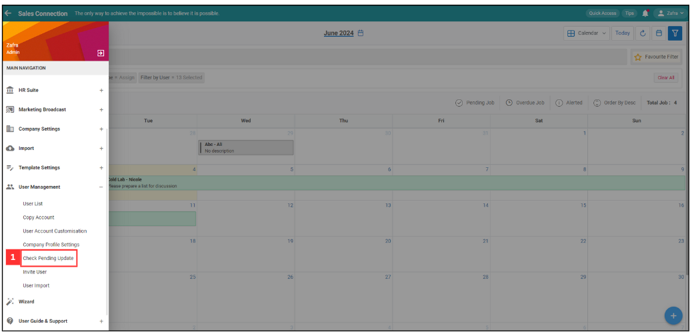
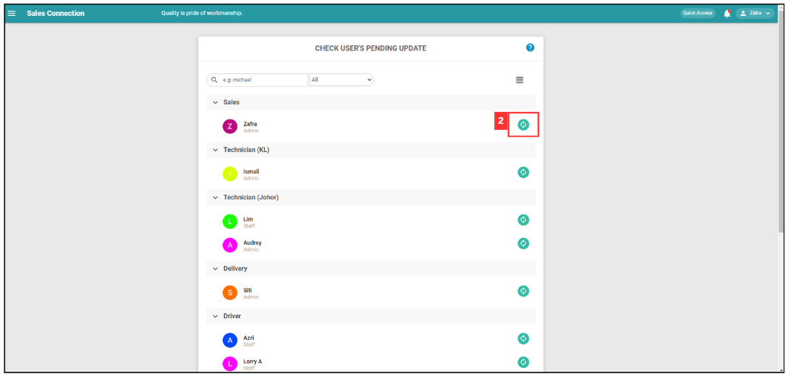
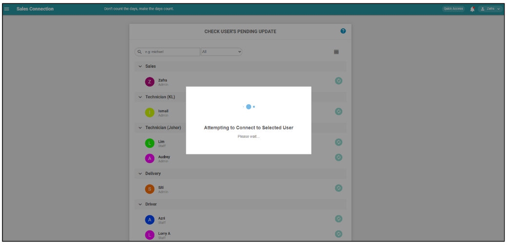
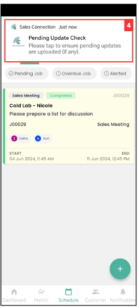
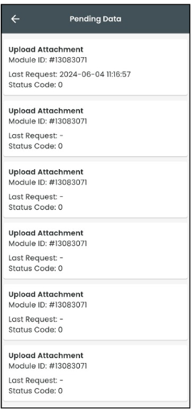
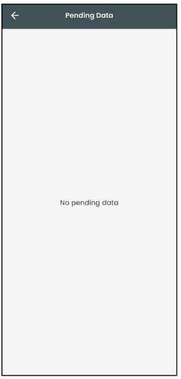
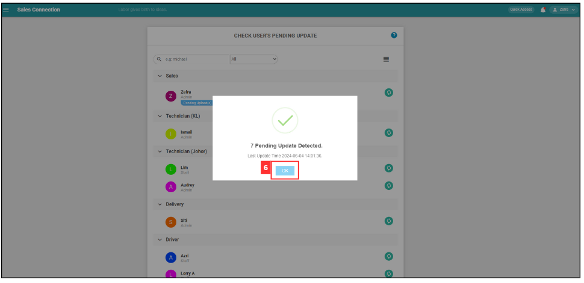
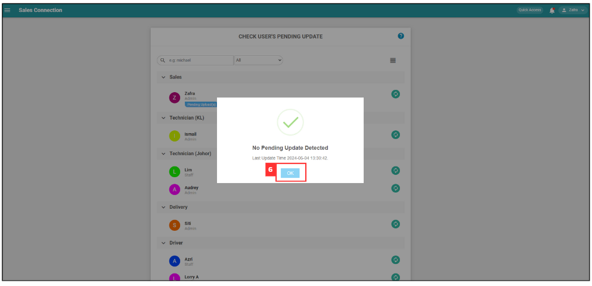

Version 1.0 
Created: 9 July 2024 
Updated: 9 July 2024 
## How to check if my staff have any pending updates?

Check on any pending upload item(s) by each of your user. If you receive a message saying "Unable to Retrieve Results", it could mean the following reason(s):

 i. Selected user has an unstable connection and system is unable to connect to their device. 
 ii. Selected user did not have the app running in the background. 
 iii. Selected user had swiped off the app.  

1. At the desktop site's Main Navigation, go to User Management > Check Pending Update. 
   **Check Pending Update here**: [https://salesconnection.my/checkPendingUploads](https://salesconnection.my/checkPendingUploads) 

   

      
   

   *Note: You must have access to User Management menu to perform this action. Please request permission or help from your admin if you do not have access to the menu.  

2. Click on the refresh button for the user with pending upload.

   

      
   
 

3. This prompt will send the notification to the user's phone.

   

      
   
 

4. Remind the user to press the "Pending Update Check" in their phone.

   

      
   
 

5. After the user press the prompt from previous step, their app will either show one of the result as pictures below. 

   a. The user has pending data:

   

      
   
 

   b. The user didn't have pending data:

   

      
   
 

6. In the desktop admin's view, either one of the results shown in the pictures below will appear. 

   a. The user has pending data:
   

      
   
 

   b. The user didn't have pending data:
   

      
   

   
   *Note: If the user has pending data, these will be updated automatically. Please advise the user to perform this action when their network is stable.

   
**Related Articles**
- [How Does an Admin Reset App Access for a User?](Admin_Reset_App_Access.md)
- [My updates are not received by my admin and other team members. Why?](Updates_Not_Received_by_Team_Members.md)
- [How to Check Pending Data?](Check_Pending_Data.md)

<!-- [Link Text](https://salesconnection.github.io/Sales-Connection-Support/Check_Pending_Update.html) -->
