Version 1.0 
Created: 22 July 2024 
Updated: 22 July 2024 
## Comment Category Segmentation

**Comment Category Segmentation** page separates Comment options by different categories for Projects, Jobs, etc. Example: Only Sales Meeting Job will have “Sales Meeting Minutes” Comment option. This option can be set to not be available for other Job categories.  

1. At the desktop site navigation bar, go to Wizard. 
   **Open Wizard Page Here:** [https://salesconnection.my/wizard](https://salesconnection.my/wizard) 

   

      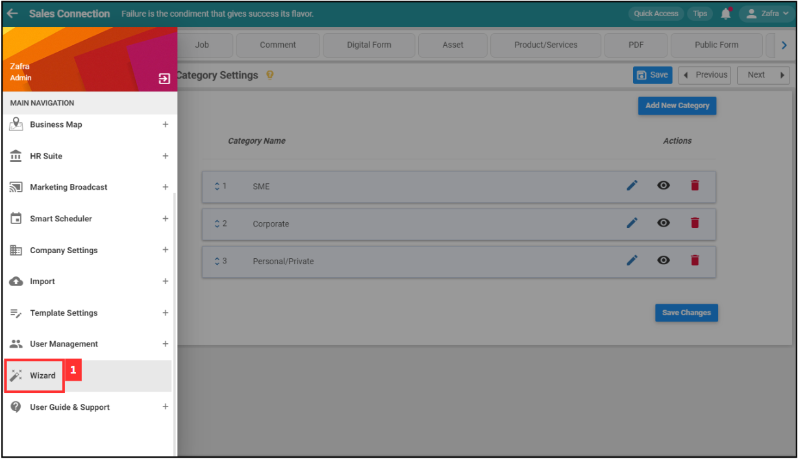
   

        
2. Click "Comment".

   

      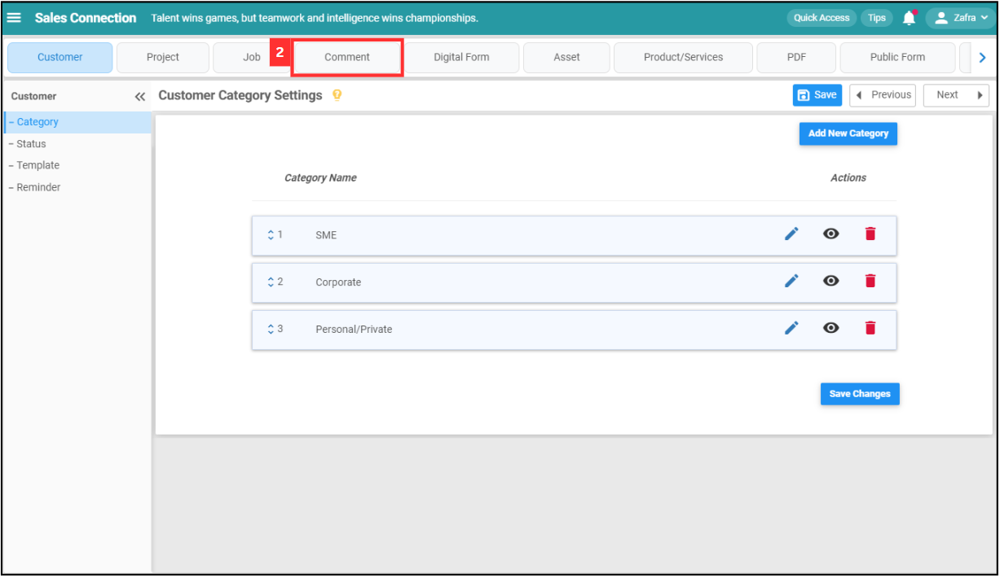
   

  
3. Click on "Category Segmentation".

   

      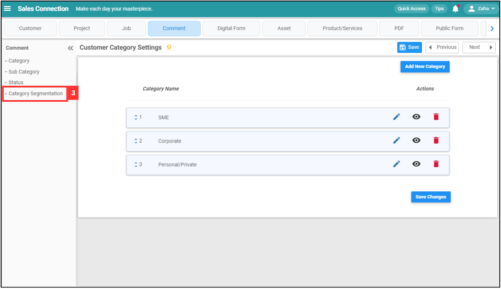
   

  
4. Click on the category. For example, click "Job".

   

      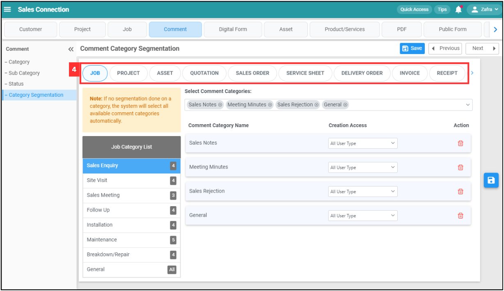
   

  
5. Click on the job category that you want to add comment category in.

   

      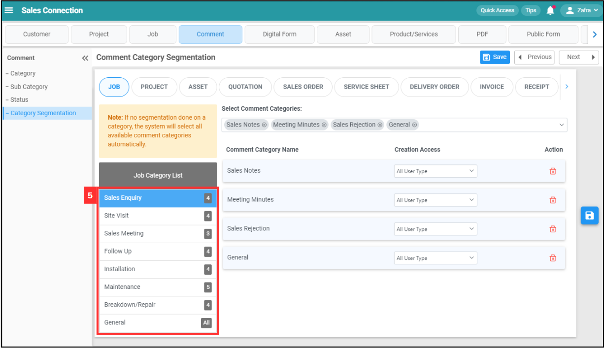
   

  
6. Click on the comment categories.

   

      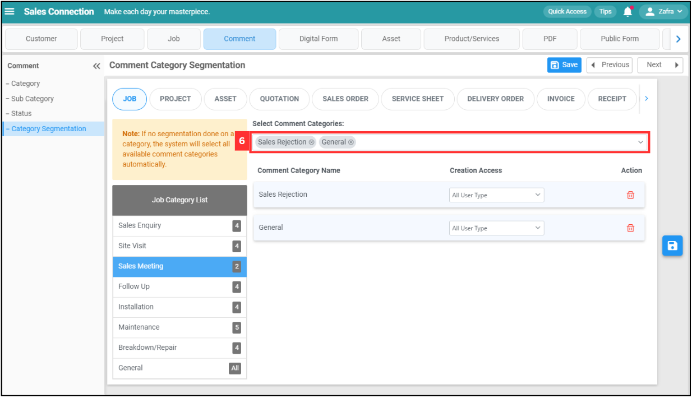
   

  
7. Enter the comment category that you want to add.

   

      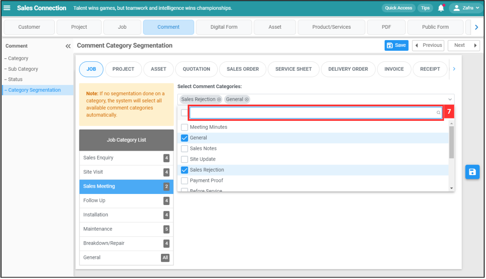
   

  
8. Tick the comment category you want to add.

   

      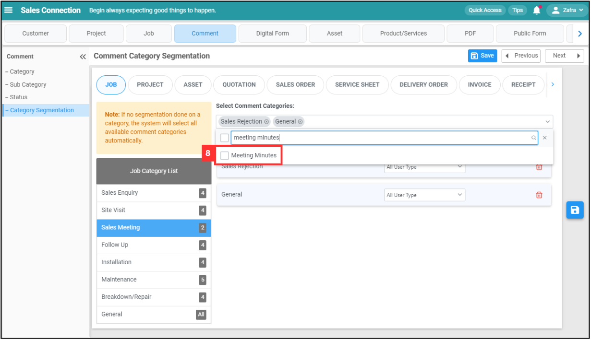
   

  
9. The added comment category will be shown as below.

   

      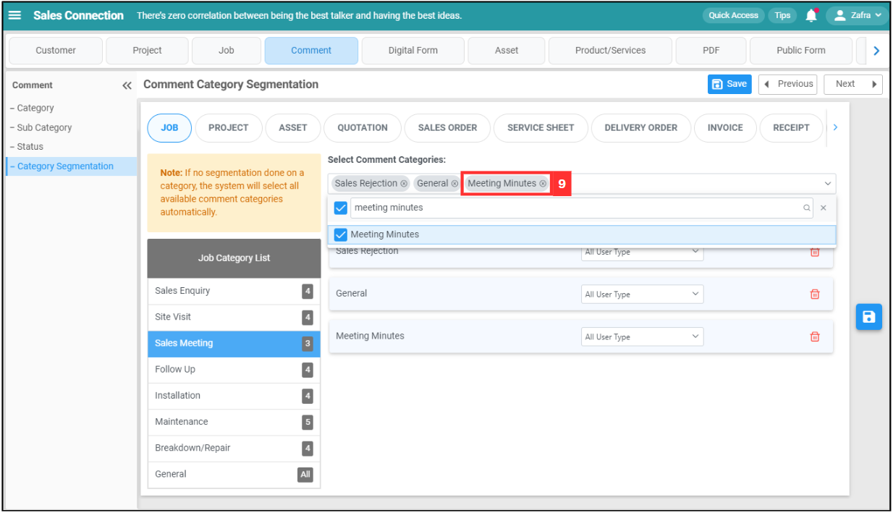
   

  
10. Click on the "Save" icon.

    

      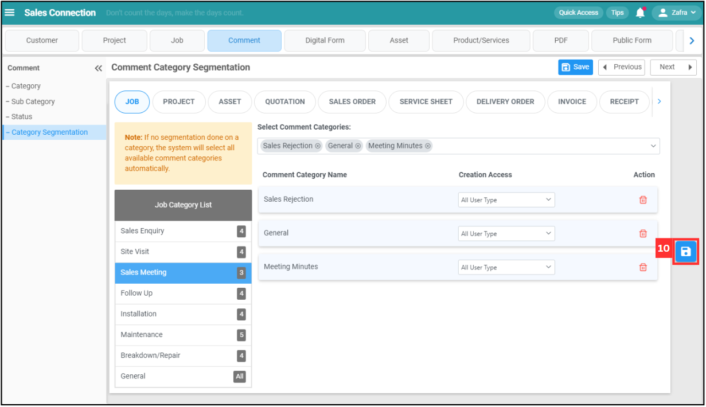
    

11. Click "Yes" to confirm.

    

       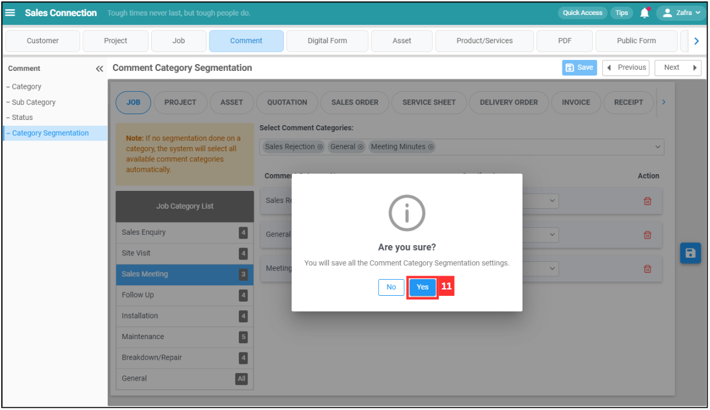
    

  
12. The comment category has been saved when this prompt appears.

    

       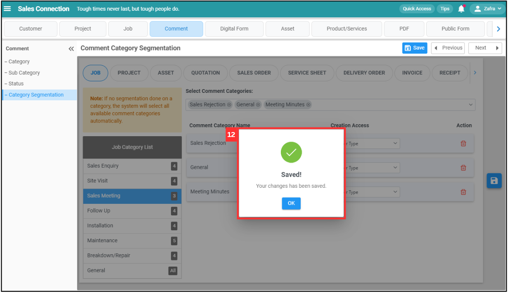
    
  
       

**Related Articles**
- [Wizard Page](Wizard_Page.md)

<!-- [Link Text](https://salesconnection.github.io/Sales-Connection-Support/Comment_Category_Segmentation.html) -->
