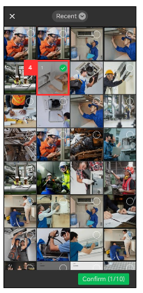
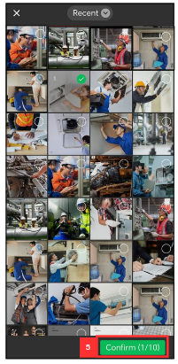

Version 1.0 
Created: 24 May 2024 
Updated: 24 May 2024 
##  📷 How to comment with Photo / Attachment?
    
**Mobile:** 
  
1. In the "Schedule" Page, click on the job that you want to comment on.

     

       
     
 

2. Click the attachment icon.

     

       
     
 

3. Click the "Gallery" icon.

   

     
   
 

4. Select the photo that you want to send.

   

     
   
 

5. Click "Confirm".

   

     
   
 

6. Click the tick icon to confirm sending this photo in the comment.

   

     
   
 

7. Click the comment area.

   

     
   
 

8. Write your comment.

   

     
   
 

9. Click the send icon.

   

     
   
 

10. The result will be shown as picture below.

    

     
    
  

**Desktop:** 

1. To comment with attachment in website, go to the desktop site Main Navigation > Business Management > Schedule > Job Schedule. 
   **Open the Job Scedule Page:** [https://salesconnection.my/activity/scheduler](https://salesconnection.my/activity/scheduler) 

   

     
   
 

2. Select the job that you want to comment on.

   

     
   
 

3. Click the attachment icon.

   

     
   
 

4. Choose the attachment that you want to upload as a comment.

   

     
   
 

5. Click the comment area.

   

     
   
 

6. Write your comment.

   

     
   
 

7. Click the send icon.

   

     
   
 

8. The result will be shown as picture below.

   

     
   

      

**Related Articles**
- [My updates are not received by my admin and other team members. Why?](Updates_Not_Received_by_Team_Members.md)

<!-- [Link Text](https://salesconnection.github.io/Sales-Connection-Support/Comment_With_Photo.html) -->
