Version 1.0 
Created: 4 July 2024 
Updated: 4 July 2024 
## Company Profile Settings

On **Company Profile Settings**, you would be able to change the system settings such as the currency used, the country setting, the email sender setting(s) and other company related info for the system as a whole for your users.  

**Navigate to the section by clicking it.** 

- [Company Profile](#section1) 
- [Email List](#section2)
   

   

   **Company Profile**

1. At the desktop site navigation bar, go to User Management > Company Profile Settings. 
   **Open Company Profile Settings Here:** [https://salesconnection.my/settings/companysettings](https://salesconnection.my/settings/companysettings) 

   

      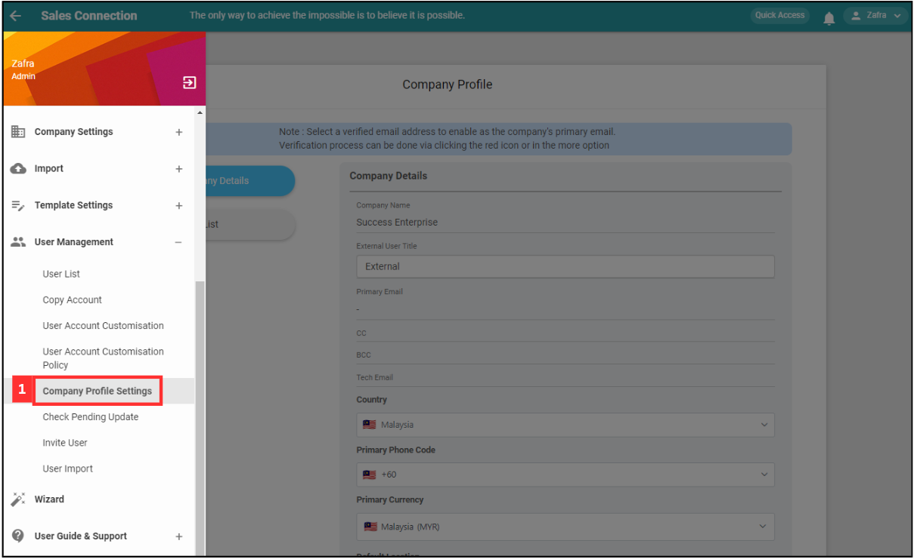
   

     
   *Note: You must have access to User Management menu to perform this action. Please request permission or help from your admin if you do not have access to the menu. 
   
2. In this section, you may change certain details such as the Country Setting and Currency setting of your system.

   

      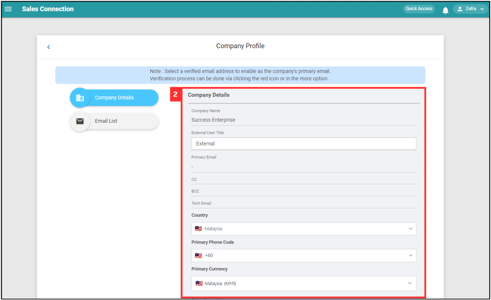
   

  
3. Default location allows your team to see the address set here first when trying to add an address in the system. Let’s click “Choose Location”.

   

      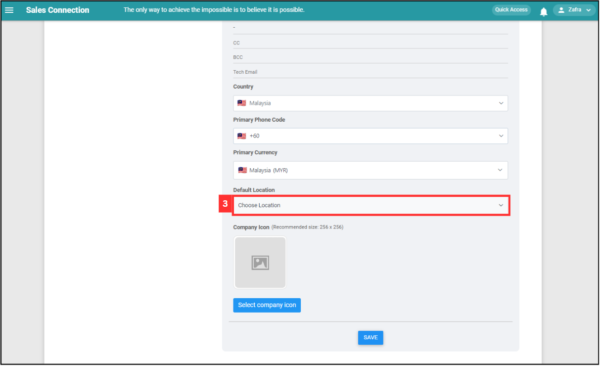
   

  
4. You may search for keywords to search the address by. For this example, we will search for a company name.

   

      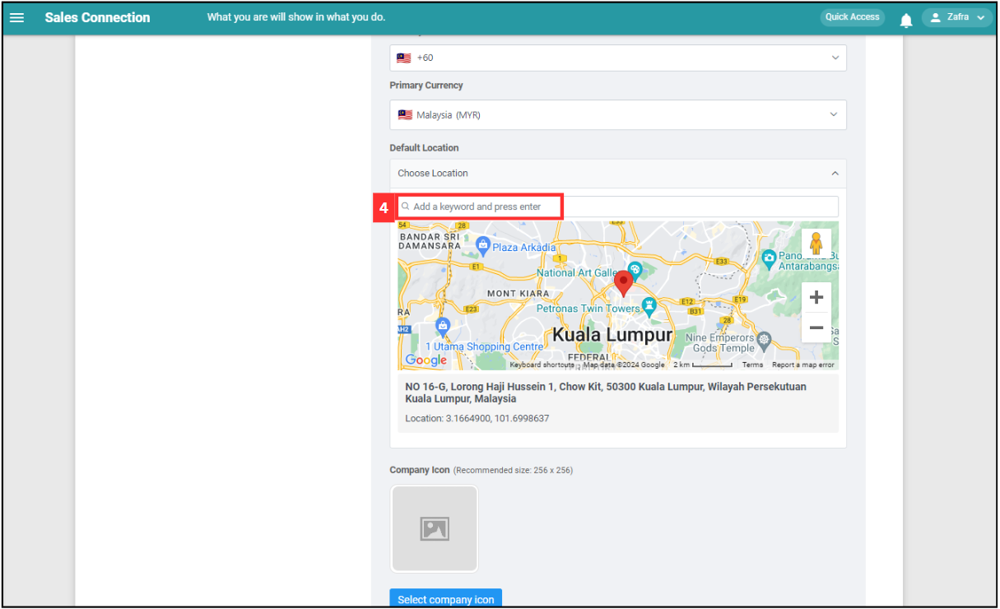
   

  
5. Make sure the company's location is correct.

   

      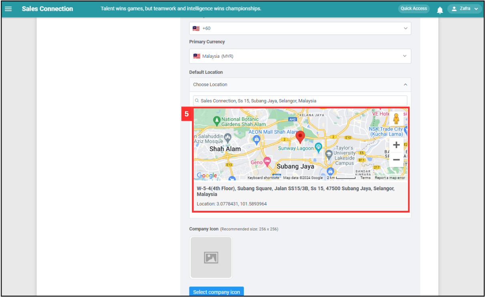
   

  
6. You can select an icon to put for the system notifications that your team would receive on their mobile device app. If nothing is set here, it will be the Sales Connection icon.

   

      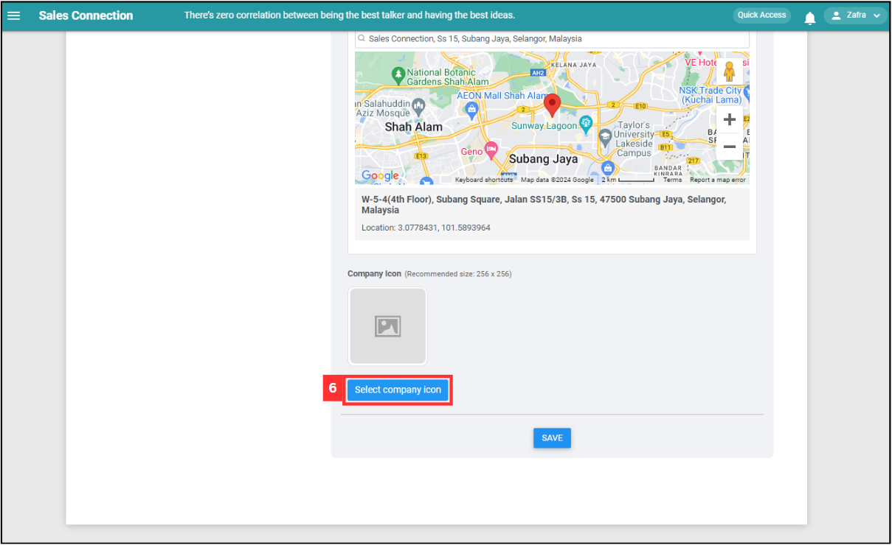
   

  
7. Click "SAVE" to save all the company details.

   

      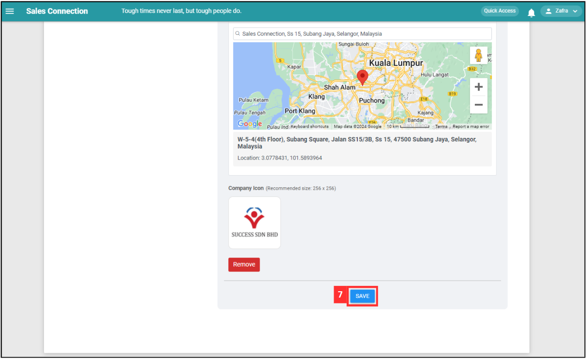
   

  
8. The company details have been saved successfully when this prompt appears.

   

      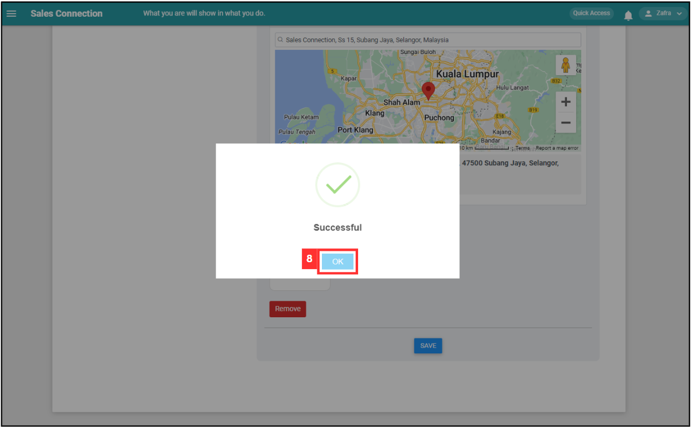
   

     
   

   **Email List**
  
9. On “Email List”, you can set emails registered as the Primary, CC, or BCC whenever you and the team use any email sending features inside the system. You can also set an email as Tech Email to be notified on any failed reminders.

   

      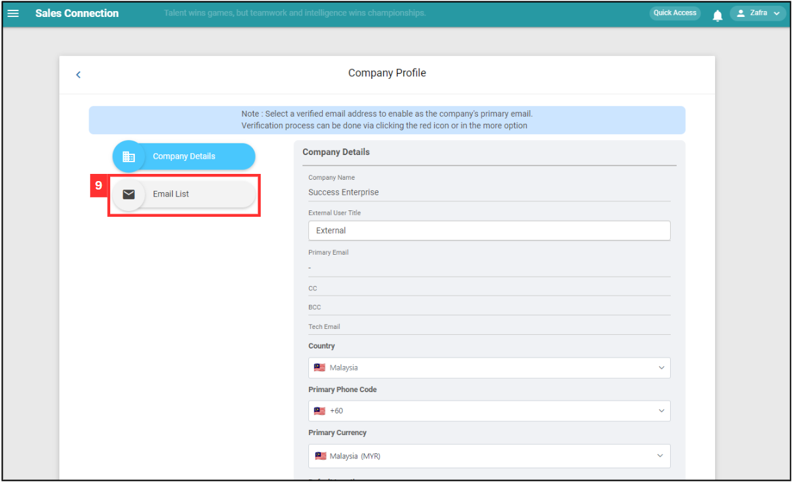
   

  
10. In order for an email to be set as any of the options mentioned, it needs to be verified by Amazon. Click on the “Verify Email” icon to verify it.

    

       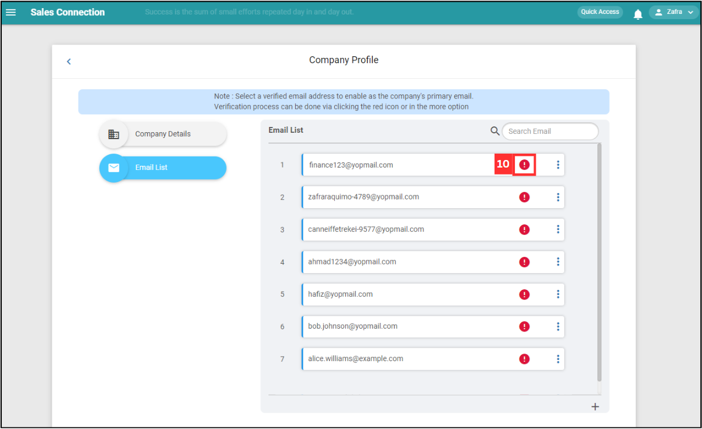
    

  
11. Click "OK" and an email will be sent to the verified email. Click on the link in the email to verify it.

    

       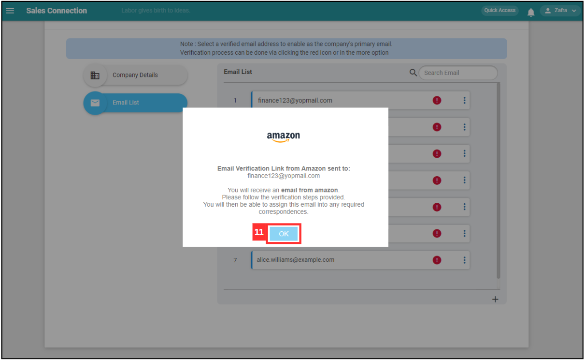
    

12. After email has been verified, click the [3 dots] button in the email list.

    

       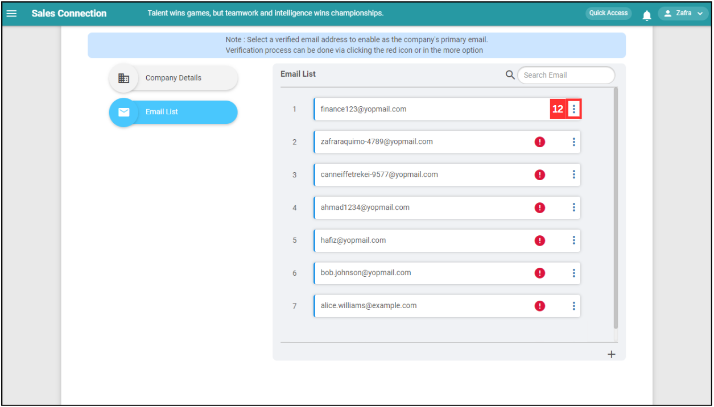
    

13. Select the option of email to set as. For this example, we will choose “Set as Primary”.

    

       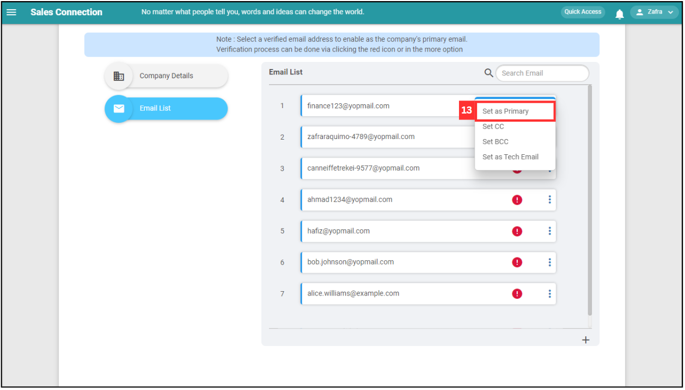
    

14. Click "Yes".

    

       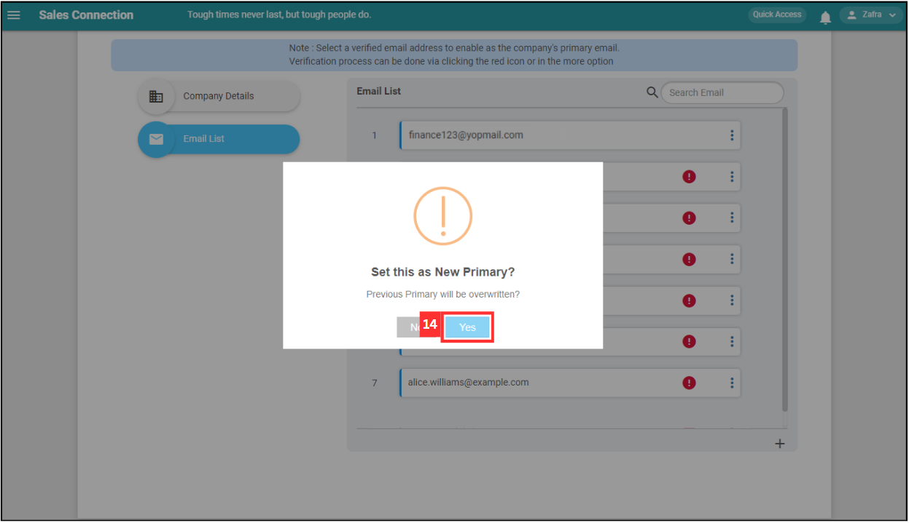
    

15. The email is saved successfully when you see a prompt such as the one in the screenshot below. In this example, this email will be used as the primary sender for any items sent out by email through the system such as Remote Signatures and PDF copies of Digital Forms.

    

       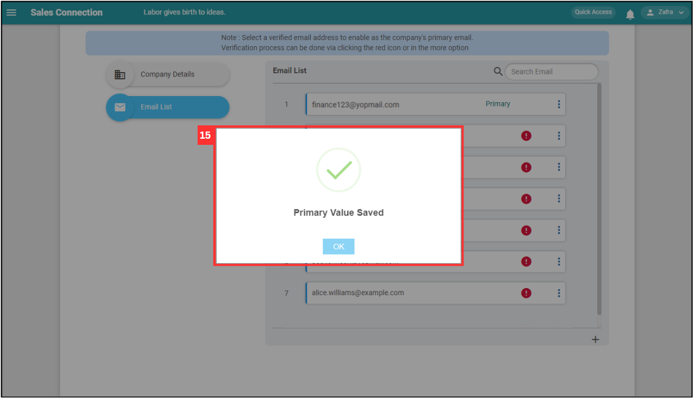
    

      

**Related Articles**
- [UAC Policy Management](UAC_Policy_Management.md)
- [Office Check-In Settings](Office_Check_In_Settings.md)

<!-- [Link Text](https://salesconnection.github.io/Sales-Connection-Support/Company_Profile_Settings.html) -->
