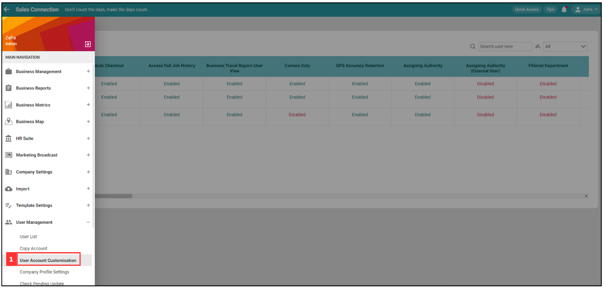
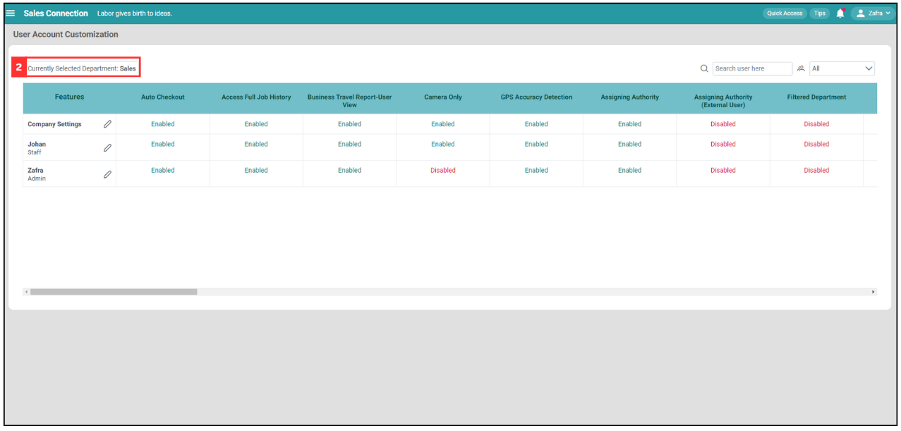
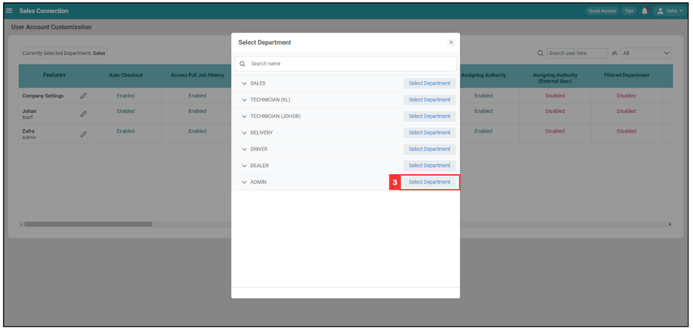
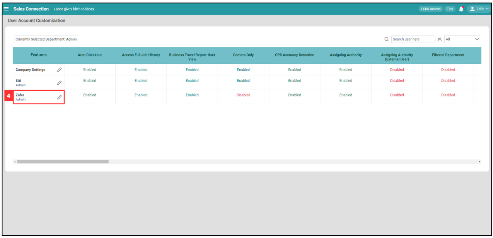
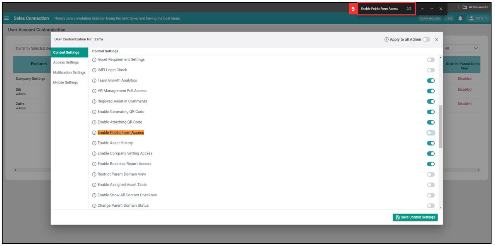
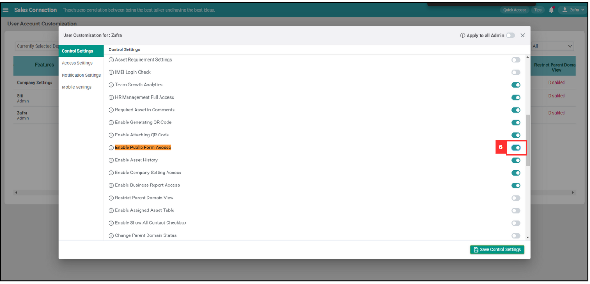
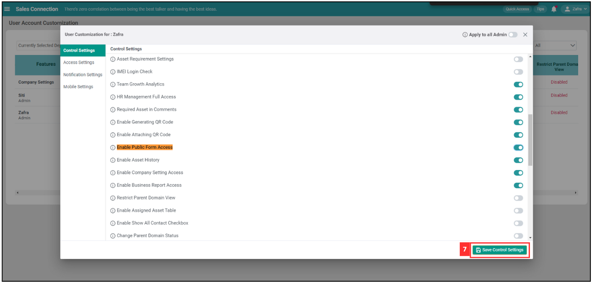
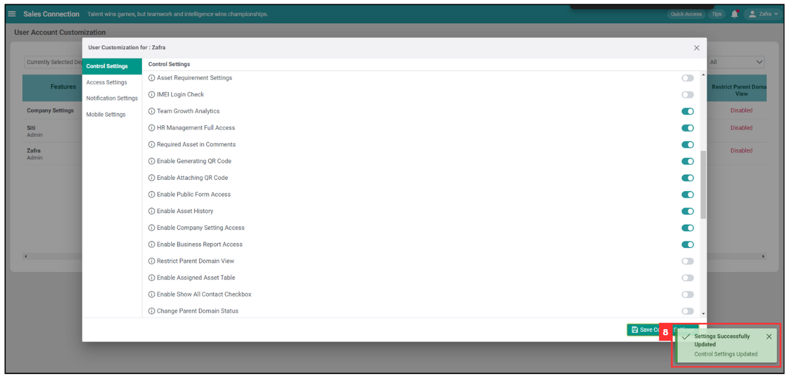

## How to Configure Public Form Access in UAC?

Decide on which team members should have access on reviewing public form submissions and take action towards it through the access control.  

1. At the desktop site's navigation bar, go to User Management > User Account Customization. 
   **Open User Account Customization:** [https://salesconnection.my/uac](https://salesconnection.my/uac) 
     
   *Note: You must have access to User Management menu to perform this action. Please request permission or help from your admin if you do not have access to the menu.

   

      
   
 

2. If you wish to change the public form access for the staff of another department, click "Currently Selected Department".

   

     
   
 

3. In this example, we will click “Select Department” button beside the department group “Admin”.

   

     
   
 

4. Click the "pencil" icon next to the user's name.

   

     
   
 

5. Scroll down to the “Enable Public Form Access” feature under “Control Settings”. Alternatively. press Ctrl + F and enter “Enable Public Form Access” to search for it.

   

     
   
 

6. Toggle/untoggle “Enable Public Form Access” to switch on/off the access to submitted public form.

   

     
   
 

7. Click "Save Control Settings".

   

     
   
 

8. “Enable Public Form Access” has been switched on/off when the prompt below appears.
 
   

     
   
 

   

**Related Articles**
- [How to Access Submitted Public Form?](Access_Submitted_Public_Form.md)
- [How to Generate Public Form?](Creation_of_Public_Form.md)
- [How to Setup Public Form Template?](Setup_Public_Form_Template_Page.md)
- [How to Pull Out Job/Project/Form Report?](Export_Report.md)
- [How to Filter Job by Date Range?](Job_Filter_by_Date_Range.md)
- [How to Set Customized Favourite Filter as Default - Desktop ](Default_Favourite_Filter.md)
- [How to Set Customized Favourite Filter as Default - App ](Default_Favourite_Filter_App.md)
- [How to Set Up the Column View in the Report Page?](How_to_Set_Up_the_Column_View_in_the_Report_Page.md)
- [How to Use Update Report Filter?](Job_Update_Report_Filter.md)

<!-- [Link Text](https://salesconnection.github.io/Sales-Connection-Support/Configure_Public_Form_Access_in_UAC.html) -->
