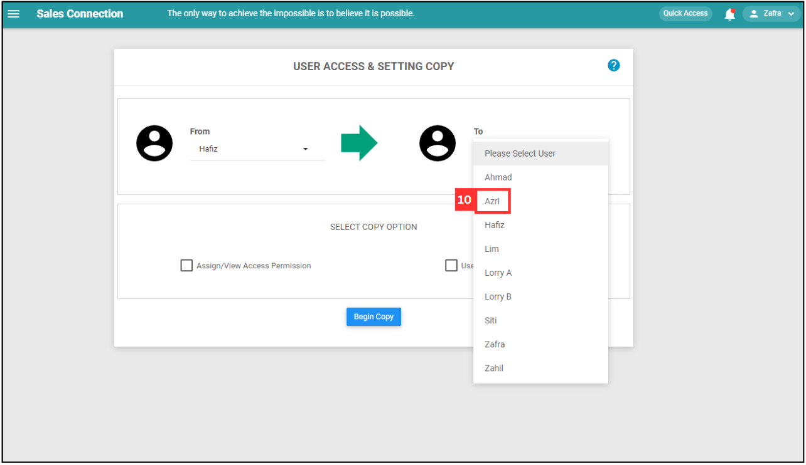
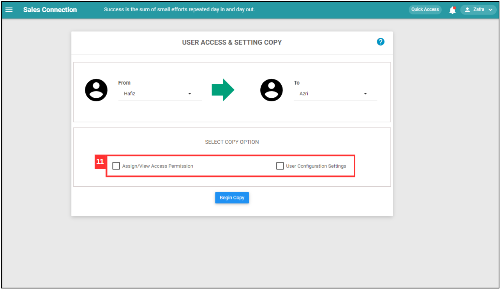
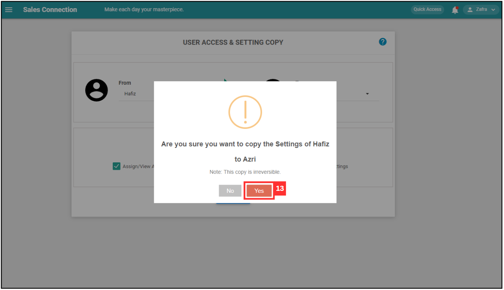
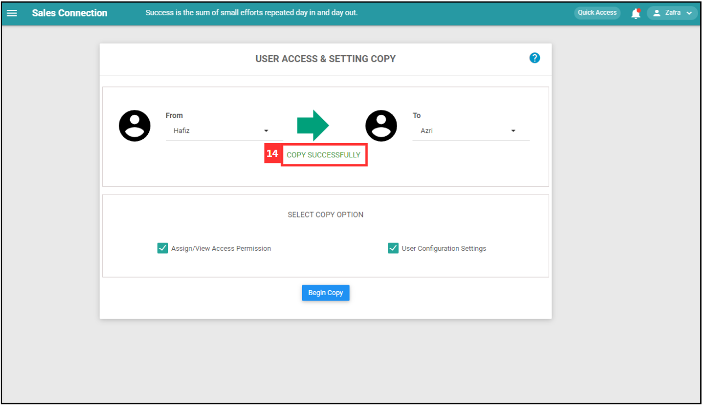

## How to Copy Account for New User?
    
  1. At the desktop site's navigation bar, go to User Management > Copy Account. 
     **Copy Account Here:** [https://salesconnection.my/transferAccount](https://salesconnection.my/transferAccount) 

     

       
     

     *Note: You must have access to User Management menu to perform this action. Please request permission or help from your admin if you do not have access to the menu. 
     
  2. Click on the expand button. 

     

       
     

  3. Select the user who needs to copy the account from. 

     

       
     

     *Note: List of users are based on Activated and Deactivated users. Deleted users are excluded. 
     
  4. Click on the expand button. 

     

       
     

  5. Select the user who needs to copy the account to. 

      

       
      

  6. Select the copy option. 

     | Access Permission Copy | Configuration Setting Copy |
     |------------------------|----------------------------|
     | This will copy all Assign/View permission of the user to the selected user (Customers, Projects, Jobs, etc.) | This will copy all user account customization settings of the user to the selected user. |
     
      

       
      

  8. Click on the "Begin Copy" button. 

      

       
      

  9. Click "Yes" to copy the account. 

      

       
      

  10. The account has been copied successfully. 

      

       
      

     

**Related Articles** 
- [How to Add New User?](Add_New_User.md)
- [How to Assist My New User to Login?](New_User_Login.md)
- [How to Login Into Sales Connection Using Mobile and Desktop?](Login.md)
