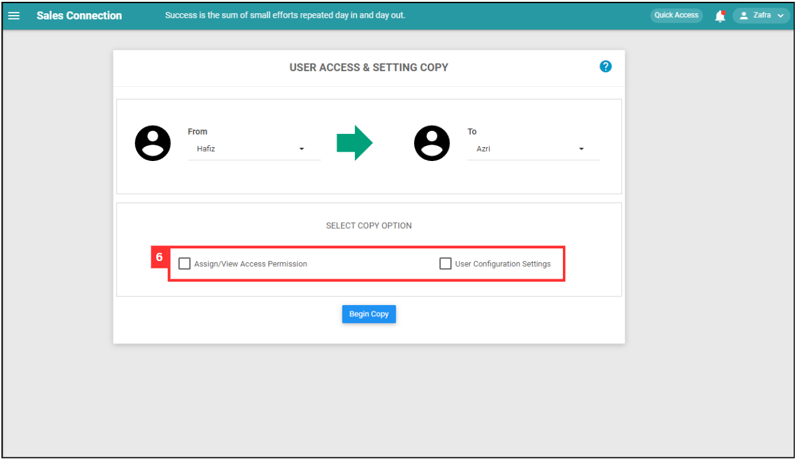

## How to Copy Account for New User?
    
  1. At the desktop site's navigation bar, go to User Management > Copy Account. 
     **Copy Account Here:** [https://salesconnection.my/transferAccount](https://salesconnection.my/transferAccount) 

     

       
     

     *Note: You must have access to User Management menu to perform this action. Please request permission or help from your admin if you do not have access to the menu. 
     
  2. Click on the expand button. 

     

       
     

  3. Select the existing user you would like to copy settings from. 

     

       
     

     *Note: List of users are based on Activated and Deactivated users. Deleted users are excluded. 
     
  4. Click on the expand button. 

     

       
     

  5. Select the new user you would like to apply the settings to. 

     

       
     

  6. Select the copy option needed. 

     | Access Permission Copy | Configuration Setting Copy |
     |------------------------|----------------------------|
     | Customers, Projects, Jobs, etc. that are Assigned/Viewed by the existing user will be Assigned/Viewed by the new user as well. | This will copy all user account customization settings of the user to the selected user. |
     
     

       
     

  7. Click on the "Begin Copy" button. 

     

       
     

  8. Click "Yes" to copy the account. 

     

       
     

  9. The account has been copied successfully. 

     

       
     

     

**Related Articles** 
- [How to Add New User?](Add_New_User.md)
- [How to Assist My New User to Login?](New_User_Login.md)
- [How to Login Into Sales Connection Using Mobile and Desktop?](Login.md)

<!-- [Link Text](https://salesconnection.github.io/Sales-Connection-Support/Copy_Account.html) -->
