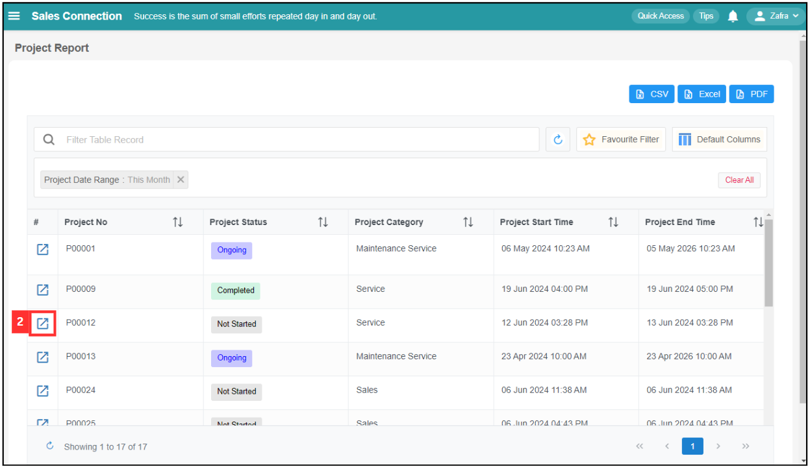
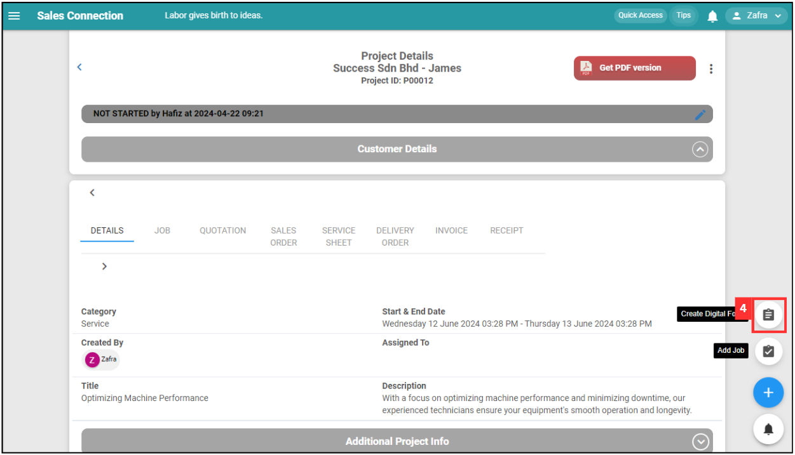
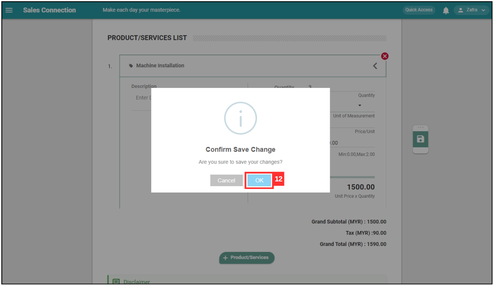

## How to Create Digital Form?

**Navigate to the section by clicking it.** 

- [From Job](#section1) 
- [From Project](#section2)
   

### From Job
1. At the desktop site's navigation bar, go to Business Management > Schedule > Job Schedule. 
   **Create Digital Form Here:** [https://salesconnection.my/activity/scheduler](https://salesconnection.my/activity/scheduler) 
     
   

     
   

2. Click on the job that needs to create digital form. 

   

     
   

3. Click on the "Create Digital Form" icon. 

   

     
   

     
4. Select the type of digital form you want to create. For this example, select "Quotation". 

   

     
   

   *Note: Digital Form Templates available are based on the access given by your admin. If you do not find your template, please request permission or help from your admin. 
     
5. Fill out the details of the new quotation. Available fields may differ depending on your company’s system setup. 

   | Field Name| Description |
   |-------|---------|
   | Category | Classifies the type of quotation. |
   | Status | Indicates the current status of the quotation. |
   | Customer | Select the address of the customer or attach the customer. |
   | Project | The project associated with this quotation. |
   | Start Date | The date when the quotation is created. |
   | Assigned User | The user responsible for this quotation. |
   | Reminder | Set a reminder for follow-ups or important dates. |
   | Product/Services List | The list of products or services included in the quotation. |
   | Description | Additional details or description of the quotation. |
          
   

     
   

6. Click "+ Product/Service" if needed. 

   

     
   

7. Select the Product/Services that needed in this form. 

   

     
   

8. Click on the "SAVE" button. 

   

     
   

9. Enter the details of the product/services. 

   

     
   

10. Click on the "Save" icon. 

    

      
    

11. Click "OK" to confirm the save change. 

    

      
    

12. Your form is successfully saved when the “Successfully Saved” prompt appears. 

    

      
    

     

### From Project

1. At the desktop site's navigation bar, go to Business Management > Schedule > Project Schedule. 
   **Create Digital Form Here:** [https://salesconnection.my/calendar/projectactivityschedule](https://salesconnection.my/calendar/projectactivityschedule) 
     
   

     
   

2. Scroll up to the top of the page. 

   

     
   

3. Click on the "Customer". 

   

     
   

     
4. Select the Customer that the Project is under from. 

   

     
   

5. Click on the expand button beside the specific project. 

   

     
   

6. Click on the "+" button. 

   

     
   

7. Click "Create Digital Form". 

   

     
   

   *Note: Digital Form Templates available are based on the access given by your admin. If you do not find your template, please request permission or help from your admin. 
     
8. Choose the category of the Digital Form. For example, select Quotation. 

   

     
   

9. Fill out the details of the new quotation. Available fields may differ depending on your company’s system setup. 

   | Field Name| Description |
   |-------|---------|
   | Category | Classifies the type of quotation. |
   | Status | Indicates the current status of the quotation. |
   | Customer | Select the address of the customer or attach the customer. |
   | Project | The project associated with this quotation. |
   | Start Date | The date when the quotation is created. |
   | Assigned User | The user responsible for this quotation. |
   | Reminder | Set a reminder for follow-ups or important dates. |
   | Product/Services List | The list of products or services included in the quotation. |
   | Description | Additional details or description of the quotation. |
          
   

     
   

10. Click on the "Save" icon. 

   

     
   

11. Click "OK" to confirm the save change. 

   

     
   

12. Your form is successfully saved when the “Successfully Saved” prompt appears. 

   

     
   

      

**Related Articles** 
- [How to Add New Customer?](Add_New_Customer.md)
- [How to Add New Project?](Add_New_Project.md)
- [How to Add New Job?](Add_New_Job.md)
- [How to Add New Asset?](How_to_Add_New_Asset.md)
- [How to Set Up Digital Form PDF Template?](Create_PDF.md)
