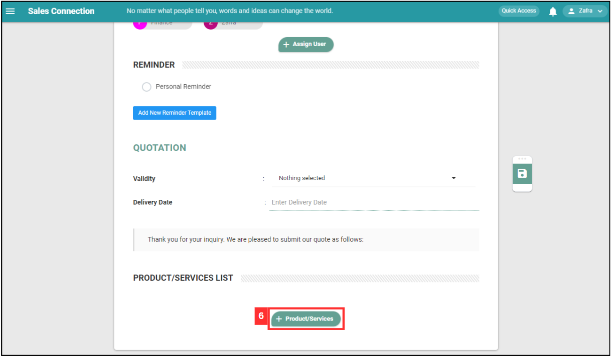
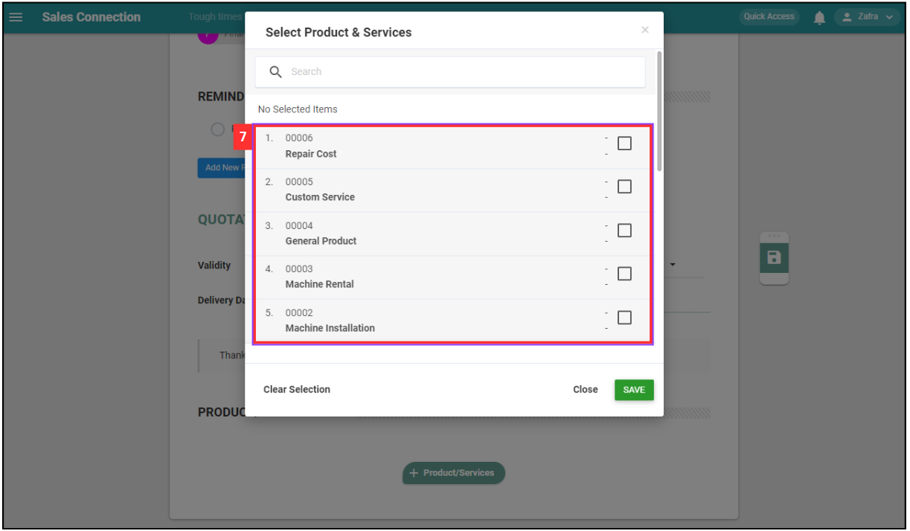

## How to Create Digital Form?
    
  1. At the desktop site's navigation bar, go to Business Management > Schedule > Job Schedule. 
     **Create Digital Form Here:** [https://salesconnection.my/activity/scheduler](https://salesconnection.my/activity/scheduler) 
     
     

       
     

  2. Click on the job that needs to create digital form. 

     

       
     

  3. Click on the "Create Digital Form" icon. 

     

       
     

     
  4. Select the type of digital form you want to create. For this example, select "Quotation". 

     

       
     

     *Note: Digital Form Templates available are based on the access given by your admin. If you do not find your template, please request permission or help from your admin. 
     
  5. Fill out the details of the new quotation. Available fields may differ depending on your company’s system setup. 

     | Field Name| Description |
     |-------|---------|
     | Category | Classifies the type of quotation. |
     | Status | Indicates the current status of the quotation. |
     | Customer | Select the address of the customer or attach the customer. |
     | Project | The project associated with this quotation. |
     | Start Date | The date when the quotation is created. |
     | Ref No | The reference number for the quotation. |
     | Payment Term | The terms of payment for the quotation. |
     | Assigned User | The user responsible for this quotation. |
     | Reminder | Set a reminder for follow-ups or important dates. |
     | Validity | The validity period of the quotation. |
     | Delivery Date | The expected delivery date for the products/services. |
     | Product/Services List | The list of products or services included in the quotation. |
     | Description | Additional details or description of the quotation. |
          
     

       
     

6. Click on the "Save" icon. 

     

       
     

7. Click "OK" to confirm the save change. 

   

       
     

8. Your form is successfully saved when the “Successfully Saved” prompt appears. 

     

       
     

        

**Related Articles** 
- [How to Add New Customer?](Add_New_Customer.md)
- [How to Add New Project?](Add_New_Project.md)
- [How to Add New Job?](Add_New_Job.md)
- [How to Add New Asset?](How_to_Add_New_Asset.md)
- [How to Set Up Digital Form PDF Template?](Create_PDF.md)
