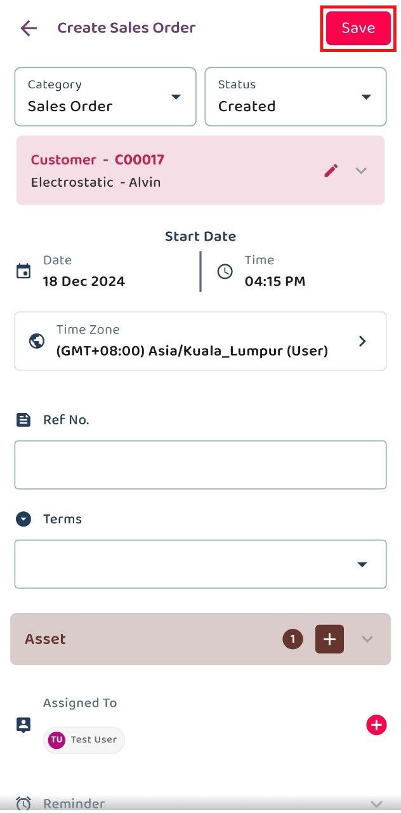
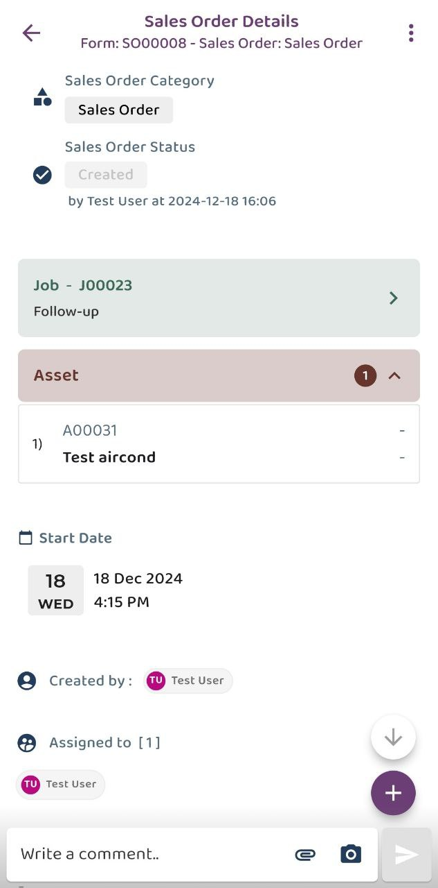

## How to Create Digital Form in Mobile App
### The steps below demonstrate how to create a digital form from a job. The process for creating a digital form is the same across all data level, including Customer, Project, and Asset.
#### Scenario 1 : Create Digital Form from To-Do List.
1) Select Job  

         

 

2) Scroll down to find To-Do List and click the button for 'Create Service Sheet'.  

         

 

3) Fill in the details and click 'Save'.  

         

 

4) The Digital Form is created in the system.   

         

 

#### Scenario 2 : Create Digital Form from “+” icon.
1) Select Job  

         

 

2) Click on the “+” icon.  

         

 

3) Click the “Add Digital Form” icon to choose digital form.  

         

 

4) Select the Digital Form require.  

         

 

5) Fill in the form with the required details, then click 'Save'. 

         

 

6) You may choose to open or skip 'Acknowledge and Feedback'. If you decide to open it later, you can access it via the three-dot icon.  

         &nbsp;&nbsp;&nbsp;&nbsp;&nbsp;&nbsp;
         &nbsp;&nbsp;&nbsp;&nbsp;&nbsp;&nbsp;
         &nbsp;&nbsp;&nbsp;&nbsp;&nbsp;&nbsp;

 

7) The Digital Form is created in the system.   

         

 
