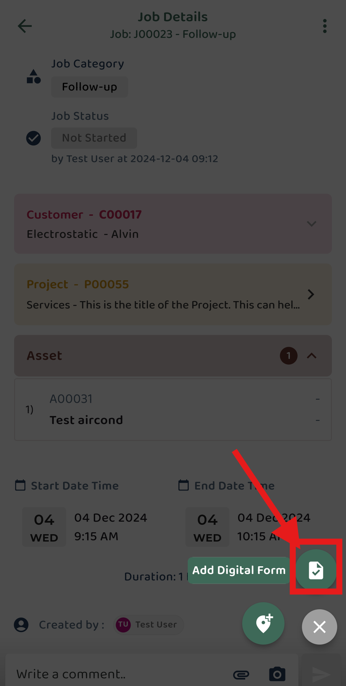
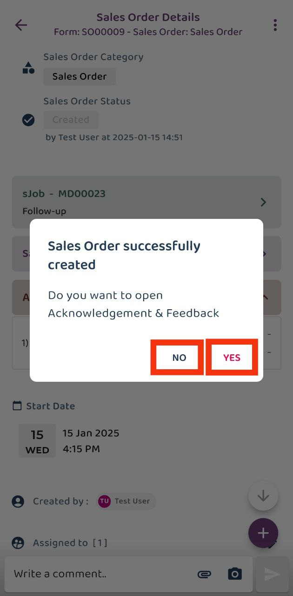

## How to Create Digital Form in Mobile App
### Customer, Project and Asset follow a similar process for creating a digital form.
1) Select Job > Click  

         

 

2) Click + icon  

         

 

3) Click Add Digital Form icon
(The location icon is used to check in job)  

         

 

4) Select your desire digital form > Click  

         

 

5) On the Digital Form page, fill in the required information as desired. 

         

 

6) Continue filling in the information. Add a product or service if it is related. 

         

 

7) Select the product or service you want, then click 'Done'. 

         

 

8) Click 'Save' if there are no further changes. 

         

 

9) You may choose to open or not open acknowledge and feedback (if you want to open later, you also can found in the three dot icon) 

         

 

         

 
