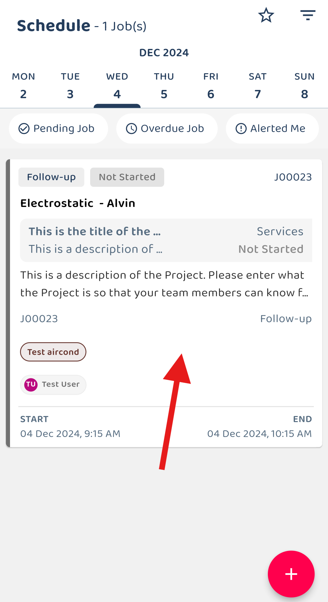
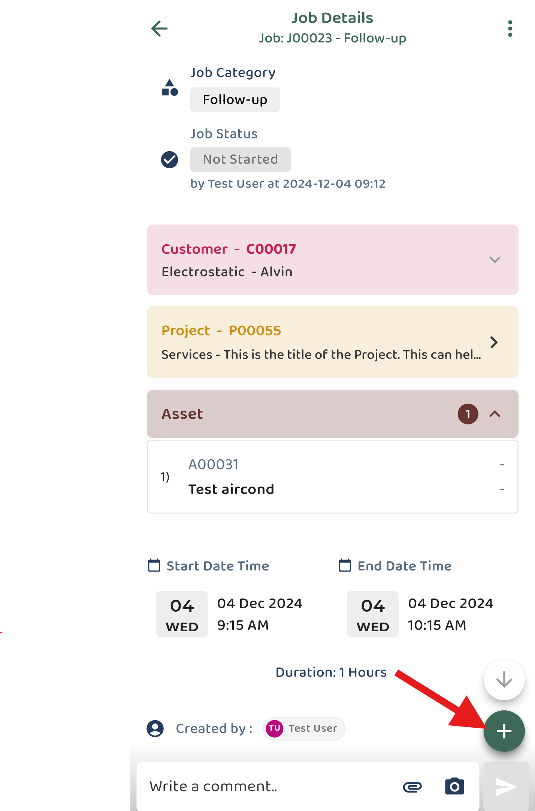

## How to Create Digital Form in Mobile App
### Customer, Project and Asset follow a similar process for creating a digital form.
#### Short intro : Below shows an example of create digital form in job.
#### Scenario 1 : Create DF from to do list.
1) Select Job  

         

 

2) Click the button for 'Create Service Sheet'.  

         

 

3) Click the 'Save' button after add the details.  

         

 

4) Digital form is created and shown.  

         

 

#### Scenario 2 : Create DF from “+” icon.
1) Select Job  

         

 

2) Click on the “+” icon.  

         

 

3) Click the “Add Digital Form” icon to choose digital form.  

         

 

4) Select the Digital Form require.  

         

 

5) Fill in the form with the required details, then click 'Save'. 

         

 

6) You may choose to open or skip 'Acknowledge and Feedback'. If you decide to open it later, you can access it via the three-dot icon.  

         

 

         

 
