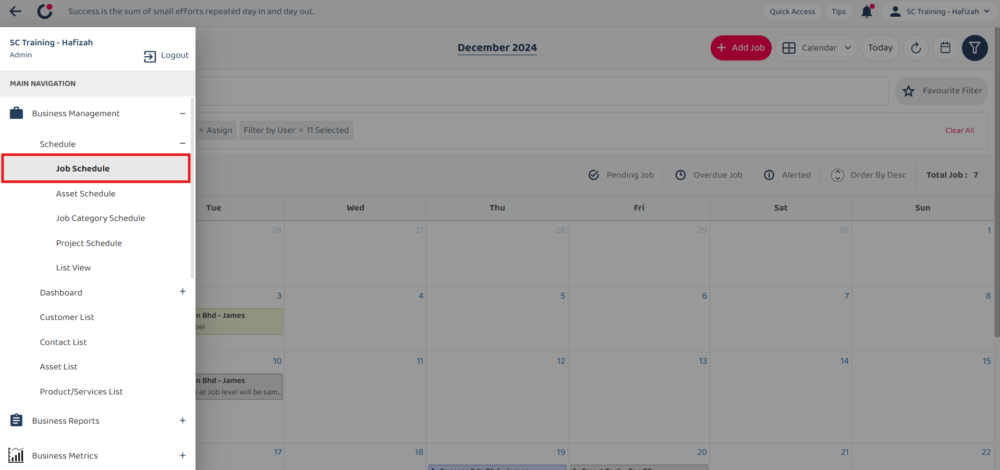
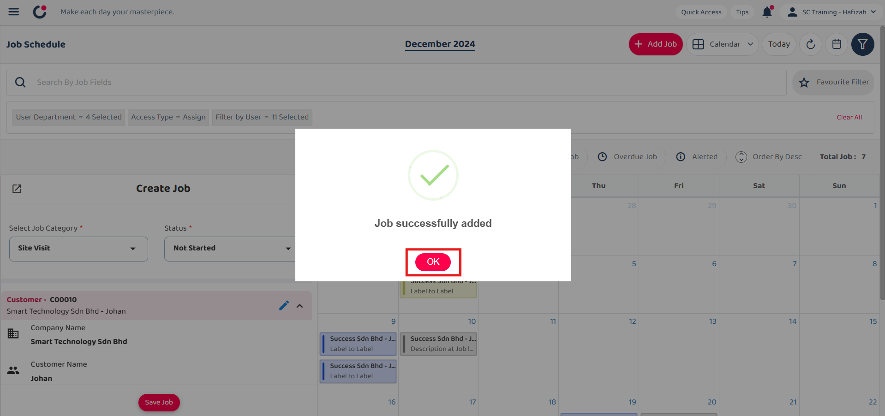

## How to Create New Digital Form?
    
  1. At the desktop site's navigation bar, go to Business Management > Schedule > Job Schedule. 
     **Add New Job Here:** [https://salesconnection.my/activity/scheduler](https://salesconnection.my/activity/scheduler) 
     
     

       
     

  2. Click on the "+" button to add new job. 

     

       
     

  3. Select the job category. 

     

       
     

     
  4. Click on the "SAVE" button. 

     

       
     

     
  5. Fill out the details of the new job. 

     | Field Name| Description |
     |-------|---------|
     | Select Job Category* | Classifies the type of job. |
     | Status* | Indicates the current status of the job. |
     | Select Customer | Choose a customer from those registered in the system. |
     | Select Asset | Choose an asset from those registered in the system. |
     | Job Start End Date* | The date range when the job is planned to start and end. |
     | Recurrent Job | Indicates if the job recurs. |
     | Assigned User | The user responsible for the job. |
     | Reminder | Set a reminder for the job. |
     | Description | Detailed description of the job. |
     | Attachment (Document or Receipt) | Upload any relevant documents or receipts. |
     
     *Note: Fields marked with an asterisk ( * ) are required. 
     
     

       
     

6. Click on the "Save Job" button. 

     

       
     

7. Click "OK" and the new job has been saved successfully. 

     

       
     

        

**Related Articles** 
- [How to Add New Customer?](Add_New_Customer.md)
- [How to Add New Project?](Add_New_Project.md)
- [How to Add New Job?](Add_New_Job.md)
- [How to Add New Asset?](How_to_Add_New_Asset.md)
