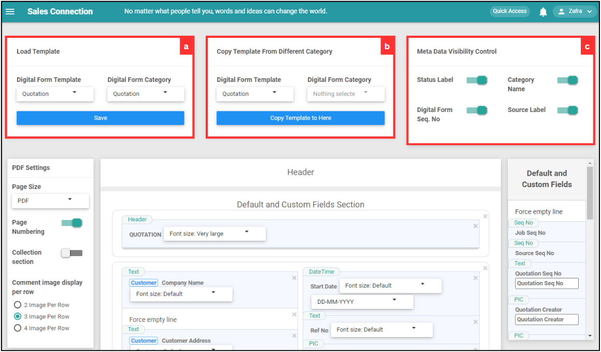

## How to Create New PDF?
    
  1. At the desktop site's navigation bar, go to Template Settings > Digital Form Templates > PDF Template Customization. 
     **Create New PDF Here:** [https://salesconnection.my/DigitalFormSetting/templatecustomisation](https://salesconnection.my/DigitalFormSetting/templatecustomisation) 
     
     

       
     

  2. Click on the "Digital Form Template" and "Digital Form Category" that needs to create PDF. 

     

       
     

  3. Click on the "Create Digital Form" icon. 

     

       
     

     
  4. Select the type of digital form you want to create. For this example, select "Quotation". 

     

       
     

     
  5. Fill out the details of the new quotation. 

     | Field Name| Description |
     |-------|---------|
     | Category | Classifies the type of quotation. |
     | Status | Indicates the current status of the quotation. |
     | Customer | Select the address of the customer or attach the customer. |
     | Project | The project associated with this quotation. |
     | Start Date | The date when the quotation is created. |
     | Ref No | The reference number for the quotation. |
     | Payment Term | The terms of payment for the quotation. |
     | Assigned User | The user responsible for this quotation. |
     | Reminder | Set a reminder for follow-ups or important dates. |
     | Validity | The validity period of the quotation. |
     | Delivery Date | The expected delivery date for the products/services. |
     | Product/Services List | The list of products or services included in the quotation. |
     | Description | Additional details or description of the quotation. |
          
     

       
     

6. Click on the "Save" icon. 

     

       
     

7. Click "OK" to confirm the save change. 

   

       
     

8. Click "OK" and the new quotation has been added successfully. 

     

       
     

        

**Related Articles** 
- [How to Add New Customer?](Add_New_Customer.md)
- [How to Add New Project?](Add_New_Project.md)
- [How to Add New Job?](Add_New_Job.md)
- [How to Add New Asset?](How_to_Add_New_Asset.md)
