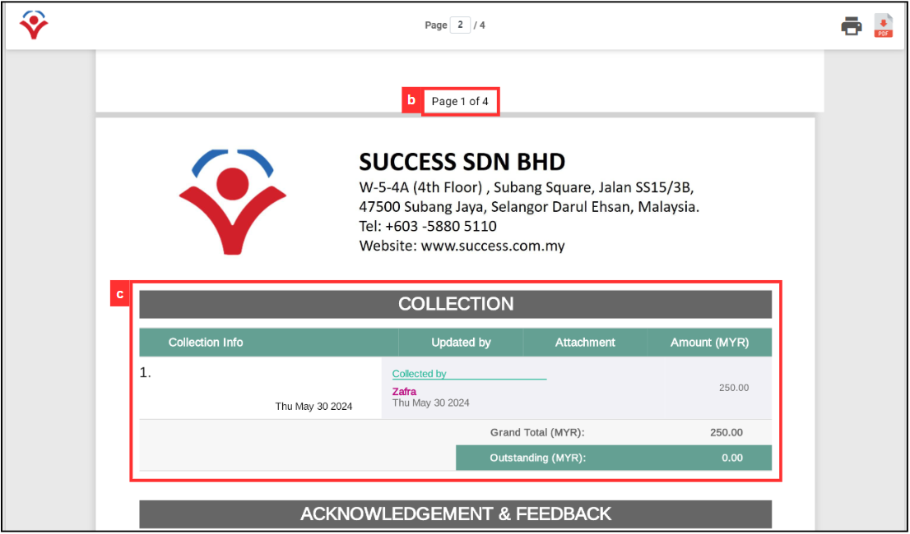

## How to Set Up Digital Form PDF Template?

**Navigate to the section by clicking it.** 

- [PDF Template Settings](#section1) 
- [Generate PDF](#section2)
   

1. At the desktop site's navigation bar, go to Template Settings > Digital Form Templates > PDF Template Customization. 
   **Create PDF Here:** [https://salesconnection.my/DigitalFormSetting/templatecustomisation](https://salesconnection.my/DigitalFormSetting/templatecustomisation) 
     
   

     
   

2. Click on the "Digital Form Template" and "Digital Form Category" that needs to create PDF. 

   

     
   

3. Click "OK" and the digital form has been selected. 

   

     
   

  
4. "Load Template" is used to choose the digital form that needs to change PDF template settings. 
     
   | No | Field Name | Description |
   |----|------------|-------------|
   | a | Digital Form Template | Select the type of digital form to load. |
   | b | Digital Form Category | Specify the category of the digital form. |
     
   

     
   

     
5. "Meta Data Visibility Control" will show the details of the digital form on top of the PDF. 

   | No | Field Name | Description |
   |----|------------|-------------|
   | a | Status Label | Define the status label for the digital form. |
   | b | Category Name | Define the category name for the digital form. |
   | c | Digital Form Seq. No | Specify the sequence number for the digital form. |
   | d | Source Label | Specify the source label |
     
   

     
   

   This section will be shown here in PDF and its position cannot be changed. 
     
   

     
   

6. "PDF Settings" is represented as below. 
     
   | No | Field Name | Description |
   |----|------------|-------------|
   | a | Page Size| Select the size of the PDF (standard PDF or receipt size). |
   | b | Page Numbering | Choose whether to include page numbers. |
   | c | Collection Section | Decide if the collection section should be included. |
   | d | Comment Image Display per Row | Determine how many images should be displayed per row in the comment section. |
 
   

     
   

   Page numbering, collection section, and comment image display settings will be shown as the images below. 
     
   

     
   

   

     
   

     
7. Change the dynamic header name by entering a new name for it. For example, enter "Service Charges" to replace the "Product/Services". 

   

     
   

   The result will be shown as the image below where the header will changed to "Service Charges". 

   

     
   

8. "Comment Section Control" is represented as below. 

   | No | Field Name | Description |
   |----|------------|-------------|
   | a | Timestamp | Toggle to include a timestamp in the comment section. |
   | b | Owner | Toggle to include the owner information in the comment section. |
   | c | Updates Force Pagebreak | Toggle to force a page break after updates in the comment section. |

   

     
   

   Timestamp, Owner, and Updates Force Pagebreak will be shown as the images below. 

   

     
   

9. "Header Title Visibility Control" will control the visibility of the title in the PDF. 

   | No | Field Name | Description |
   |----|------------|-------------|
   | a | Product/Services | Toggle to show or hide the product/services header. |
   | b | Signature | Toggle to show or hide the signature header. |
   | c | Asset | Toggle to show or hide the asset header. |
   
   

     
   

   For example, the visibility of "Product/Services" and "Asset" has been toggled. The header will be shown in PDF as the image below. 

   

     
   

10. Click on the "Add Row" button to add elements. 

    

      
    

  
11. Select the column number you want to show in a row. 

    

       
    

  
12. A new row with two columns is added. 

    

       
    

  
13. All the digital form fields will be placed here. Drag and drop the elements to place them in the empty column to show in PDF.  
    *Note: "Force empty line" is used to place an empty line between two elements. 
      
    

       
    

14. After editing the PDF template, scroll up to the "Load Template" and click on the "Save" button. 

    

       
    

15. Click "YES" to confirm. 

    

       
    

16. Click "OK" and the PDF template has been saved successfully. 

    

       
    

    

    **Generate PDF**

17. To generate PDF for digital form, at the desktop site navigation bar, go to Business Reports > Digital Form Report. 
    **Open Digital Form Report Here:** [https://salesconnection.my/reports/digitalform?code=DR01](https://salesconnection.my/reports/digitalform?code=DR01)

    

       
    

18. Click on the "Quotation" to select the category of the digital form. 

    

       
    

19. Click on the category of the digital form that needs to generate PDF. 

    

       
    

20. Click the expand button beside the "Service Sheet" you want to create PDF.

    

       
    

21. The "Service Sheet" will opened. 

    

       
    

22. Scroll down to the PDF section and click "+ Generate PDF". 

    

       
    

23. Confirm the selection and click "Yes". 

    

       
    

24. Click "OK" and the PDF has been generated successfully. 

    

       
    

25. There are four options to view and send the PDF: WhatsApp, download, Email, and view on new tab. Click on any of the options to send or view the PDF. 

    

       
    

26. This is the PDF generated. 

    

       
    

       

**Related Articles** 
- [How to Create Digital Form?](Create_Digital_Form.md)
- [Digital Form Template Settings](Digital_Form_Template_Settings.md)
- [How to Generate and Share QR Code for Public Form?](Creation_of_Public_Form.md)

<!-- [Link Text](https://salesconnection.github.io/Sales-Connection-Support/Create_PDF.html) -->
