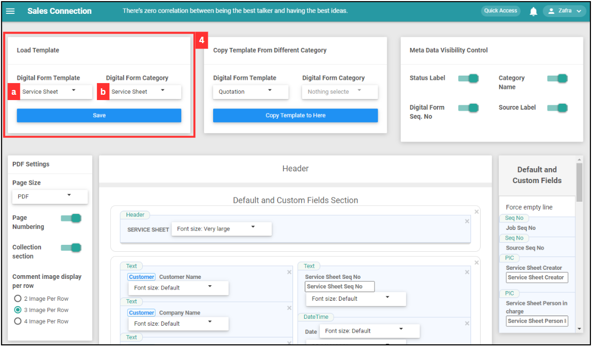
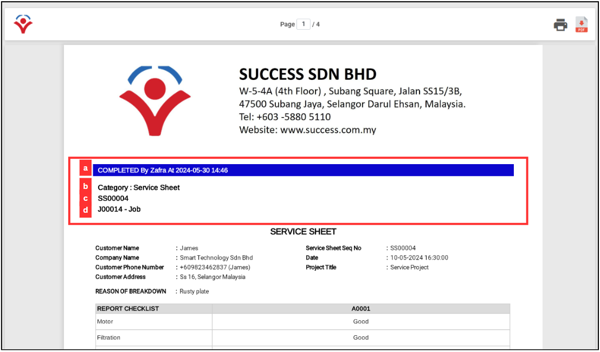

## How to Create PDF?
    
  1. At the desktop site's navigation bar, go to Template Settings > Digital Form Templates > PDF Template Customization. 
     **Create PDF Here:** [https://salesconnection.my/DigitalFormSetting/templatecustomisation](https://salesconnection.my/DigitalFormSetting/templatecustomisation) 
     
     

       
     

  2. Click on the "Digital Form Template" and "Digital Form Category" that needs to create PDF. 

     

       
     

  3. Click "OK" and the digital form has been selected. 

     

       
     

  
  4. "Load Template" is used to choose the digital form that needs to change PDF template settings. 

     **Section a:** Load Template 
     
     | Field Name | Description |
     |------------|-------------|
     | Digital Form Template | Select the type of digital form to load. |
     | Digital Form Category | Specify the category of the digital form. |
     
     

       
     

     
  5. "Meta Data Visibility Control" will show the details of the digital form on top of the PDF. 

     **Section b:** Meta Data Visibility Control

     | Field Name | Description |
     |------------|-------------|
     | Status Label | Define the status label for the digital form. |
     | Category Name | Define the category name for the digital form. |
     | Digital Form Seq. No | Specify the sequence number for the digital form. |
     | Source Label | Specify the source label |
     
     

       
     

     This section will be shown here in PDF and its position cannot be changed. 
     
     

       
     

  6. "PDF Settings" is represented as Section c. 

     **Section c:** PDF Settings
     
     | Field Name | Description |
     |------------|-------------|
     | Page Size| Select the size of the PDF (standard PDF or receipt size). |
     | Page Numbering | Choose whether to include page numbers. |
     | Collection Section | Decide if the collection section should be included. |
     | Comment Image Display per Row | Determine how many images should be displayed per row in the comment section. |

     

       
     

     This section will be shown here in PDF and its position cannot be changed. 
     
     

       
     

     
  8. Fill out the details of the new quotation. 

     **Section d:** Dynamic Header Name
     
     | Field Name | Description |
     |------------|-------------|
     | Product/Services | Specify the text for the product/services header. |
     | Asset | Specify the text for the asset header. |
     | Acknowledgement & Feedback | Specify the text for the acknowledgement & feedback header. |
     | Comment | Specify the text for the comment header. |

      **Section e:** Comment Section Control

     | Field Name | Description |
     |------------|-------------|
     | Timestamp | Toggle to include a timestamp in the comment section. |
     | Owner | Toggle to include the owner information in the comment section. |
     | Updates Force Pagebreak | Toggle to force a page break after updates in the comment section. |

      **Section f:** Header Title Visibility Control

     | Field Name | Description |
     |------------|-------------|
     | Product/Services | Toggle to show or hide the product/services header. |
     | Signature | Toggle to show or hide the signature header. |
     | Asset | Toggle to show or hide the asset header. |

      **Section g:** Default and Custom Fields

     All the digital form fields will be placed here. Drag and drop the elements to place them at the place you want to show in PDF.  

     

       
     

9. Click on the "Save" icon. 

     

       
     

10. Click "OK" to confirm the save change. 

   

       
     

11. Click "OK" and the new quotation has been added successfully. 

     

       
     

        

**Related Articles** 
- [How to Add New Customer?](Add_New_Customer.md)
- [How to Add New Project?](Add_New_Project.md)
- [How to Add New Job?](Add_New_Job.md)
- [How to Add New Asset?](How_to_Add_New_Asset.md)
- [How to Create Digital Form?](Create_Digital_Form.md)
