Version 1.0 
Created: 16 July 2024 
Updated: 16 July 2024 
## How to Create New Reminder Template and do Autopopulate Setting?

Reminders serve as a digital assistant for you and your team to keep track of your daily tasks, important projects, milestones and many more depending on how you and the team have configured it.  

**Navigate to the section by clicking it.** 

- [Create New Reminder Template](#section1) 
- [Autopopulate Setting](#section2)
   

## Create New Reminder Template

1. At the desktop site's navigation bar, go to Template Settings > Reminder Templates. 
   **Create Reminder Templates Here:** [https://salesconnection.my/reminder/templatev2](https://salesconnection.my/reminder/templatev2) 

   

     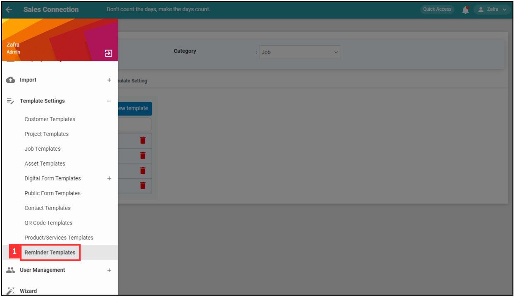
   

   *Note: You must have access to Template Settings menu to perform this action. Please request permission or help from your admin if you do not have access to the menu. 

2. Click on the Category section to expand.

   

     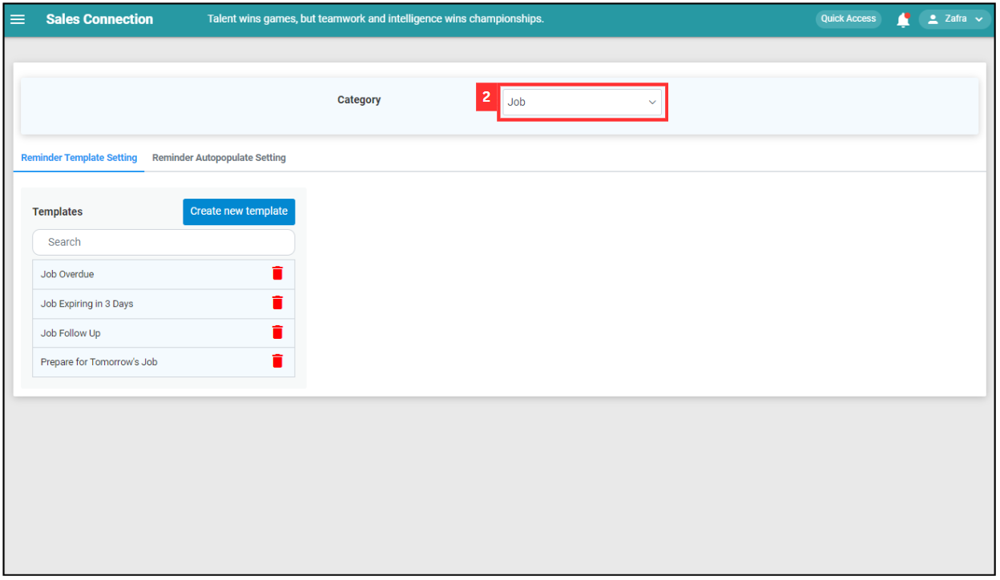
   

3. Select the category you want to create a new reminder for. 

   

     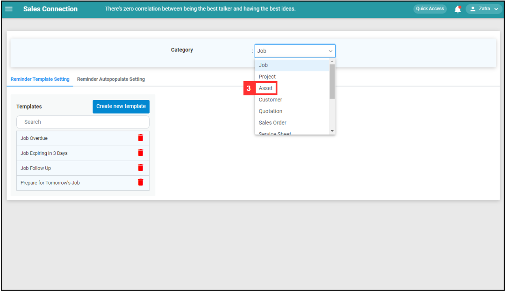
   

4. Click "Create new template". 

   

     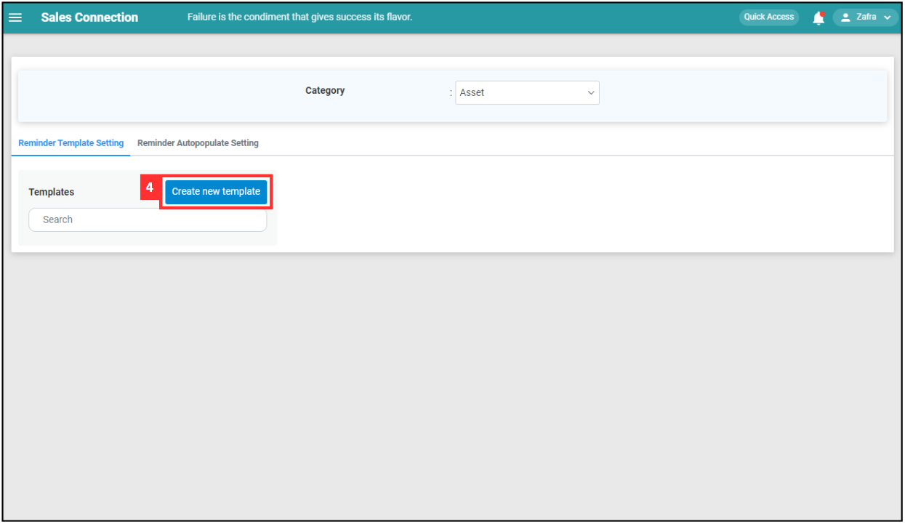
   

5. Enter the details for the reminder. 

   | Terms | Meaning |
   |-------|---------|
   | Template Name | Enter the name of the new reminder. |
   | Reminder Type | Choose whether the reminder is internal or external. *Note: External reminder may incur additional cost. Need to check with your consultant prior using it. |
   | Action Type | Choose the reminder notification type - push notification or email. |
   | Message Title | Write the message title to show on the notification. |
   | Message Content | Write the content about the reminder. |
   | Condition | Select the condition for the reminder. |
   | Internal Recipient | Internal Recipient = Choose the user type received. (Default recipient will include users assigned to the Job/Project/etc.) |

   

     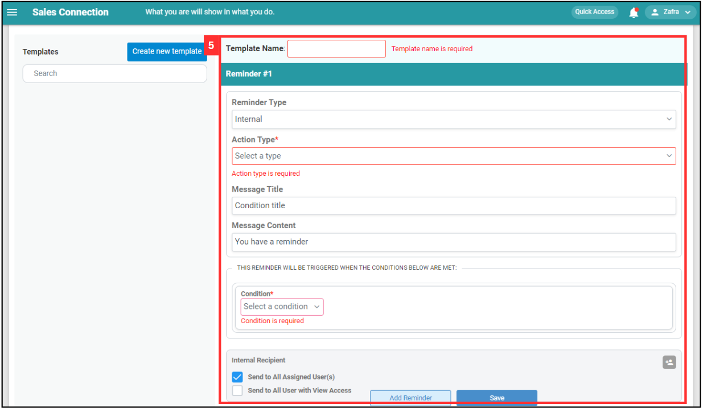
   

   *Note: External reminder may incur additional cost. Please check with your Sales Connection Consultant for further information. 

6. If you wish to add another reminder in the same template, click “Add Reminder” and repeat the previous steps. Otherwise, click “Save”. 

   

     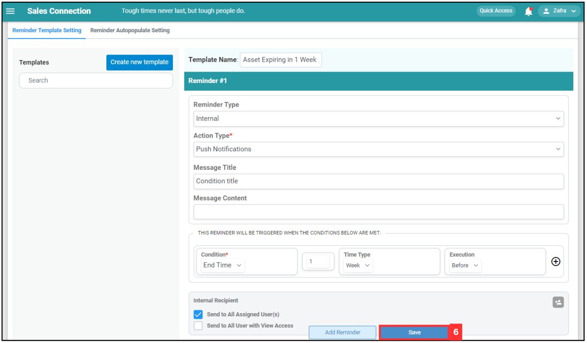
   

7. The reminder template is saved successfully once it appears on the list on your left. 

   

     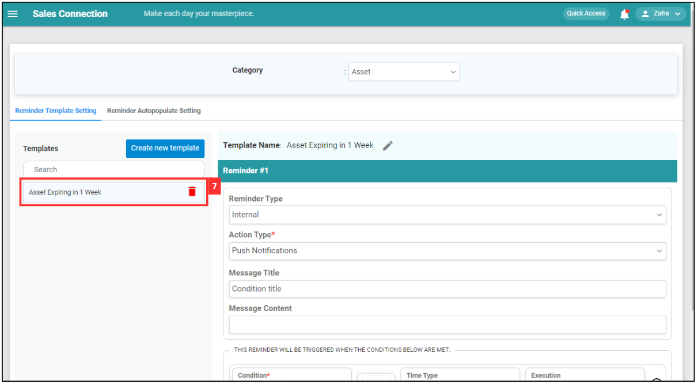
   

     

## Autopopulate Setting

1. Click "Reminder Autopopulate Setting". 

   

     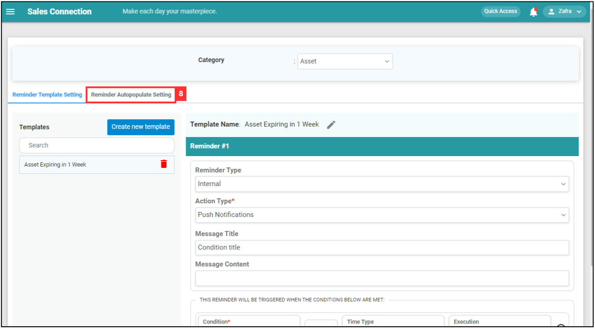
   

2. Select the category that you would like to include the reminder in. 

   

     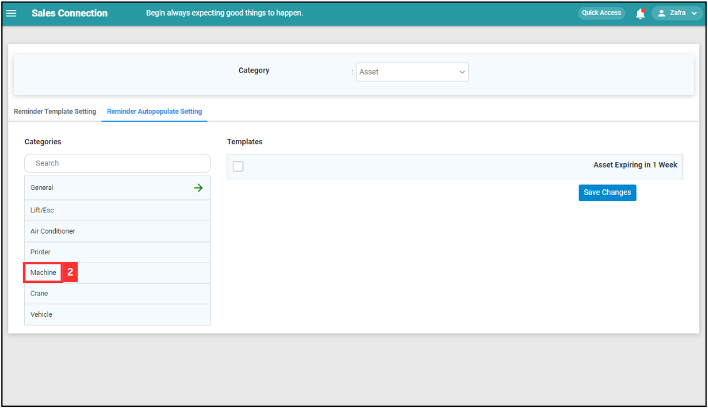
   

3. Tick the box to show the reminder in the category. 

   

    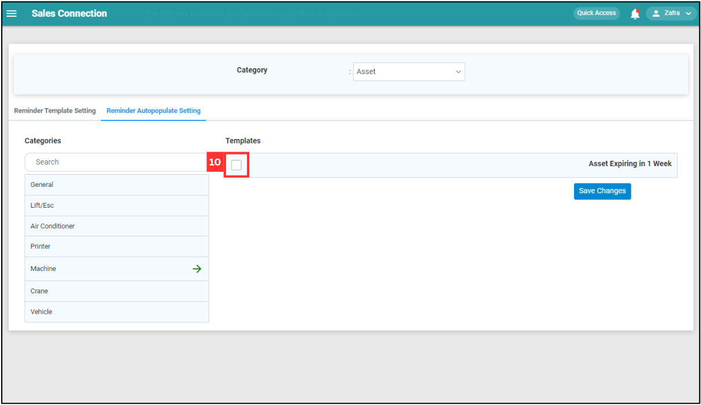
   

4. Click "Save Changes". 

   

    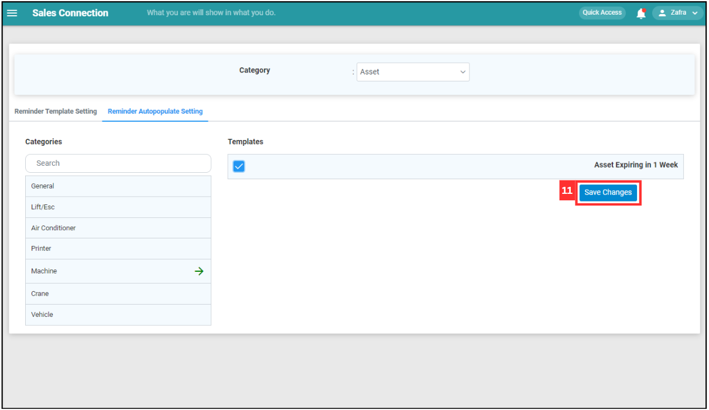
   

5. Click “Yes” and the reminder will be automatically populated into the category when a new Job of the same category is created. 

   

     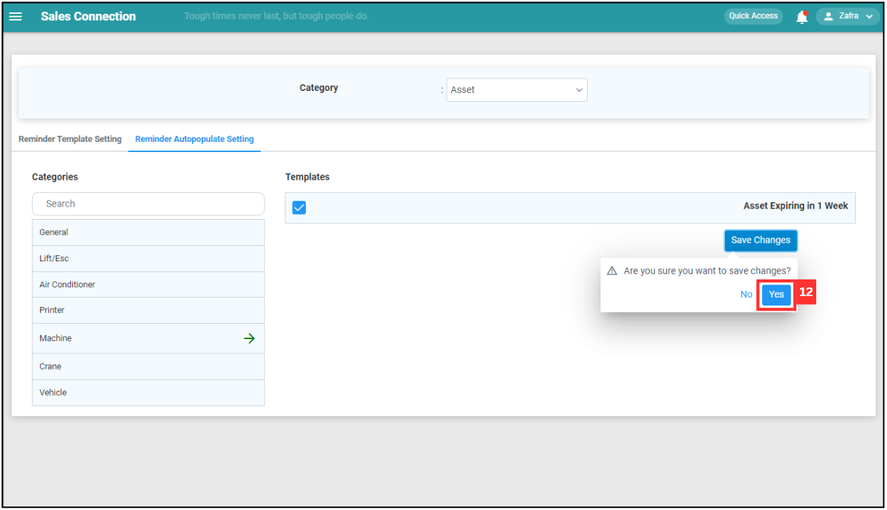
   

   

**Related Articles**
- [How to Edit Reminder Template?](Edit_Reminder_Template.md)

<!-- [Link Text](https://salesconnection.github.io/Sales-Connection-Support/Create_Reminder_Template.html) -->
