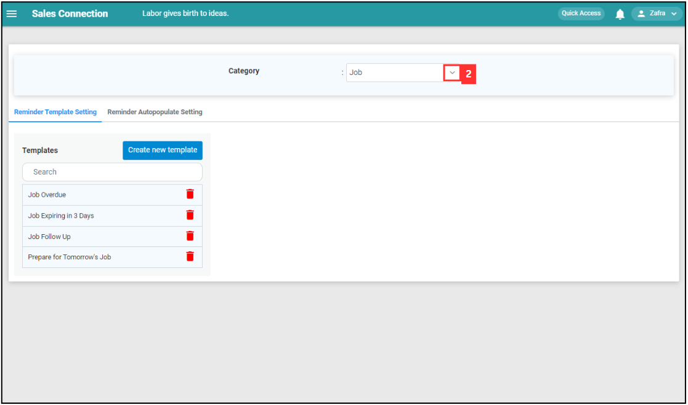
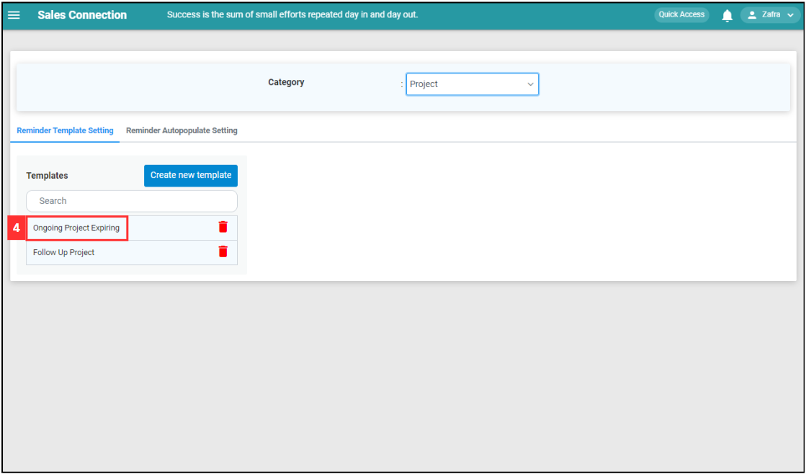
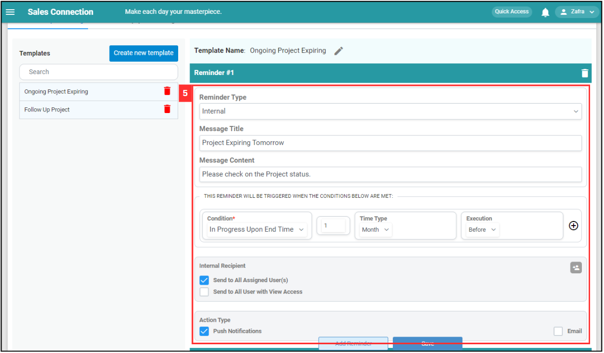
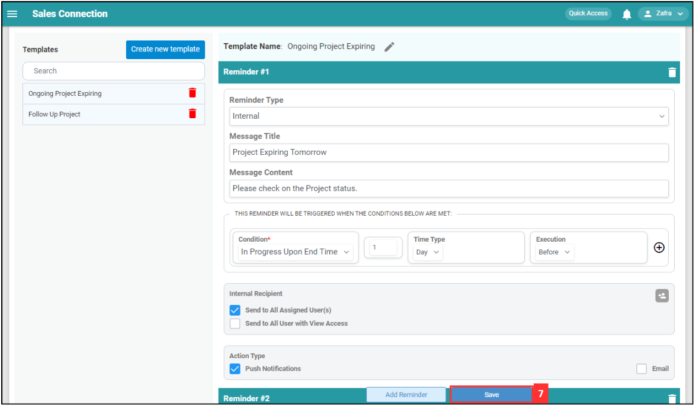

## How to Create New Reminder Template?
    
  1. At the desktop site's navigation bar, go to Template Settings > Reminder Templates. 
     **Create Reminder Templates Here:** [https://salesconnection.my/reminder/templatev2](https://salesconnection.my/reminder/templatev2) 

     

       
     

  2. Click on the expand button for categories. 

     

       
     

  3. Select the category you want to create a new reminder for. 

     

       
     

  4. Click "Create new template". 

     

       
     

  5. Enter the details for the reminder. 

     | Terms | Meaning |
     |-------|---------|
     | Template Name | Specifies the trigger for the reminder. |
     | Reminder Type | Represents a numeric value associated with the time type. |
     | Action Type | Specifies the unit of time for the numeric value entered in the second column. |
     | Message Title | Indicates whether the reminder is to be executed before or after the specified. |
     | Message Content | Specifies the trigger for the reminder. |
     | Condition | Represents a numeric value associated with the time type. |
     | Internal Recipient | Specifies the unit of time for the numeric value entered in the second column. |

     

       
     

  6. Click on the "Save" button after entering the details. 

     

       
     

  7. The new reminder has been saved when it showed here. 

     

       
     

  8. Click "Reminder Autopopulate Setting". 

     

       
     

  9. Click on the category you want to include the new reminder in. 

     

       
     

  10. Tick the box to show the reminder in the category. 

      

        
      

  11. Click "Save Changes". 

      

        
      

  12. Click "Yes" and the reminder will be shown in the category. 

      

        
      

   

**Related Articles**
- [How to Edit Reminder Template?](Edit_Reminder_Template.md)
