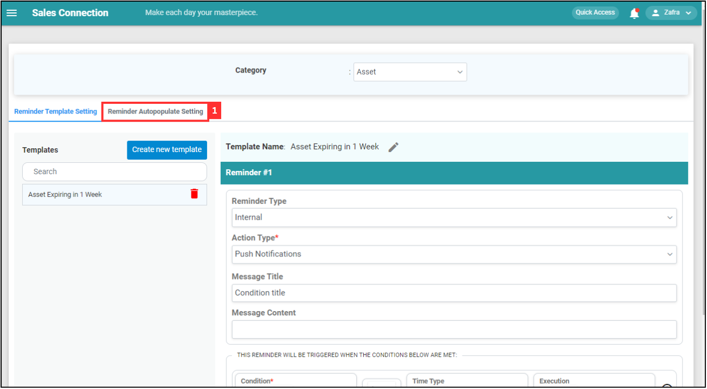
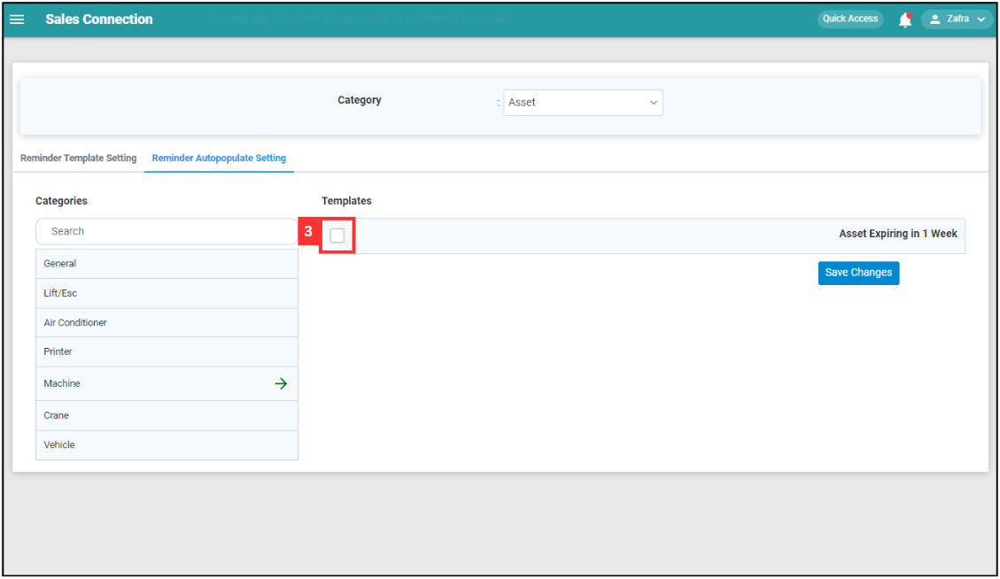
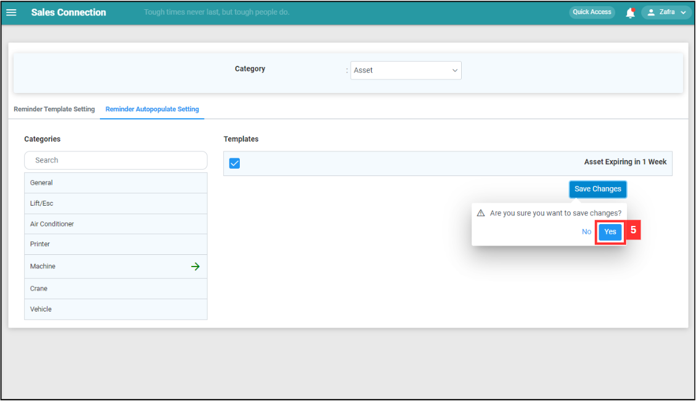

## How to Create New Reminder Template?
    
  1. At the desktop site's navigation bar, go to Template Settings > Reminder Templates. 
     **Create Reminder Templates Here:** [https://salesconnection.my/reminder/templatev2](https://salesconnection.my/reminder/templatev2) 

     

       
     

  2. Click on the expand button for categories. 

     

       
     

  3. Select the category you want to create a new reminder for. 

     

       
     

  4. Click "Create new template". 

     

       
     

  5. Enter the details for the reminder. 

     | Terms | Meaning |
     |-------|---------|
     | Template Name | Enter the name of the new reminder. |
     | Reminder Type | Choose whether the reminder is internal or external. |
     | Action Type | Choose the reminder notification type - push notification or email. |
     | Message Title | Write the message title to show on the notification. |
     | Message Content | Write the content about the reminder. |
     | Condition | Select the condition for the reminder. |
     | Internal Recipient | Choose the user type received. |

     

       
     

  6. Click on the "Save" button after entering the details. 

     

       
     

  7. The new reminder has been saved when it showed here. 

     

       
     

  8. Click "Reminder Autopopulate Setting". 

     

       
     

  9. Click on the category you want to include the new reminder in. 

     

       
     

  10. Tick the box to show the reminder in the category. 

      

       
      

  11. Click "Save Changes". 

      

       
      

  12. Click "Yes" and the reminder will be shown in the category. 

      

       
      

   

**Related Articles**
- [How to Edit Reminder Template?](Edit_Reminder_Template.md)
