Version 1.0 
Created: 9 July 2024 
Updated: 9 July 2024 
## How to Generate and Share QR Code for Public Form?

*Note: Provide a QR code for customers who prefer to submit service inquiries or tech support tickets via a form. This allows them to access and submit the form at their convenience.  

**Navigate to the section by clicking it.** 
- [Desktop Version](#section1) 
- [Mobile App Version](#section2)   

*Note: The tutorial below is based on Asset Page but all of these can be applied to other data level such as Customer, Project, Job, and Digital Form. 

  
   
### Generate QR Code For Asset - Desktop

1. For example, if you want to create a Public Form for an asset, go to Main Navigation > Business Management > Asset List. 
     **Open Asset List Page Here:** [https://salesconnection.my/asset-list](https://salesconnection.my/asset-list) 

   

     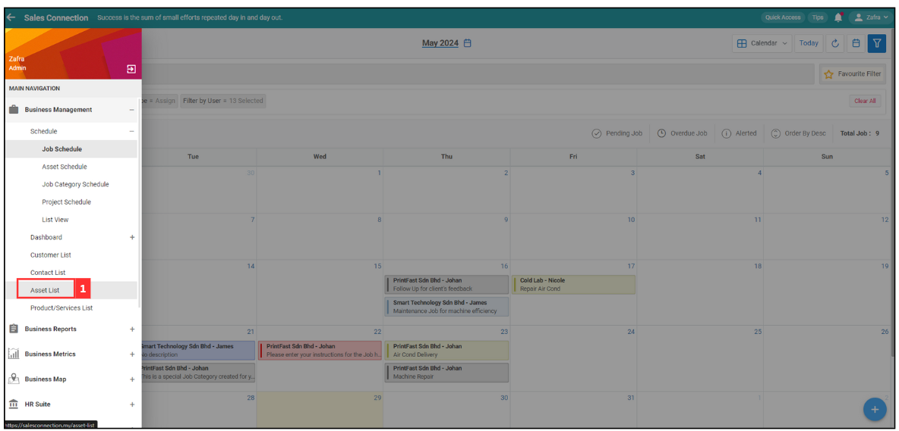
   

2. Choose the asset you want and click the expand button beside. 

   

     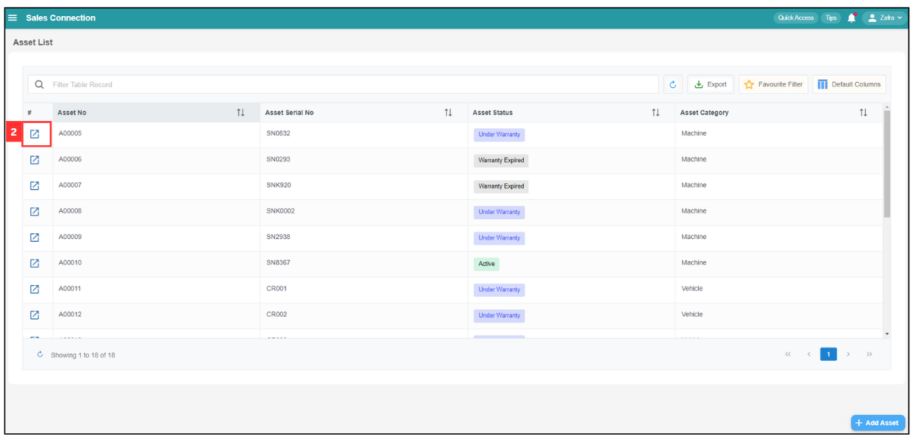      
   

3. At the top right corner of "Asset Details" page, click the ellipsis. 

   

     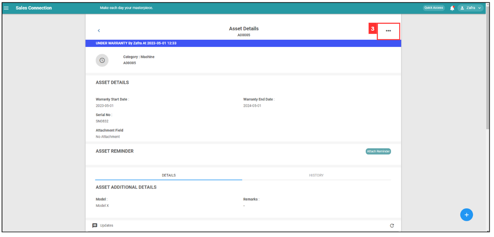
   

4. If the asset's QR code has not generated before, click "Generate QR". 

   

     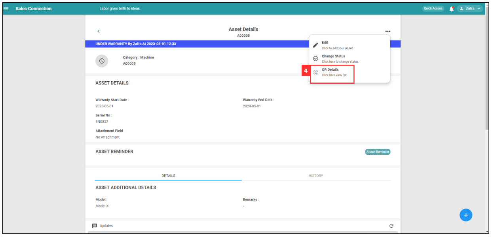
   

  *Note: If you don't see this option to generate a QR, please contact your admin to request for permission.  
5. The generated QR code will appear as the image below. 

   

     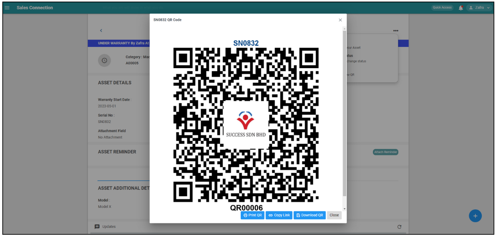
   
 

### Send Public Form to Customer - Desktop

- [Print QR](#section4) 
- [Copy Link](#section5) 
- [Download QR](#section6)   

**Print QR**

1. If you wish to print the QR code for the asset, click "Print QR". 

   

     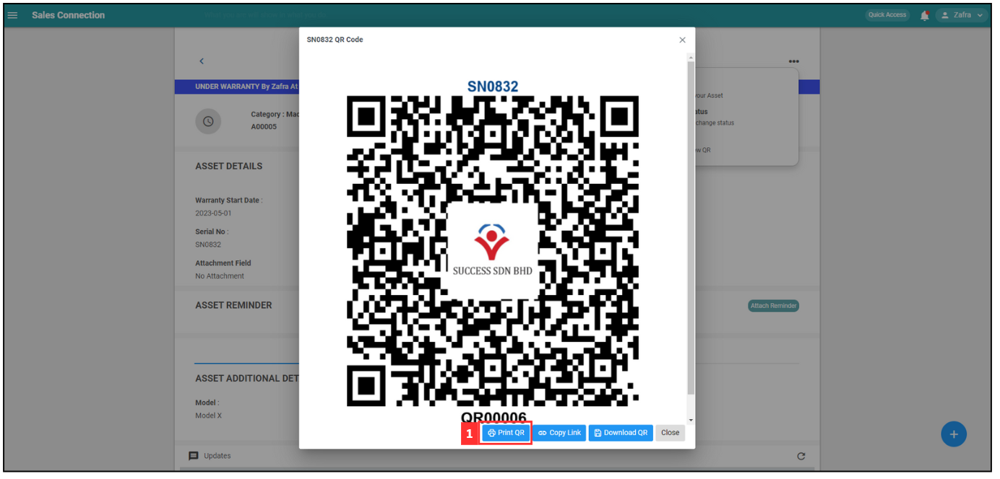
   
 
   
2. After done for the print setting, click on the "Print" button and the asset's QR code has been printed. 

   

     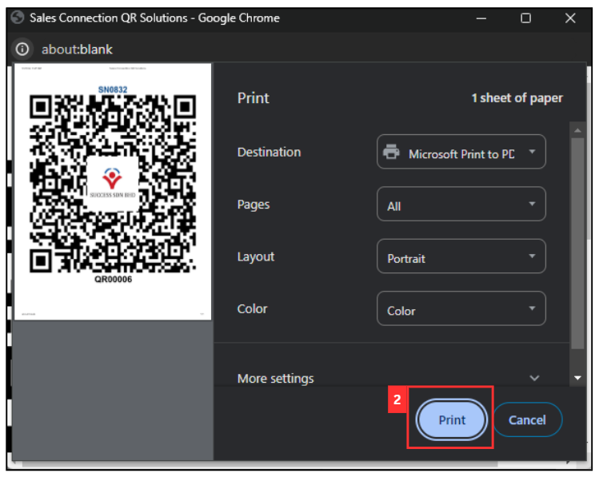
   

   *Note: To ensure optimal printing, you can use your own preferred printer hardware. 

3. Use the external QR code scanner to scan this QR code and the Public Form will show as the image below.

   

     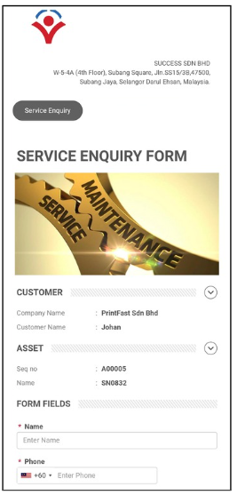
   
 

**Copy Link**

1. For example, if you wish to copy the link of the asset and send it to a customer using WhatsApp, click "Copy Link." 

   

     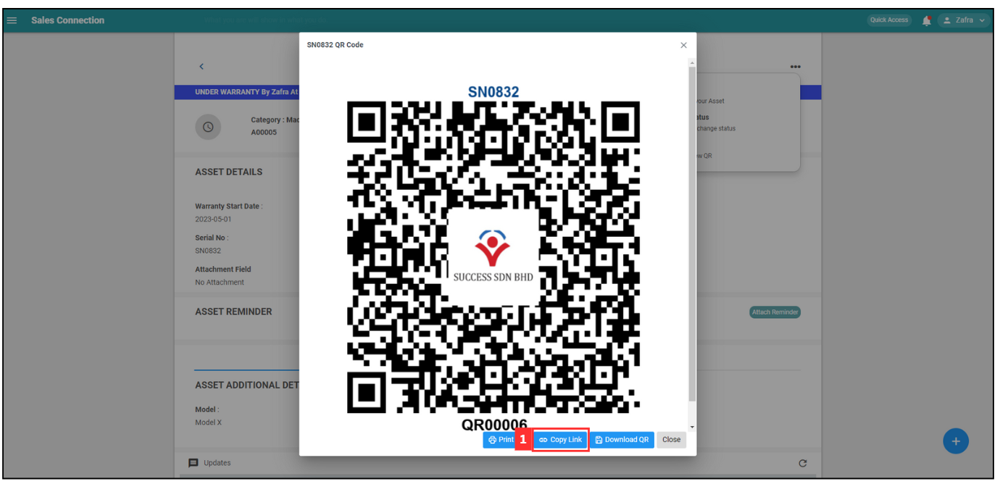
   
 
 
2. On the WhatsApp page, press Ctrl + V to paste the link. 

   

     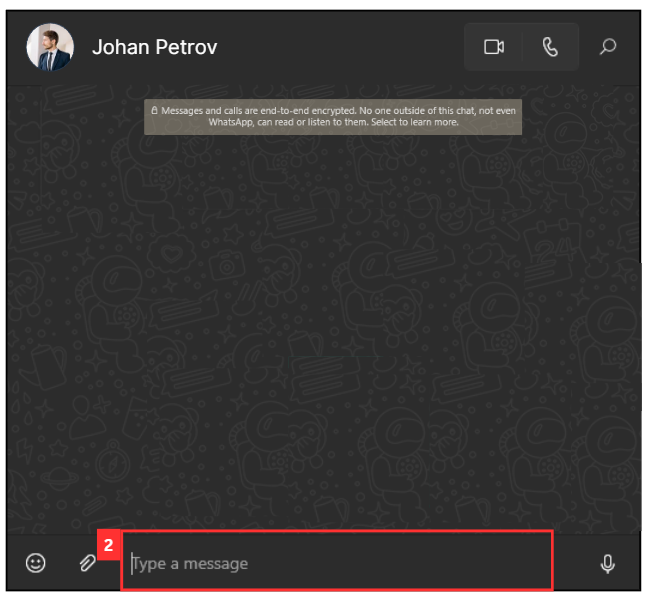
   
 

3. Click the send button to send the asset link to the customer. 

   

     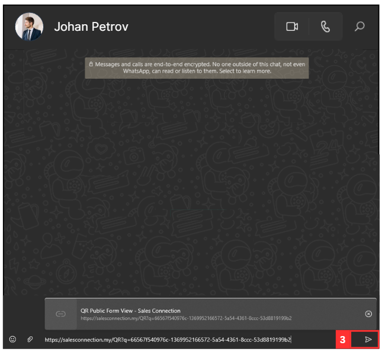
   
 

4. After you successfully send the link to the customer, it will appear as shown in the picture below. 

   

     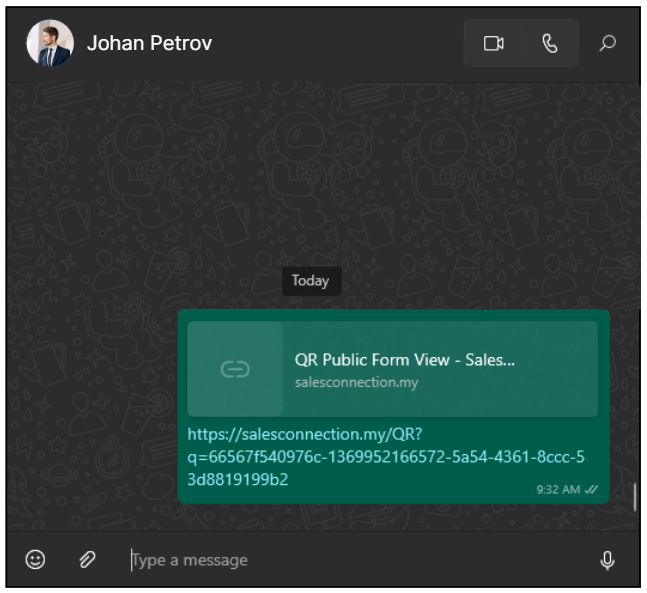
   

   *Note: Due to WhatsApp's policy, users must either save your contact or reply to you at least once before they can open your link. 

5. When the link is open, the Public Form will show as the image below.

   

     
   
 

**Download QR**

1. If you want to save the QR code in your desktop, click "Download QR". 

   

     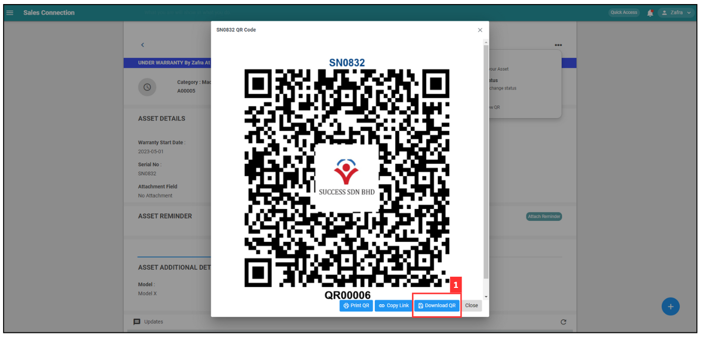
   
 
   
2. The QR code will appear at the top in your desktop's "File Explorer" > "Desktop" > "Downloads".

   

     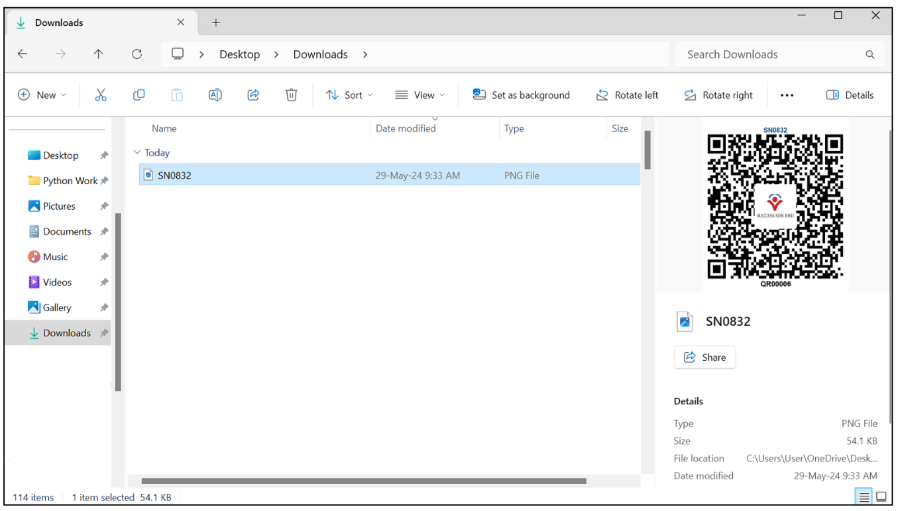
   

     

   

### Genarate QR Code For Asset - Mobile App

1. In Sales Connection Mobile App, click "Dashboard" page.

   

     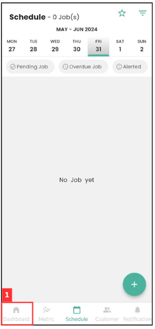
   
 
 
2. Click "Asset".
   
   

     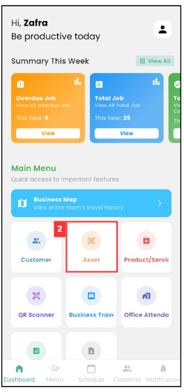
   
 

3. Click the asset that you want to generate QR code.

   

     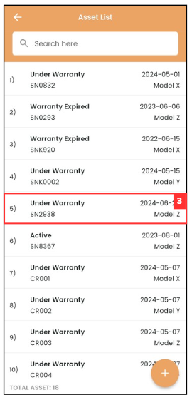
   
 

4. Click the three dots icon.

   

     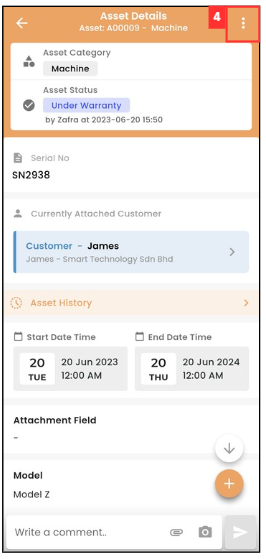
   
 

5. Click "Genarate QR Code" if you are the first time to generate a QR code for this asset.

   

     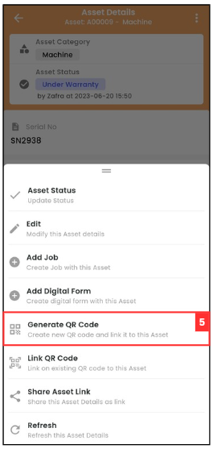
   

   *Note: If you don't see this option to generate a QR, please contact your admin to request for permission.  
6. Select the "Template" you want.  
   *Note: This template refers to the placement of the company logo in the center of the QR code.
   

     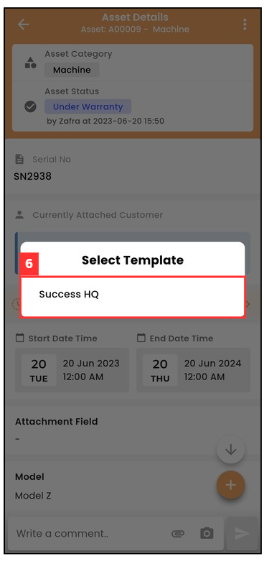
   
 

7. When you saw this "Success" prompt, means that the QR Code for this asset has been generated.

   

     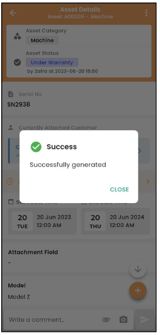
   
 

### Send Asset Link to Customer - Mobile App

1. Click the three dots icon.

    

     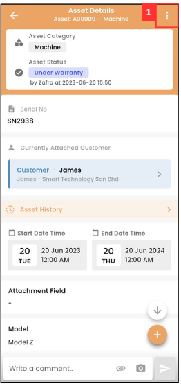
   
 

2. Click "Share Asset Link".

   

     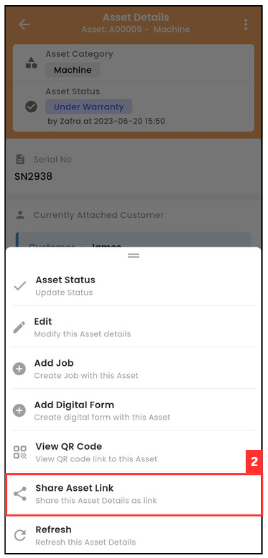
   
 

3. Click "Share Link by Whatsapp".

   

     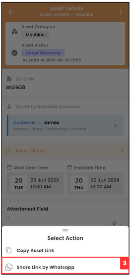
   
 

4. Select the customer that you want to send the asset link to.

   

     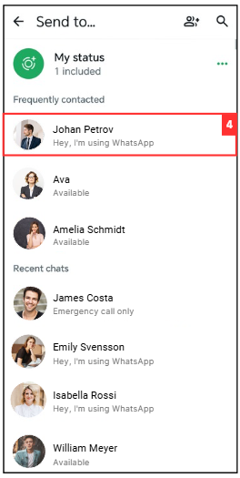
   
 

5. Click the forward message button.

   

     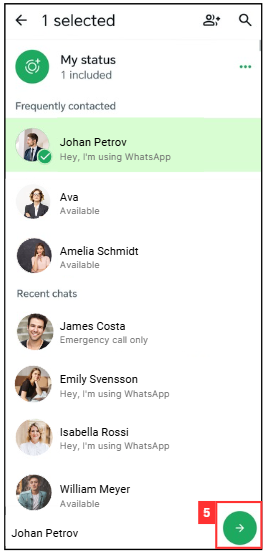
   
 

6. Click the send button to send the asset link to customer.

   

     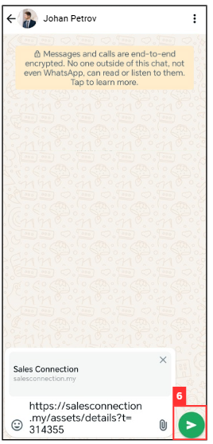
   
 

7. The asset link has been sent successfully to your customer as image shown below.

   

     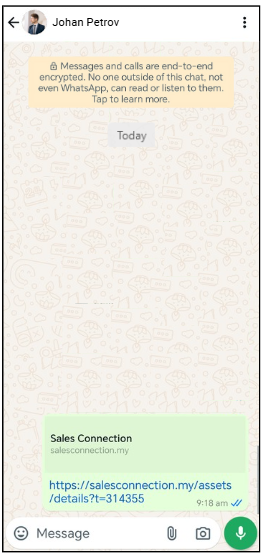
   
 

8. When the link is open, the Public Form will show as the image below.

   

     
   

   

**Related Articles**
- [How to Create Digital Form?](Create_Digital_Form.md)

<!-- [Link Text](https://salesconnection.github.io/Sales-Connection-Support/Creation_of_Public_Form.html) -->
