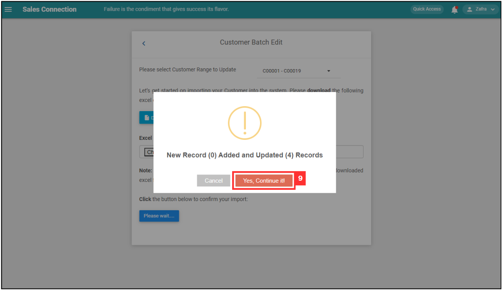

Version 1.0 
Created: 11 July 2024 
Updated: 11 July 2024 
## How to do Customer/Project/Product/Services/UOM Bulk Update?

*Note: This guide for Bulk Update is to batch edit existing data in the system. To import new data, please refer to the related articles attached at the bottom of the page. 
  
  1. If you want to do bulk update for customer, at the desktop site's navigation bar, go to Import > Customer Bulk Update. 
     **Do Customer Bulk Update Here:** [https://salesconnection.my/customerbulkimport](https://salesconnection.my/customerbulkimport) 
     **Do Project Bulk Update Here:** [https://salesconnection.my/dealbulkimport](https://salesconnection.my/dealbulkimport) 
     **Do Product/Services Bulk Update Here:** [https://salesconnection.my/productbulkimport](https://salesconnection.my/productbulkimport) 
     **Do UOM Bulk Update Here:** [https://salesconnection.my/uomimport/uomedit](https://salesconnection.my/uomimport/uomedit) 

     

       
     

  2. Select the customer range to update. 

     

       
     

  3. Click "Download Customer excel data". 

     

       
     

  
  4. Update the customer details. 
     a. The details include: 
        - Customer Name 
        - Company Name 
        - Phone 
        - Email 
        - Address 
        - Assign - Which user is assigned to this [Customer] 
        - View - Which user can view this [Customer] 
        - Category - If blank, default category (First in the list will be selected) 
        - Status - If blank, default status (First in the list will be selected) 
        - Depart assign - Which Department is assigned to this [Customer] 
        - Depart view - Which Department can view this [Customer] 
    
     

       
     

     
  5. Make sure all the updated information of the customers is correct and save the file. 

     

       
     

  6. Go back to the customer bulk update page and choose the correct file by clicking "Choose File" to import. 

     

       
     

  7. Make sure the file uploaded is correct. 

     

       
     

  8. Click on the "SUBMIT" button. 

     

       
     

  9. Click "Yes" to confirm the action. 

     

       
     

  10. Click "OK" and the customer details have been updated successfully. 

      

       
      

     

**Related Articles** 
- [How do I Import New Customer(s)?](Import_Customer.md)
- [How do I Import New Project(s)?](Import_Project.md)
- [How do I Import New Product/Services(s)?](Import_Product_Services.md)
- [How do I Import New Asset(s)?](Import_Asset.md)
- [How do I Import New UOM(s)?](Import_UOM.md)
- [How do I Import New User(s)?](Import_User.md)
- [How do I Import New Contact(s)?](Import_Contact.md)
- [How to do Asset Bulk Update?](Asset_Bulk_Update.md)

<!-- [Link Text](https://salesconnection.github.io/Sales-Connection-Support/Customer_Bulk_Update.html) -->
