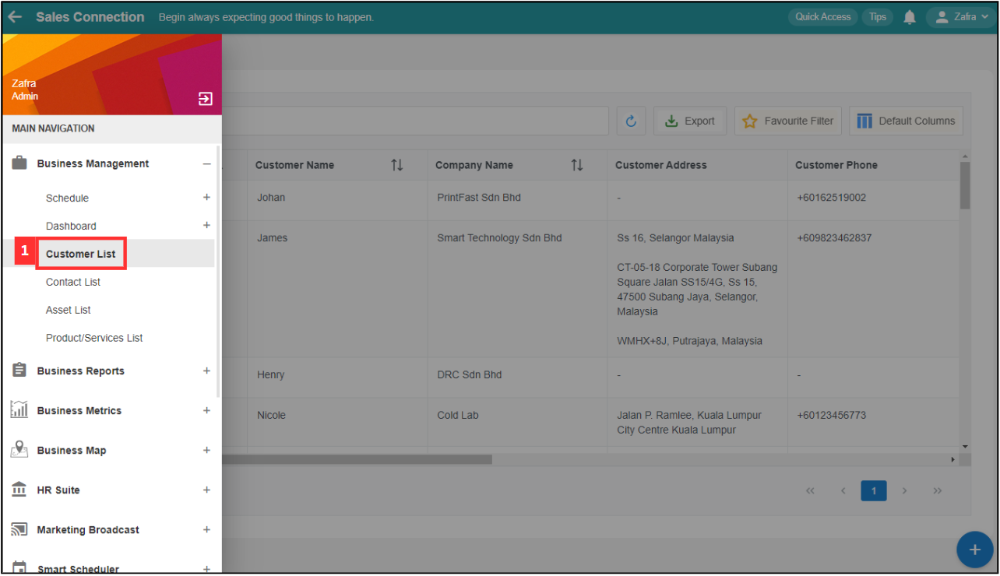
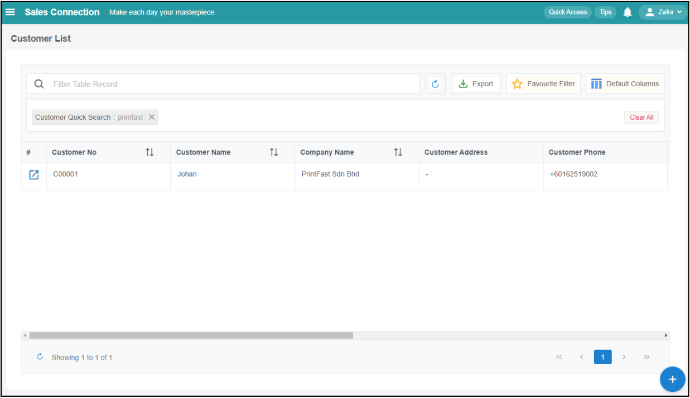
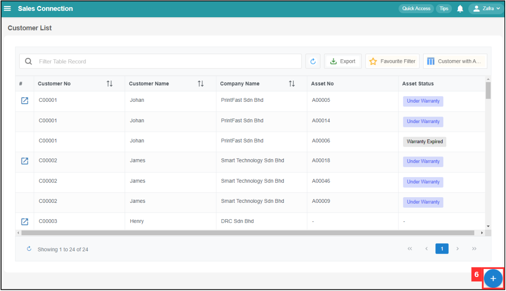
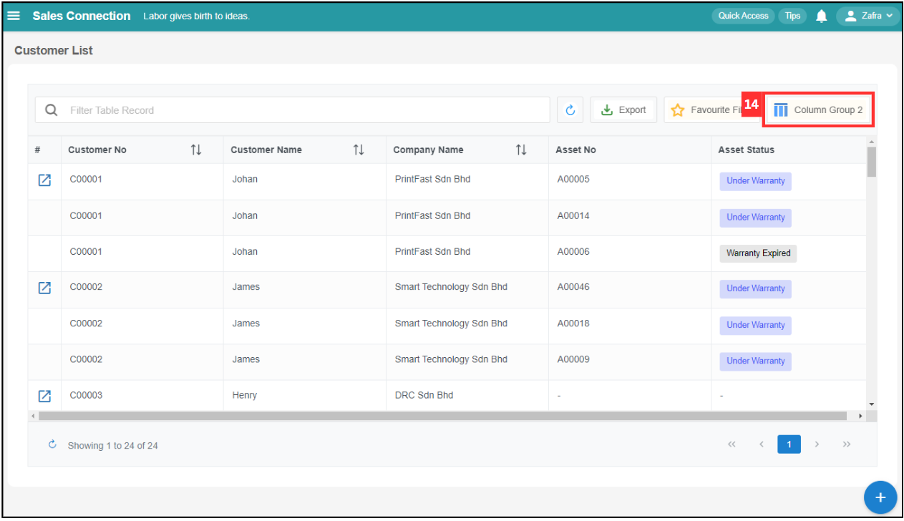
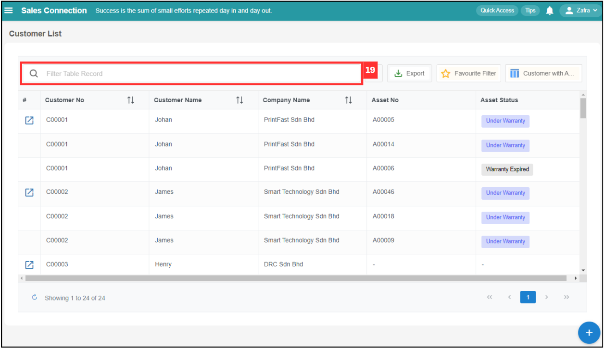
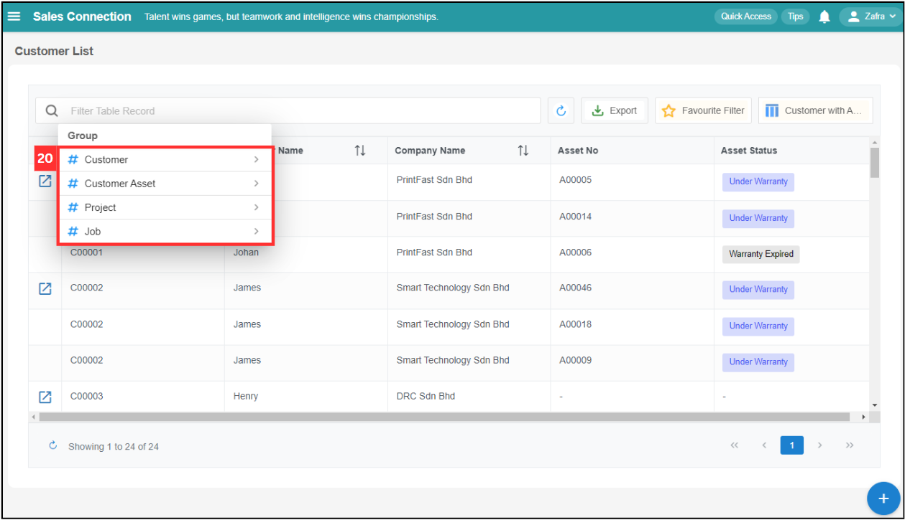
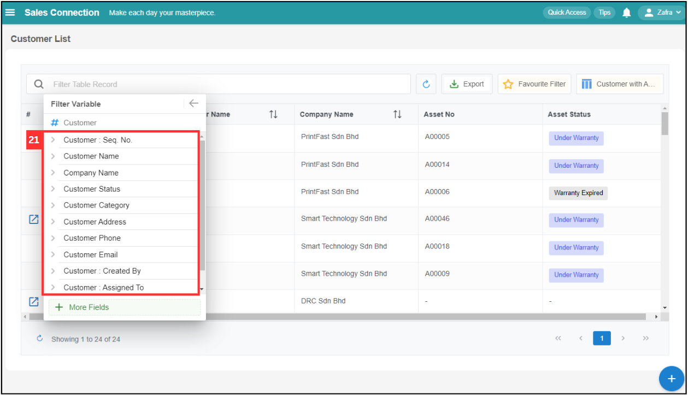
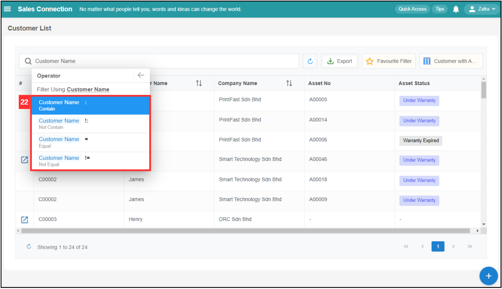
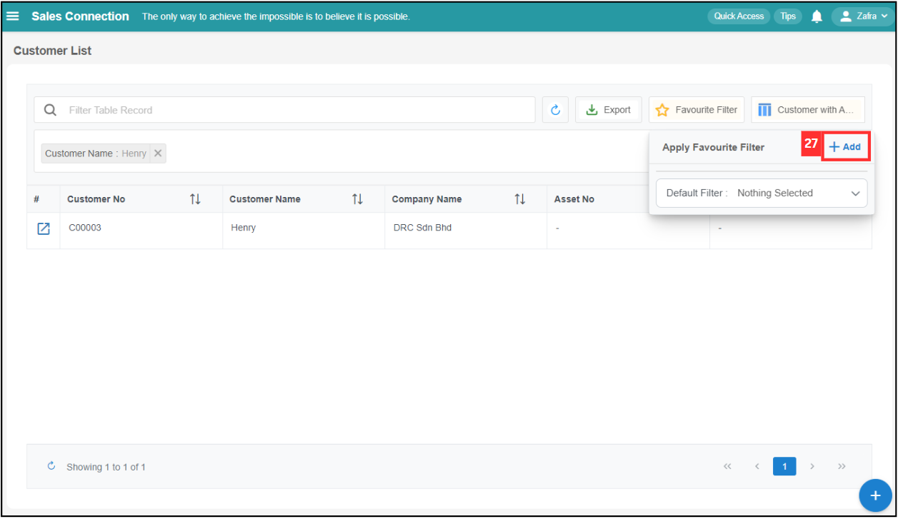
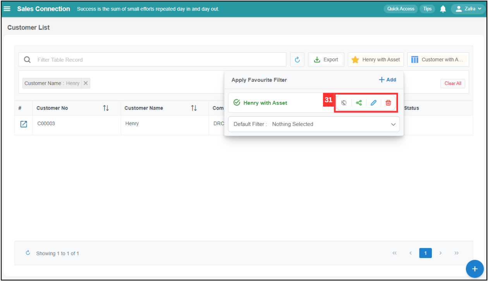

## Customer List

**Customer List** displays detailed information about all customers, including sequence numbers, names, company affiliations, addresses, and phone numbers. It allows users to manage and access customer data efficiently.  

**Navigate to the section by clicking it.** 

- [Default Columns](#section1) 
- [Filter](#section2) 
- [Favourite Filter](#section3) 
- [Export](#section4) 
- [Refresh](#section5) 
- [Add New Customer](#section6)
   

1. At the desktop's navigation bar, go to Business Management > Customer List.

   

     
   

     

   

   ### Default Columns

2. Click "Default Columns".

   

     
   

3. Click "+ Create".

   

     
   

4. Select the columns you want to display.

   

     
   

5. Click to scroll down.

   

     
   

6. Tick "Asset Split" if you want to display the asset separately.

   

     
   

7. Click "Save".

   

     
   

8. Click "Column Group 2".

   

     
   

9. Click the "pencil" icon to edit the default column's name.

   

     
   

10. Enter the name of the default column.

   

     
   

11. Click the "tick" icon to save the name.

   

     
   

12. The "Default Column" has been saved successfully.

   

     
   

     

   

   ### Filter

13. Click "Filter Table Record" to filter the customer.

   

     
   

14. Select the filter group you want.

   

     
   

15. Select the filter variable.

   

     
   

16. Select the operator you want to apply.

    | Operator | Definition | 
    |---------|:-----|
    | Contain | The result will show all relevant results based on the filter values. (Not consider capital letter and small letter, recommend to use it if you are not remember the exact customer name.) |
    | Not Contain | The results will show all relevant results except the selected filter values. (Not consider capital letter and small letter.)| 
    | Equal | The results will only show exact the same based on the filter value (Consider capital letter and small letter, recommend to use it if you remember the exact customer name.)| 
    | Not Equal | The results will only show except the exact filter value. (Consider capital letter and small letter.) |

   

     
   

17. For example, enter the customer name to filter.

   

     
   

18. After typing the value, press "Enter".

   

     
   

19. The result will be shown as below.

   

     
   

     

   

   ### Favourite Filter
   
20. Click "Favourite Filter" if you want to add a favourite filter.

   

     
   

21. Click "+ Add".

   

     
   

22. Enter the name of the favourite filter.

   

     
   

23. Click on the "Save" button and the favourite filter has been saved successfully.

   

     
   

24. Click "Favourite Filter".

   

     
   

25. Click on the icon beside the favourite filter to have more actions.

    | Icon | Description |
    |------|-------------|
    | Global |  |
    | Share |  |
    | Edit |  |
    | Delete |  |

   

     
   

26. Click "Default Filter" if you want to set a default filter.

   

     
   

27. Select the favourite filter you want to set as the default filter.

   

     
   

28. Default filter has been set successfully and it will apply automatically when you enter this page.

   

     
   

29. Click "Clear All" if you want to clear all the filter applied.

   

     
   

     

   

   ### Export
   
30. Click "Export" button if you want to export the customer list.

   

     
   

31. Select the export options to export the customer list.

   

     
   

     

   

   ### Refresh
   
32. Click on the "Refresh" button to get the latest information.

   

     
   

     

   

   ### Add New Customer
   
33. Click on the "+" button to add a new customer.

   

     
   

   

**Related Articles**
- [Update Report Page](Report_Update_Page.md)
- [How to Filter Job by Date Range?](Job_Filter_by_Date_Range.md)
- [How to Set Customized Favourite Filter as Default - Desktop ](Default_Favourite_Filter.md)
- [How to Set Customized Favourite Filter as Default - App ](Default_Favourite_Filter_App.md)
- [How to Set Up the Column View in the Report Page?](How_to_Set_Up_the_Column_View_in_the_Report_Page.md)
- [How to Use Update Report Filter?](Job_Update_Report_Filter.md)
- [How to Pull Out Job/Project/Form Report?](Export_Report.md)
