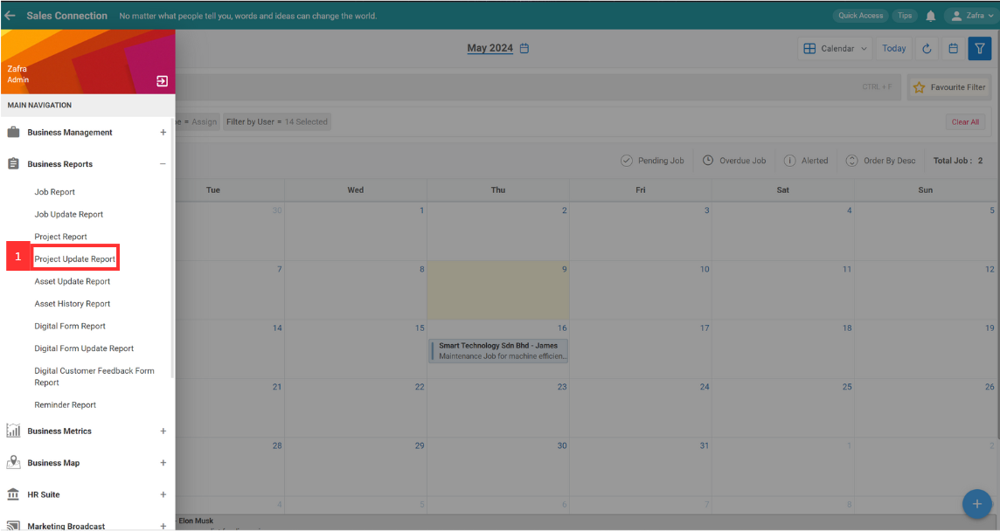
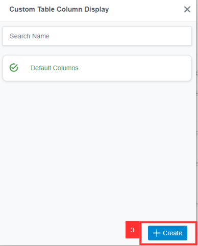
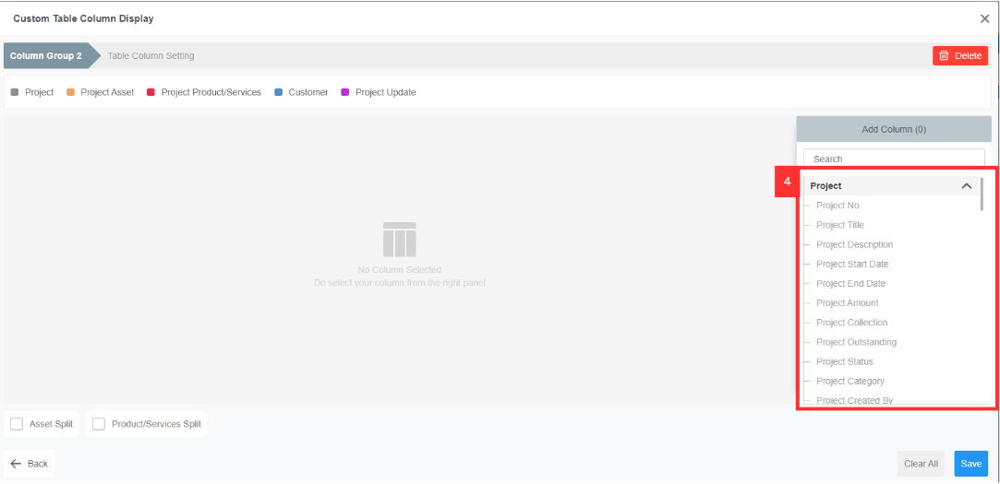

## ❤ How to set customized favourite filter in Report Pages?

**Desktop site:** 

1. In the "Main Navigation", under the "Business Reports", select "Project Update Report". 
   **Add Favourite Filters in Project Update Report here:** [https://salesconnection.my/reports/deal-update](https://salesconnection.my/reports/deal-update)

   

     
   
 

2. Click the "Default Columns".

   

     
   
 

3. Click the "Create" button to create a new custom table column display.

   

     
   
 

4. You can select the column based on your own preference.

   

    
   
 

5. Click "Save" to save the custom column display that you want.
   
   

     
   
 

6. This is the output.
   
   

     
   
 

7. To save this favourite Filter, click "Favourite Filter".

   

     
   
 

8. Click the "+Add" button.

   

     
   
 

9. Enter the name for this customized favourite filter.

   

     
   
 

10. Click "Save" to save this favourite filter.

    

      
    
 

