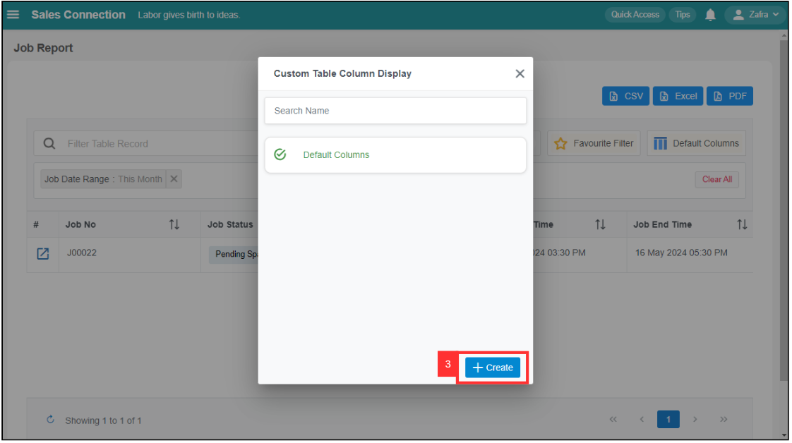
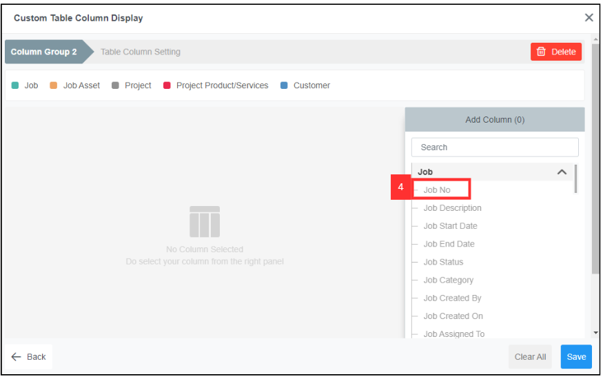
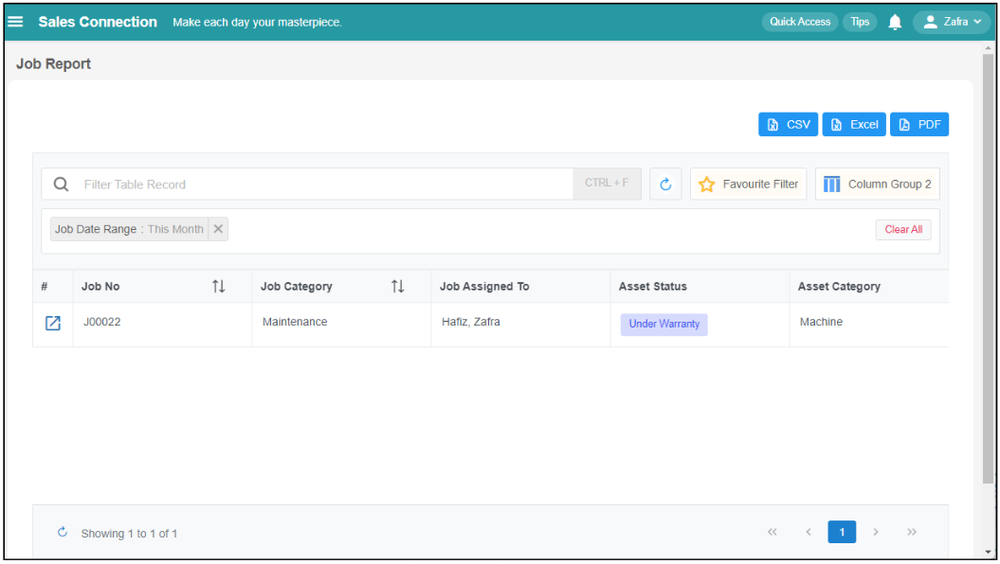
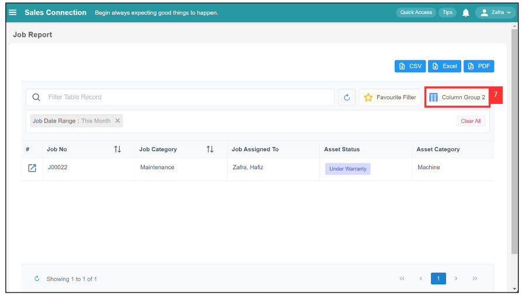

## ❤ How to Set Customized Favourite Filter in Report Pages?

**Desktop site:** 

1. In the "Main Navigation", under the "Business Reports", select "Job Report". 
   **Add Favourite Filters in Report here:** [https://salesconnection.my/reports/activity](https://salesconnection.my/reports/activity)

   

     
   
 

2. Click the "Default Columns".

   

     
   
 

3. Click the "Create" button to create a new custom table column display.

   

     
   
 

4. You can select the column based on your own preference.

   

    
   
 

5. Click "Save" to save the custom column display that you want.
   
   

     
   
 

6. This is the result.
   
   

     
   
 

7. You can click the "Column Group 2" button if you want to choose others custom table column display.

   

     
   
 

8. Choose the Custom Table Column Display based on your own preference.

   

     
   
 

9. The results will then be shown.

   

     
   
 

   

**Related Articles** 
- [How to Search Job Using Date Range?](Job_Filter_by_Date_Range.md)
- [How to Set Customized Favourite Filter as Default - Desktop ](Default_Favourite_Filter.md)
- [How to Set Customized Favourite Filter as Default - App ](Default_Favourite_Filter_App.md)
- [How to Use Update Report Filter?](Job_Update_Report_Filter.md)
