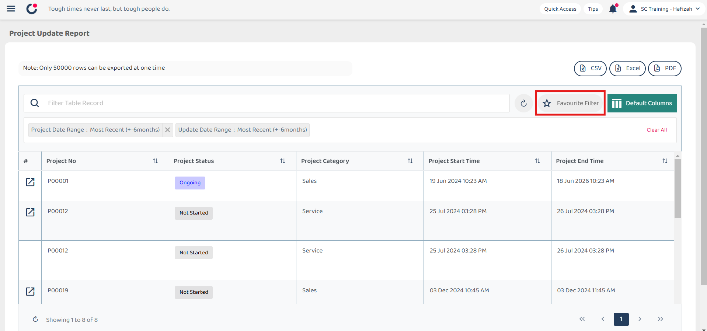
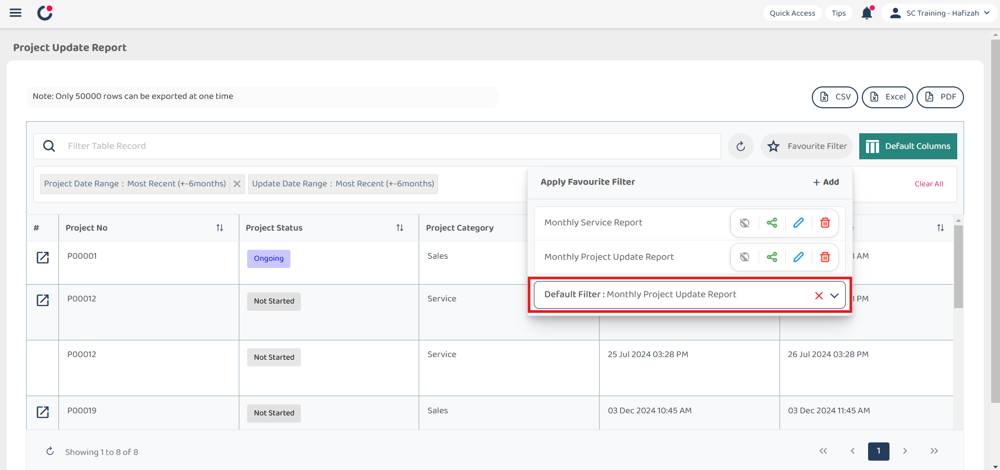

Version 1.0 
Created: 23 May 2024 
Updated: 23 May 2024 
## ❤ How to Set Customized Favourite Filter as Default - Desktop

*When to use this? Favorite filter is to simplify the process so that you don’t have to click the filters repetitively. 

**Desktop Version:** 

1. For example, if you want to set a favourite filter as default in "Project Update Report". First step, you need to click "Favourite Filter".

   

     
   
 

2. Click the expand button.

   

     
   
 

3. From this dropdown list, you can select which filter you want use and apply it as the default filter. 

   

     
   
 

4. Once you’ve clicked on the filter and it shows like the image below, you’ve successfully set it as your default filter.

   

     
   
 

6. When you log in the next time, it will automatically show you the results applying the default filter you’ve selected.

   

     
   

   

**Related Articles** 
- [How to Search Job Using Date Range?](Job_Filter_by_Date_Range.md)
- [How to Set Customized Favourite Filter as Default - App ](Default_Favourite_Filter_App.md)
- [How to Set Up the Column View in the Report Page?](How_to_Set_Up_the_Column_View_in_the_Report_Page.md)
- [How to Use Update Report Filter?](Job_Update_Report_Filter.md)

<!-- [Link Text](https://salesconnection.github.io/Sales-Connection-Support/Default_Favourite_Filter.html) -->
