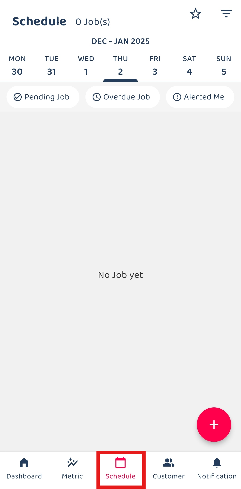
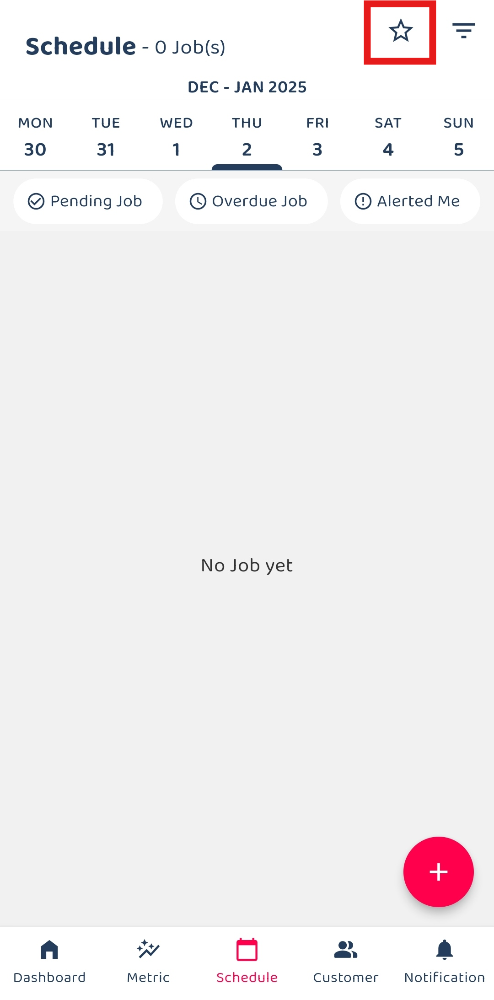

Version 1.0 
Created: 23 May 2024 
Updated: 23 May 2024 
## ⭐ How to Set Customized Favourite Filter as Default - App

1. For example, if you want to set a favourite filter for Job Schedule. Click "Schedule".

   

     
   

2. Click the star icon.

   

     
   

   
3. Click and hold on the item that you want to set it as default.

   

     
   

4. The favourite filter has been save as default.

   

     
   

   
5. Here's the result.

   

     
   

   

**Related Articles** 
- [How to Search Job Using Date Range?](Job_Filter_by_Date_Range.md)
- [How to Set Customized Favourite Filter as Default - Desktop ](Default_Favourite_Filter.md)
- [How to Set Up the Column View in the Report Page?](How_to_Set_Up_the_Column_View_in_the_Report_Page.md)
- [How to Use Update Report Filter?](Job_Update_Report_Filter.md)
  
<!-- [Link Text](https://salesconnection.github.io/Sales-Connection-Support/Default_Favourite_Filter_App.html) -->
