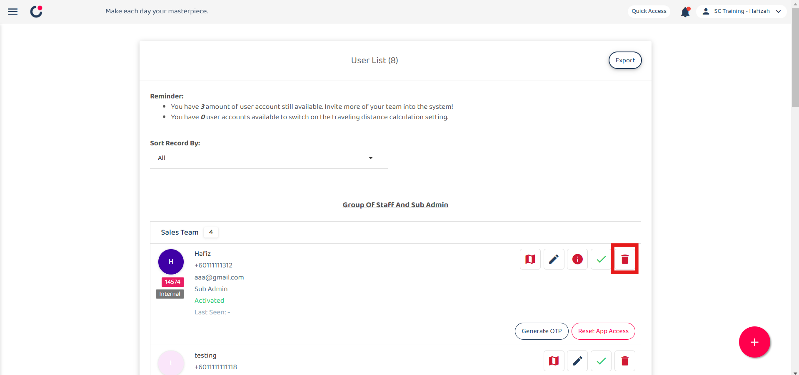
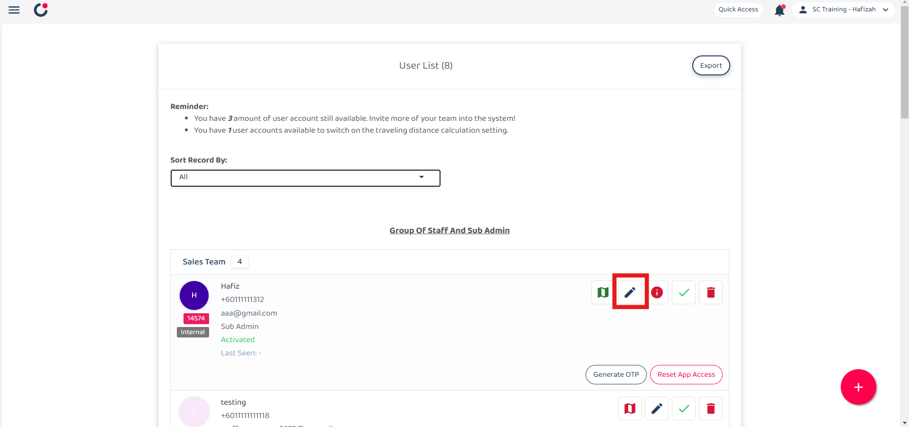
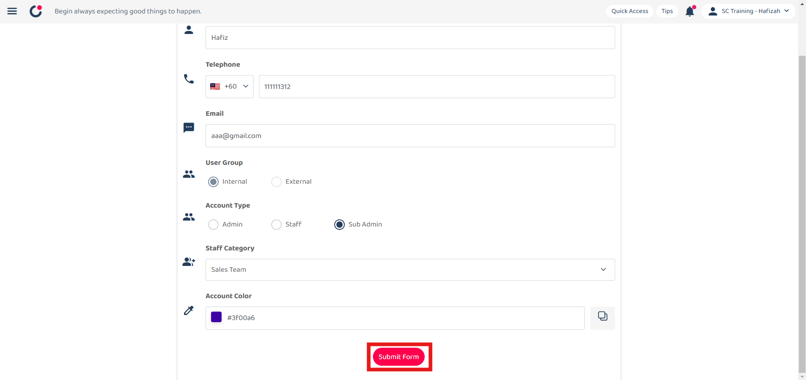

Version 1.0 
Created: 24 May 2024 
Updated: 24 May 2024 
## How Do I Delete/Deactivate a Resigned User or Change to a New User?

**Differences between delete, deactivate and change user**

|   |  Delete   |   Deactivate   |   Change   |
|-------|----------|----------------|------------|
| User can access the system. | No | No | Yes |
| Data will remain in the system. | No | Yes | Yes |
| The users’ jobs can be traced in the schedule and metrics overview pages. | No | Yes | Yes |

  

**Navigate to the section by clicking it.** 

- [Deactivate a Resigned User?](#section1) 
- [Delete a Resigned User?](#section2) 
- [Change to a New User?](#section3)
   

## Deactivate a Resigned User
### What happens when a user is deactivated?
- The user can't login to the system. 
- The user's data will still stay in the system (e.g. Assigned to/ Creator column, job schedule, metrics, etc.) 
- A deactivated user account is not counted as one.  

### How to deactivate a user?
1. Go to desktop site navigation bar > User Management > User List. 
   **Open User List Page Here:** [https://salesconnection.my/usermanage/userlist](https://salesconnection.my/usermanage/userlist) 
   *Note: Only certain admins can deactivate users. 

   

      
   

   
3. Navigate to the user you want to deactivate. 

   

      
   

4. Click on the "Green Tick" icon to deactivate the user. 

   

      
   

5. Click "Yes" to confirm your deactivation. 

   

      
   

6. Click "OK" and the user has been deactivated successfully. 

   

      
   

    

## ⚠ Delete a Resigned User
### What happens when a user is deleted from the system?
- The user can't login to the system. 
- The user is removed from all the tasks they were assigned to or created. 
- The users’ jobs won't appear in the schedule and metrics overview pages. 
*Note: All updates, comments, and check-ins/outs by the deleted user will stay in the system.  

### How to delete a user?
1. Go to desktop site navigation bar > User Management > User List. 
   **Open User List Page Here:** [https://salesconnection.my/usermanage/userlist](https://salesconnection.my/usermanage/userlist) 
   *Note: Only certain admins can delete users. 

   

      
   

2. Navigate to the user you want to delete. 

   

      
   

3. Click on the "Red Bin" icon to delete the user. 

   

      
   

4. Click "Yes" to confirm your deletion. 

   

      
   

5. Click "OK" and the user has been deleted successfully. 

   

      
   

 

## ⚠ Change to a New User
### What happens if I replace a resigned user with a new user in the system?
- The resigned user will no longer have the system access. 
- The new user will have all items previously assigned to or created by the resigned user. 
- **All historical data** of the resigned user will be **overwritten** by the new user (e.g. Assigned to/ Creator columns, job schedule, metrics, etc.)  

### How to change to a new user?
1. Go to desktop site navigation bar > User Management > User List. 
   **Open User List Page Here:** [https://salesconnection.my/usermanage/userlist](https://salesconnection.my/usermanage/userlist) 
   *Note: Only certain admins can deactivate users. 

   

      
   

   
2. Navigate to the user you want to change the details to the new user. 

   

      
   

3. Click on the "Blue Pencil" icon to change the user details. 

   

      
   

4. Replace the original details with the new user's information. 
   a. The details include: 
        - Name 
        - Telephone 
        - Email (optional if the user only uses a mobile device) 
        - User Group 
        - Account Type 
        - Staff Category 

   

      
   

5. Click "Submit Form" and the user details has been changed successfully. 

   

      
   

      

**Related Articles** 
- [How to Add New User?](Add_New_User.md)
- [How to Assist My New User to Login?](New_User_Login.md)
- [How to Login Into Sales Connection Using Mobile and Desktop?](Login.md)

<!-- [Link Text](https://salesconnection.github.io/Sales-Connection-Support/Delete,_Deactivate_or_Change_User.html) -->
