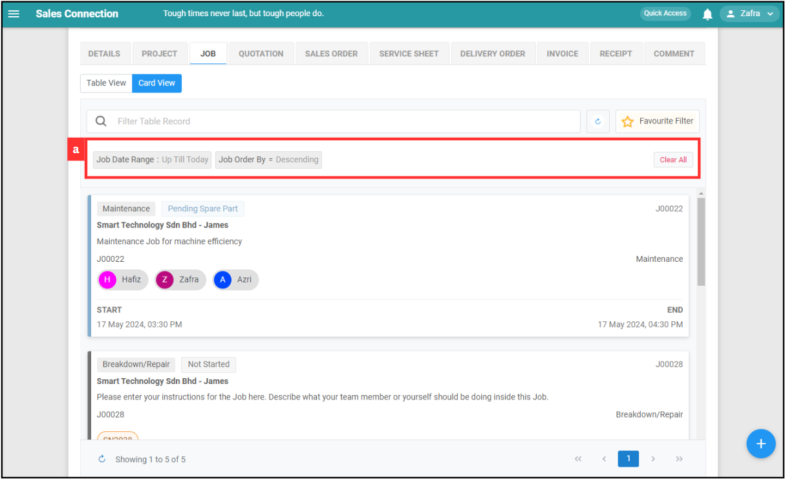

## Why is the Console Tab showing a different number of jobs for the same customer?

### Here are the potential issues and solutions:
(If yes to each, move on to the next scenario).  

**1. Filter** 

a. Different filters applied will affect the result. Make sure the same filter is applied or click "Clear All" to clear the filters. 

   

      
   

    
    
**2. User Type** 
  
a. Different user types will affect job visibility. Contact your admin for user access. 

   | User Type | Description |
   |-----------|-------------|
   | Admin | Can access everything in the system. |
   | Sub-Admin | Can see all Jobs within the department. |
   | Staff/Associate User | Can only see their own Jobs. |
   
   *Note: These are based on Default Access. Your account may have specific settings. Please check with your Admin if your settings are different from the Default. 
   
   **Click here to know more about user type:** [User Type Default Access](User_Types_Default_Access.md) 
    
     
**3. Assign Access** 

   a. If the user type is the same, assign access might be the cause of job visibility. Only the assigned jobs will be shown. 

   b. Make sure the user has been assigned to the job.  

**4. View Access** 

   a. If the user type is the same and the job is not assigned to the user, view access might be the cause of the job visibility. 

   b. Make sure the user is given the view access to the job.
   

**Related Articles** 
- [User Type Default Access](User_Types_Default_Access.md)

<!-- [Link Text](https://salesconnection.github.io/Sales-Connection-Support/Different_Number_Jobs_For_Same_Customer.html) -->
