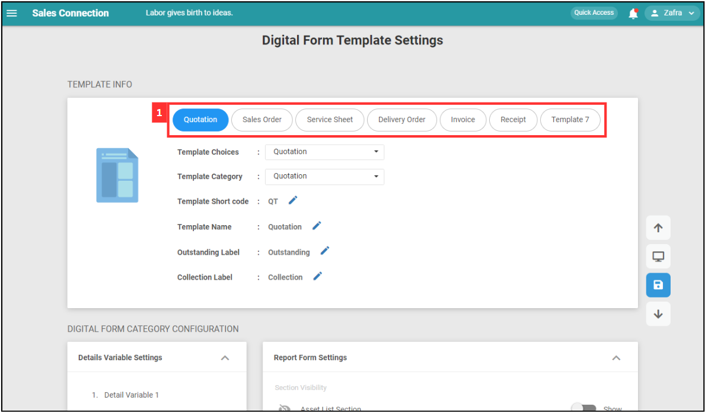

## Digital Form Template Settings

The Digital Form Template Settings page enables users to **configure** and **manage** digital form templates comprehensively, providing flexibility and control over various business processes. 

**Open Digital Form Template Settings Here:** [https://salesconnection.my/ServiceReport/TemplateSetting](https://salesconnection.my/ServiceReport/TemplateSetting) 

| No | Terms | Description |
|----|-------|---------|
| 1 | Template Info | Configure the basic details like template choices, category, short code, and labels. |
| 2 | Digital Form Category Configuration | Set up detailed settings for the digital form category. |
| 3 | Default Field Settings | Set default fields that will apply to all types of digital forms. |
| 4 | Custom Field Settings | Customize fields and their layout for the digital form. |
| 5 | Product/Services Settings | Manage product/services elements, pre-populate settings, and disclaimers. |
| 6 | Customer Feedback Settings | Add and configure feedback fields such as signature, rating, and instruction. |

  

**Navigate to the section by clicking it.** 

- [Template Info](#section1) 
- [Digital Form Categpry Configuration](#section2) 
- [Default Field Settings](#section3) 
- [Custom Field Settings](#section4) 
- [Product/Services Settings](#section5) 
- [Customer Feedback Settings](#section6)
   

   

   **Template Info**

1. "Template Info" allows users to define and configure the basic attributes of the digital form template.

   | No | Field Name | Description |
   |----|------------|-------------|
   | a | Template Choices | Choose the type of digital form before starting to edit the template. |
   | b | Template Category | Define the category of the template. |
   | c | Template Short Code | Short code for the template type. |
   | d | Template Name | Name of the template. |
   | e | Outstanding Label | Label for indicating outstanding items. |
   | f | Collection Label | Label for indicating collection items. |

   

     
   

   

   **Digital Form Category Configuration**

2. "Details Variable Settings" is used to show six details of the digital form in the card view.

   | No | Terms | Represent |
   |----|-------|---------|
   | a | Detail Variable 1 | Digital Form Code (e.g. QT00001) |
   | b | Detail Variable 2 | - |
   | c | Detail Variable 3 | Start Date |
   | d | Detail Variable 4 | - |
   | e | Detail Variable 5 | Amount |
   | f | Detail Variable 6 | - |

   

     
   

   For example, Quotation form will be shown as below.

   

     
   

3. To replace the Detail Variable with other fields, click "Open Setting".

   

     
   

   
4. Determine the elements from the default field and custom field that you want to replace the Detail Variable.

   

     
   

5. Drag the element to the left box to replace the original Detail Variable.

   

     
   

6. Replace the Detail Variable following the sequence.

   

     
   

   The result will be shown as below.

   

     
   

7. "Report Form Settings" allows users to customize the appearance and behavior of digital form reports.

   | No | Fields | Description |
   |----|--------|-------------|
   | a | Section Visibility | Manage the visibility of different sections in the report. |
   | b | Auto Populate | Automatically fill in data fields based on predefined rules. |
   | c | Fields Control | Customize and control the fields that appear in the report. |
   | d | Mapping Control | Define how data fields are mapped and transferred. |
   | e | PDF Watermark Control | Configure and apply watermarks to the PDF version of the report. |

   

     
   

   

     
   

8. User(s) who has been added in "Prepopulate Assigned User During Digital Form Creation" will be automatically assigned when the new digital form is created.

   

     
   

   

   **Default Field Settings**

9. "Default Fields Element" allows to set default values for various templates in the digital form.

   

     
   

   

   **Custom Field Settings**

10. "Custom Fields Settings" allows to add and configure custom fields for the digital form template. You can click on the "Custom Field Element" and edit it at the right side.

    | No | Field | Description |
    |----|-------|-------------|
    | a | Custom Field Element | Different types of custom fields: header, instruction, break line, checklist, text, and many more. |
    | b | Custom Field View | Area to preview and edit custom fields added to the digital form template. |

    

      
    

   

   **Product/Services Settings**
   
11. "Product/Services Element" allows users to enable or disable specific fields for product/services such as description and remarks.

    

      
    

12. "Product/Services Prepopulate Settings" allows users to add product/services to prepopulate certain fields automatically.

    

      
    

13. "Product/Services Disclaimers" allows users to add disclaimers related to product/services to appear in the digital form.

    | No | Fields | Description |
    | a | Section Title | Enter the title for the disclaimer section. |
    | b | Note | Add a note that will be displayed in the disclaimer section. |
    | c | Description | Provide a detailed description or additional information for the disclaimer. |
    | d | Modify Permission | Set permissions to control who can modify this disclaimer. |
    | e | Add Disclaimers | Click to add a new disclaimer to the product/services settings. |
    | f | Visibility Field | Toggle to control the visibility of the disclaimer field within the digital form. |

    

      
    

   

   **Customer Feedback Settings**
   
14. "Customer Feedback Settings" allows users to manage and configure feedback fields that can be added to digital form.

    | No | Fields | Description |
    |----|--------|-------------|
    | a | Add Text Field | Click to add a new text field for customer feedback. |
    | b | Add Drop Down | CLick to add a new dropdown menu for customer feedback options. |

    

      
    

15. After done for the digital form template settings, click these icons to preview and save.

    | No | Icon | Description |
    |----|------|-------------|
    | a | Preview | Click to preview the current configuration of the digital form. |
    | b | Save | Click to save the current configuration and changes made to the digital form. |

    

      
    

   

**Related Articles**
- [How to Set Up Digital Form PDF Template?](Create_PDF.md)
- [How to Setup Job Template Page?](Setup_Job_Template.md)
- [How to Setup Public Form Template Page?](Setup_Public_Form_Template_Page.md)

<!-- [Link Text](https://salesconnection.github.io/Digital_Form_Template_Settings.html) -->
