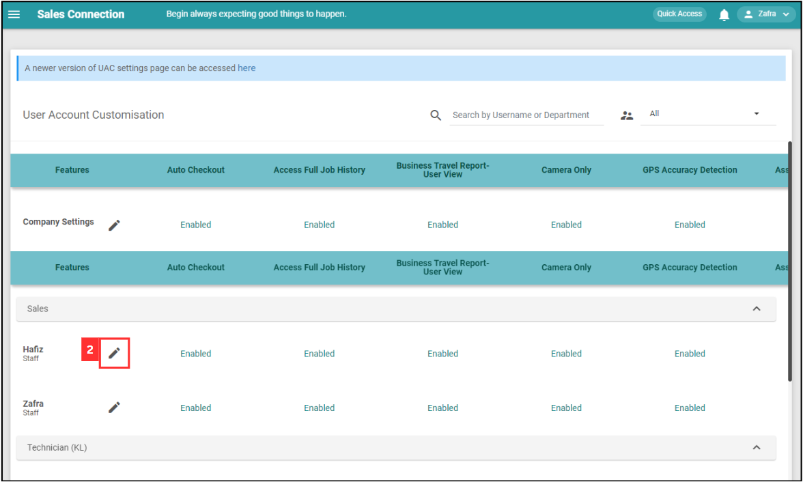
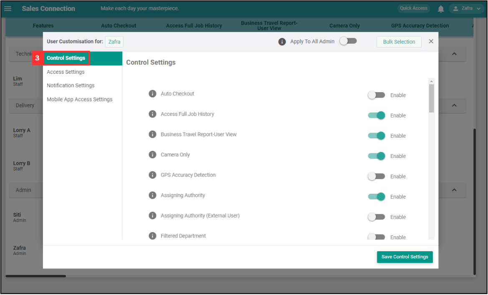

Version 1.0 
Created: 24 May 2024 
Updated: 24 May 2024 
## I Get Spammed By a Lot of Notifications. How Do I Disable It?

*Note: Only certain admins can disable the notification. Please contact your admin if you wish to disable the notifications. 

  1. To disable notifications for users, go to User Management > User Account Customisation. 

     

       
     

  
  2. Navigate to the user who needs to disable the notifications and click on the "Pencil" icon beside the name. 

     

       
     

  3. Click on "Control Settings". 
     *Note: This is only needed if the admin wants to disable own notifications. If the action is not for admin, please continue with Step 7. 

     

       
     

  4. Enable the "Removal of Global Notification for Admin". 

     

       
     

  5. Click "Save Control Settings". 

     

       
     

  6. Click "OK" and the "Global Notification" for admin has been removed. 

     

       
     

  7. Click on "Notification Settings". 

     

       
     

  8. Click the boxes next to the notifications you don't want to see. For example, deselect all the job notifications. 

     

       
     

  9. Click "Save Notification Settings". 

     

       
     

  10. Click "OK" and the notifications have been disabled. 

      

        
      

  *Note: You can liaise with the consultant to get suggestions on which notification should be kept. 
   

**Related Articles** 
- [How to Login Using Mobile and Desktop?](Login.md)
- [How to Assist My New User to Login?](New_User_Login.md)
- [I Can't Login to My Other Phone. Why?](IMEI.md)
