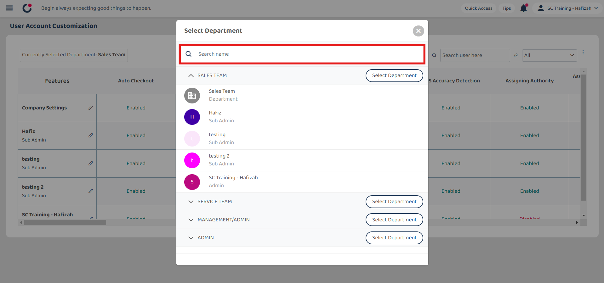
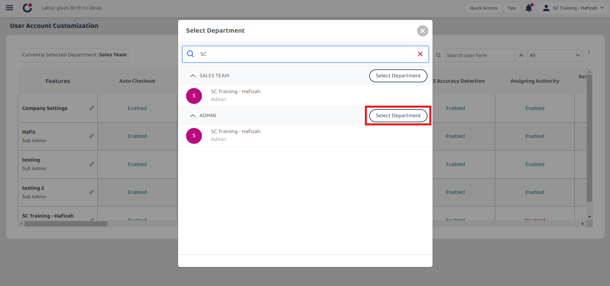
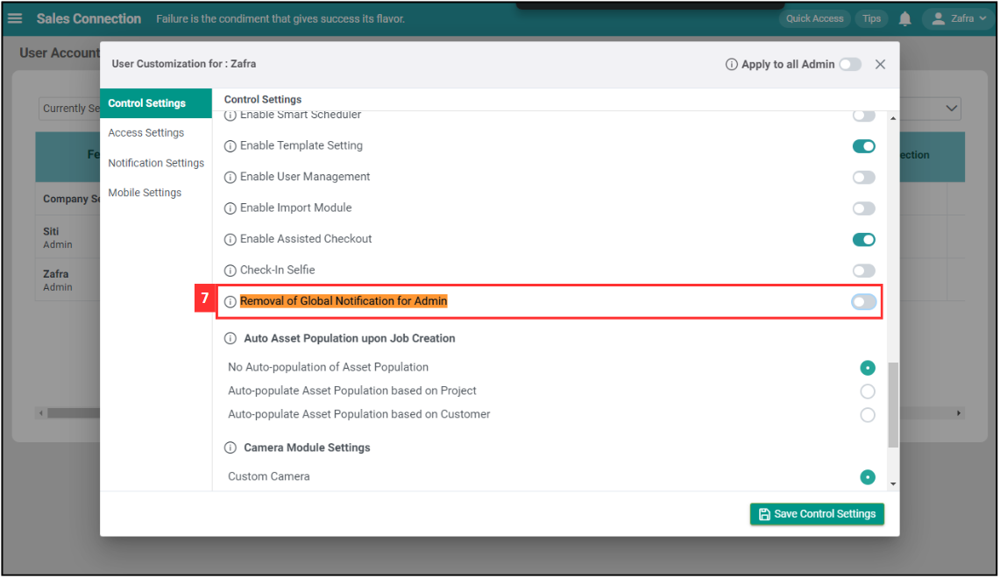
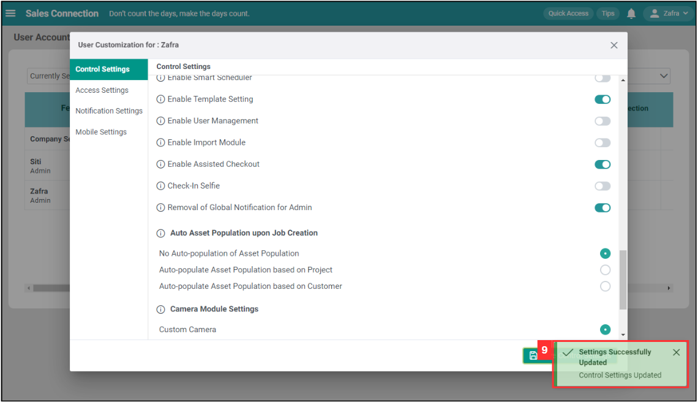

Version 1.0 
Created: 24 May 2024 
Updated: 24 May 2024 
## I Get Spammed By a Lot of Notifications. How Do I Disable It?

*Note: Only certain admins can disable the notification. Please contact your admin if you wish to disable the notifications. 

  1. To disable notifications for users, go to desktop site navigation bar > User Management > User Account Customisation. 
     **Open UAC Page Here:** [https://salesconnection.my/uac](https://salesconnection.my/uac) 
     
     

       
     

     
  2. Click on the department name. 
  
     

       
     

     
  3. Enter the name of the user who needs to disable notification. 

     

       
     

  
  4. Click on the "Select Department" button. 

     

       
     

  5. Click the "pencil" icon beside the user who needs to disable the notifications. 

     

        
     

  6. Press Ctrl + F on your keyboard and type “Removal of Global Notification for Admin” to search for the field. 
     *Note: This is only needed if the admin wants to disable own notifications. If the action is not for admin, please continue with Step 10 by clicking the link below. 
     [Start Here If Not For Admin](#section1)

     

       
     

  
  7. Enable the "Removal of Global Notification for Admin". 

     

       
     

  8. Click "Save Control Settings". 

     

       
     

  9. The "Global Notification" for admin has been removed. 

     

       
      

      
     
  10. Click on "Notification Settings". 

      

        
      

  11. Click the boxes next to the notifications you don't want to see. For example, deselect all the job notifications.. 

      

        
      

  12. Click "Save Notification Settings". 

      

        
      

  13. The notifications have been disabled. 

      

        
      

  *Note: You can liaise with the consultant to get suggestions on which notification should be kept. 
   

**Related Articles** 
- [How to Login Into Sales Connection Using Mobile and Desktop?](Login.md)
- [How to Assist My New User to Login?](New_User_Login.md)
- [I Can't Login to My Other Phone. Why?](IMEI.md)
- [My Staff Did Not Receive Their OTP. What Should I Do?](Not_Receiving_OTP.md)
- [I am Not Getting Any Notification From the System On My Device. Why?](Not_Getting_Notification.md)

<!-- [Link Text](https://salesconnection.github.io/Sales-Connection-Support/Disable_Notification.html) -->
