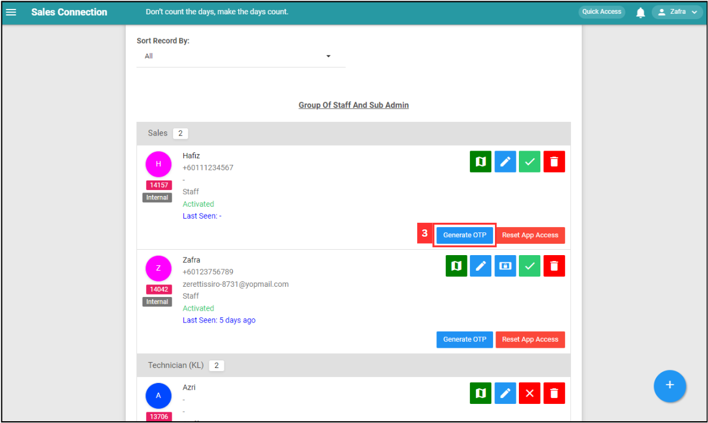
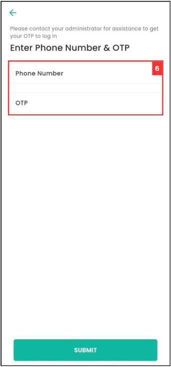
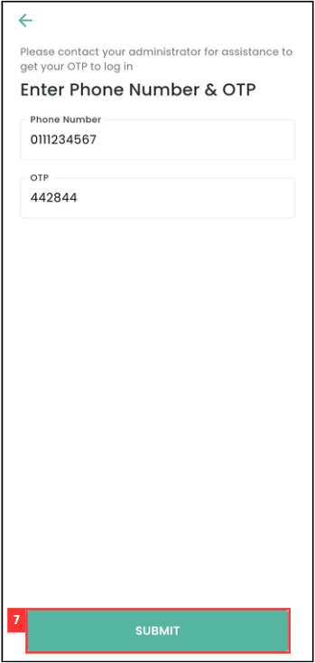

## I get spammed by a lot of notifications. How do I disable it?

*Note: Only certain admins can disable the notification. Please contact your admin if you wish to disable the notifications. 

  1. To disable notifications for users, go to User Management > User Account Customisation. 

     

       
     

  
  2. Navigate to the user who needs to disable the notifications and click on the "Pencil" icon beside the name. 

     

       
     

  3. Click on "Control Settings". 
     *Note: This is only needed if the admin wants to disable own notifications. If the action is not for admin, please continue with Step 7. 

     

       
     

  4. Enable the "Removal of Global Notification for Admin". 

     

       
     

  5. Click "Save Control Settings". 

     

       
     

  6. Click "OK" and the "Global Notification" for admin has been removed. 

     

       
     

  7. Click on "Notification Settings". 

     

       
     

  8. Untick the column that the user wishes not to receive the notifications from it. 

     

       
     

  9. Click "Save Notification Settings". 

     

       
     

  10. Click "OK" and the notifications have been disabled. 

     

       
     

        

**Related Articles** 

