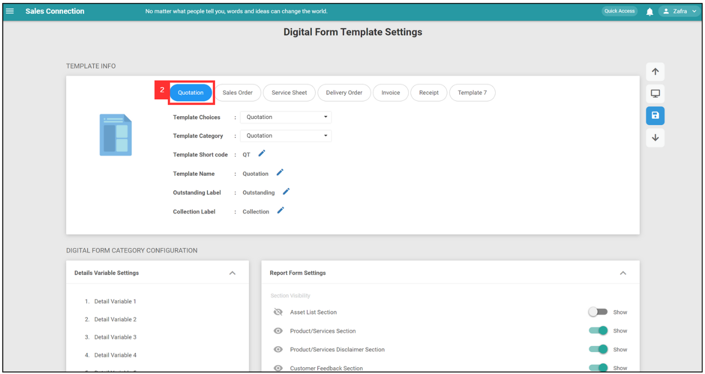
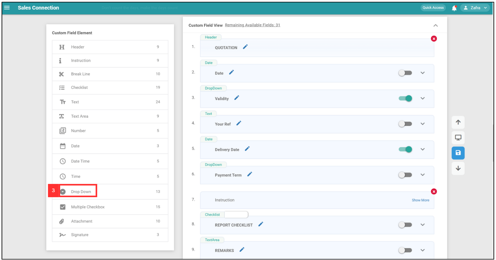
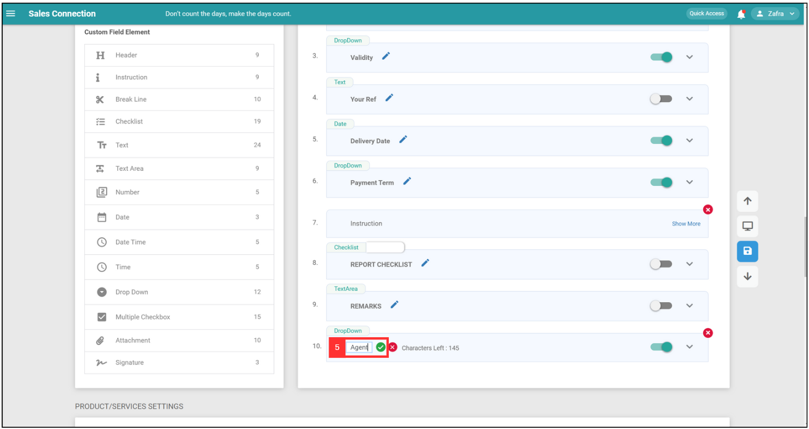
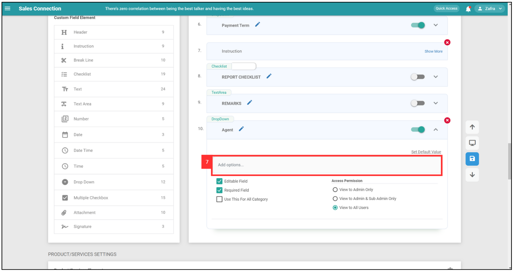
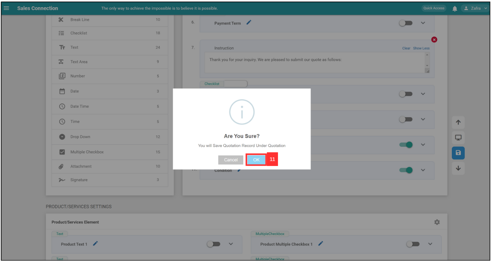
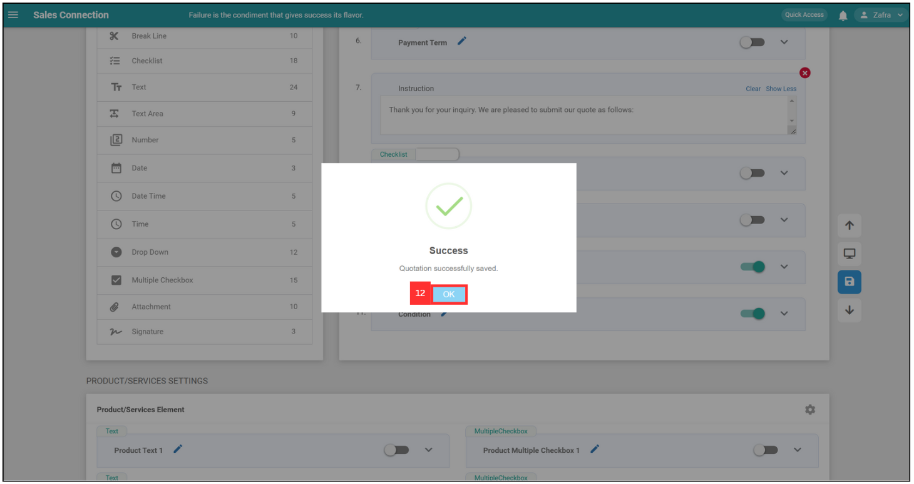
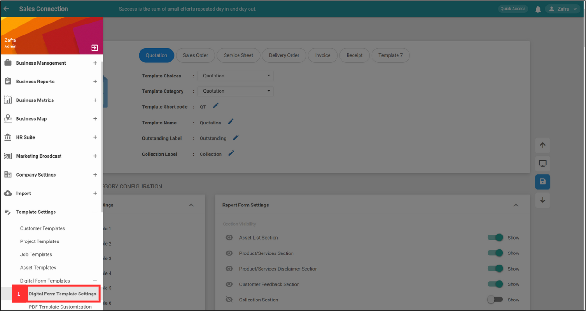
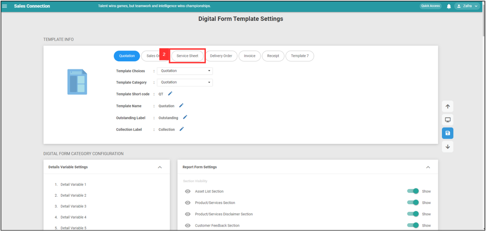
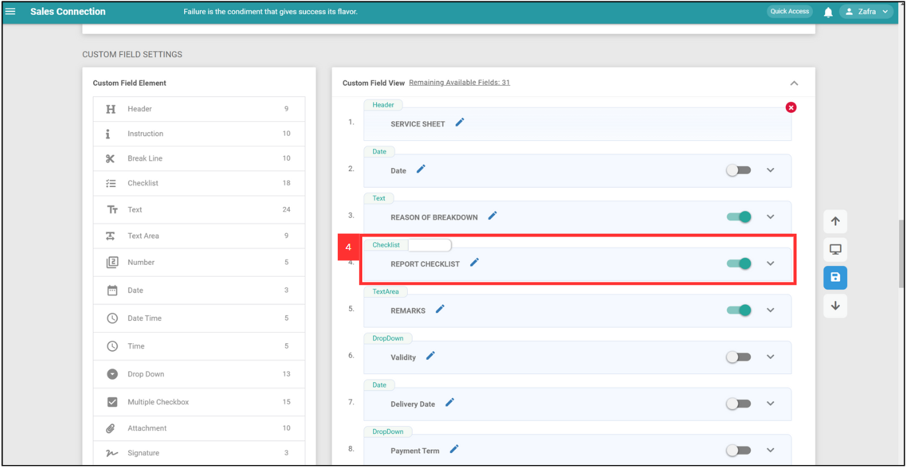

## 🔽 How to add dropdown options in Digital Form?

**Desktop site:** 

1. For example, if you want to add dropdown options for Quotations. Go to desktop site navigation bar > "Template Settings" > "Digital Form Templates" > "Digital Form Template Settings". 
   **Open the page here**: [https://salesconnection.my/ServiceReport/TemplateSetting](https://salesconnection.my/ServiceReport/TemplateSetting) 

   

     
   
 

2. Select "Quotation"

   

      
   
 

3. Click "Drop Down" to add new dropdown options. 

   

     
   
 
   
4. Click the 🖋️ Pencil Icon to rename the new dropdown. 

   

     
   
 
  
5. After rename for the new dropdown, click the tick icon to save the name. 

   

      
   
 
  
6. Click the expand button to add options. 

   

      
   
 
  
7. Click "Add Options" to add options. 

   

      
  
8. Add the next option by clicking the Enter key on your keyboard. 

   

     
   
 
  
9. Make sure the dropdown has been toggled as in the image shown below. 

   

     
   
 

10. Click the save button to save this dropdown options. 

    

     
    
 

11. Click "OK". 

    

     
    
 

12. Click "OK" and your dropdown options have been added successfully. 

    

     
    
  

## ✍🏻 How to edit checklist dropdown options?

1. For example, if you want to add dropdown options for Quotations. Go to desktop site navigation bar > "Template Settings" > "Digital Form Templates" > "Digital Form Template Settings". Select "Service Sheet" 
   **Open the page here**: [https://salesconnection.my/ServiceReport/TemplateSetting](https://salesconnection.my/ServiceReport/TemplateSetting) 

   

    
   
 

2. Select "Service Sheet".

   

    
   
 
   
3. Click "Yes" for the pop up message. 

   

    
   
 

4. Scroll down to "Custom Field View" and select the Checklist that you want to edit. 

   

    
   
 

5. Click the expand button. 

   

    
   
 

6. Click the "+ Manage Items". 

   

    
   
 

7. Edit the checklist dropdown option by clicking on which option you want to edit. 

   

    
   

8. After editing, click the blue icon and click "OK" on the pop up message to save your change. 

   

    
   

9. Click the "Cross" icon to close the checklist page. 

   

    
   

10. Remember to save your change by clicking the blue icon beside then click "OK". 

   

    
   

11. Your changes have been saved succefully.

    

    
   

    
