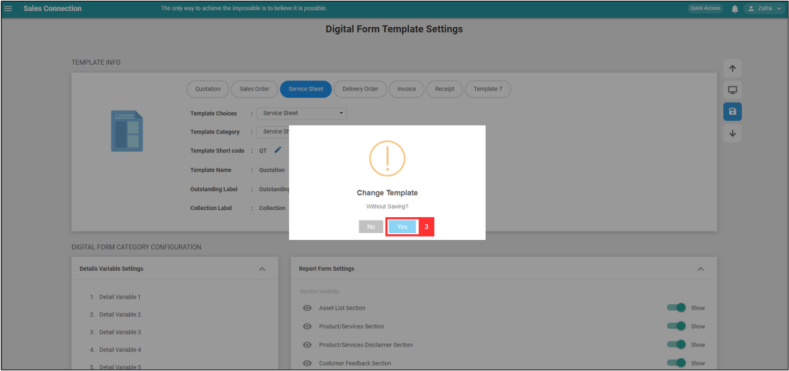

## 🔽 How to add dropdown options in Quotation?

**Desktop site:** 

1. For example, if you want to add dropdown options for Quotations. Go to desktop site navigation bar > "Template Settings" > "Digital Form Templates" > "Digital Form Template Settings". Select "Quotation" 
   **Open the page here**: https://salesconnection.my/ServiceReport/TemplateSetting

    
  

2. Select "Drop Down" to add new dropdown options. 

    
  

  
3. Click the Pencil Icon to edit the new dropdown name.

    
  

  
4. After Rename for the new dropdown, click the tick icon to save the name.

    
  

  
5. Click the expand button to add options or edit for the access permission of the new dropdown.

    
  

  
6. Click "Add Options" to add options.

    
  

  
7. Add the next option by clicking the Enter key on your keyboard.

    
  

  
8. Click the save icon to save this new option.

    
  

  
## 🔑 How to edit checklist dropdown options?

1. For example, if you want to add dropdown options for Quotations. Go to desktop site navigation bar > "Template Settings" > "Digital Form Templates" > "Digital Form Template Settings". Select "Service Sheet" 
   **Open the page here**: [https://salesconnection.my/ServiceReport/TemplateSetting](https://salesconnection.my/ServiceReport/TemplateSetting) 

   

    
   

2. Select "Service Sheet". 

   

    
   

3. Drag down to "Custom Field View" and select the Checklist that you want to edit. 

   

    
   

4. Click the expand button. 

   

    
   

5. Click the "+ Manage Items". 

   

    
   

6. If you want to add a new dropdown option for the checklist, click the dropdown button. 

   

    
   

7. Edit the checklist dropdown option by clicking on which option you want to edit. 

   

    
   

8. After editing, remember to save your change. 

   

    
   

   
    
