Version 1.0 
Created: 24 May 2024 
Updated: 24 May 2024 
## ✍🏻 How to Edit Checklist Dropdown Options?

### How to add an item or option in the checklist of a digital form? (As shown below)

   
   

    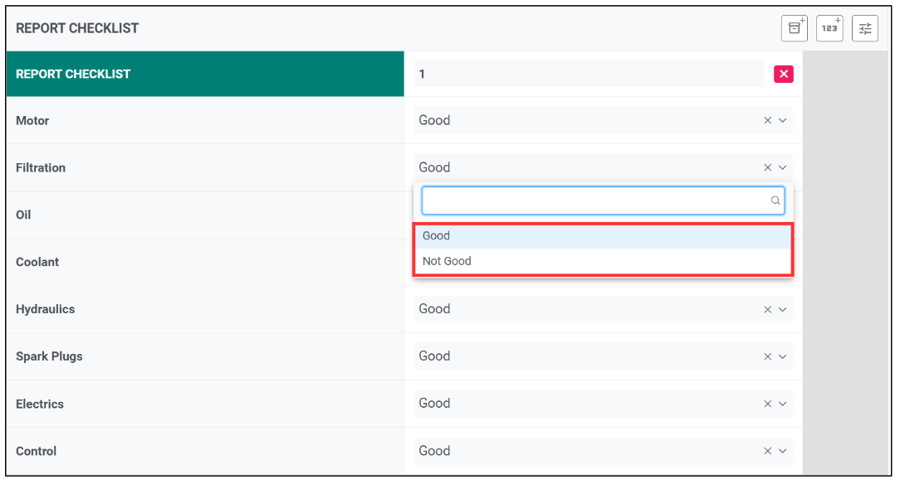
   
  

**Note: To add an option in an existing dropdown, click the link below** 

[Add an option in an existing dropdown](#section1) 
   

1. For example, if you want to edit checklist dropdown options for Service Sheet. 
    
   Go to desktop site navigation bar > "Template Settings" > "Digital Form Templates" > "Digital Form Template Settings". 
   **Open the page here**: [https://salesconnection.my/ServiceReport/TemplateSetting](https://salesconnection.my/ServiceReport/TemplateSetting) 

   

    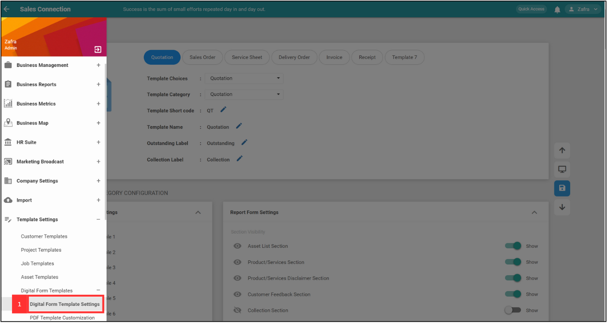
   

2. Select "Service Sheet".

   

    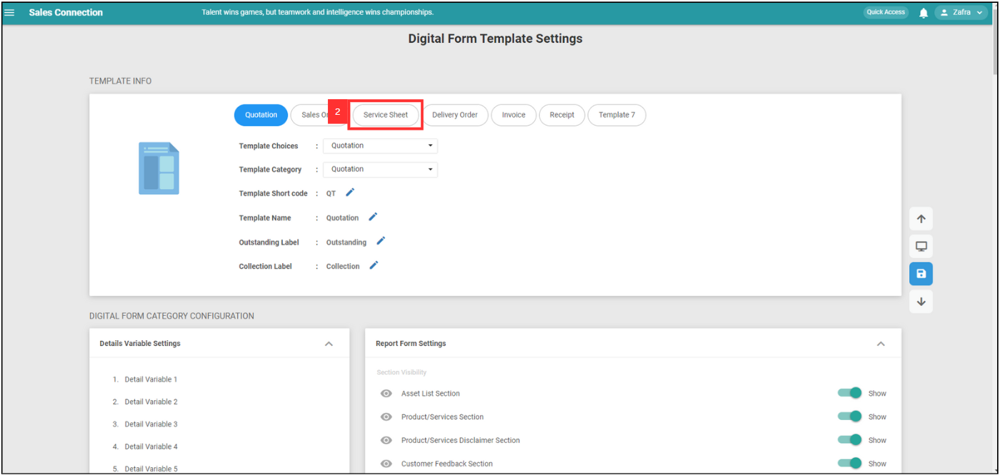
   

   
3. Click "Yes" for the pop up message. 

   

    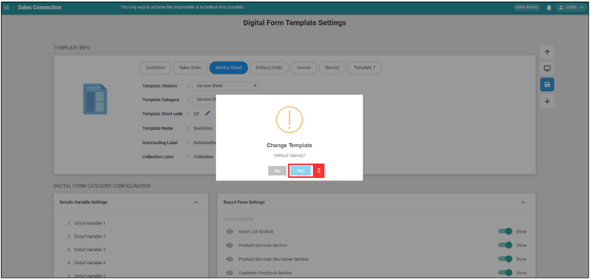
   

4. Scroll down to "Custom Field View" and select the Checklist that you want to edit. 

   

    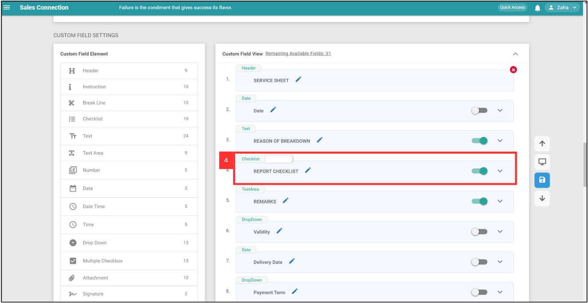
   

5. Click the expand button. 

   

    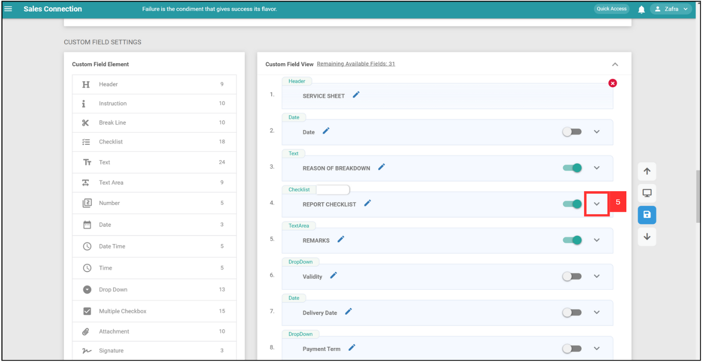
   

6. Click the "+ Manage Items". 

   

    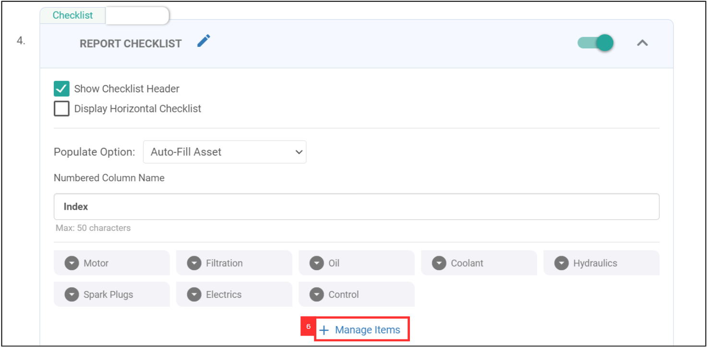
   

7. Edit the checklist dropdown option by clicking on which option you want to edit. 

   

    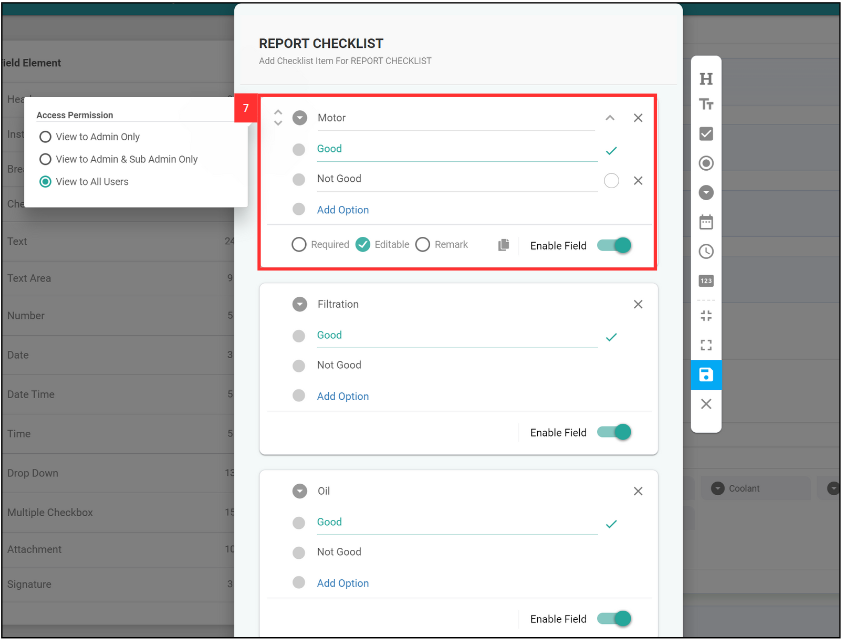
   

8. For example, "Not Good" is edited to Moderate. 

   

    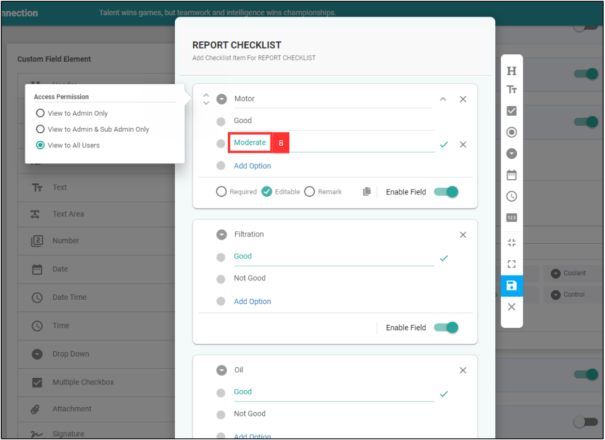
   

9. If you want to set "Moderate" as the default option, click the "tick" icon. 
   
   

    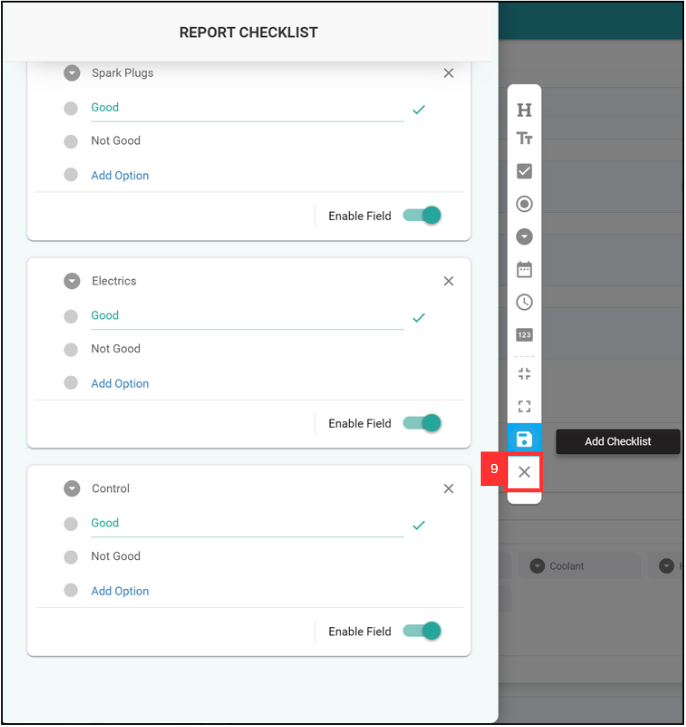
   

10. After editing, click the blue Save icon and click “OK” on the pop up message to save your changes.    

    

      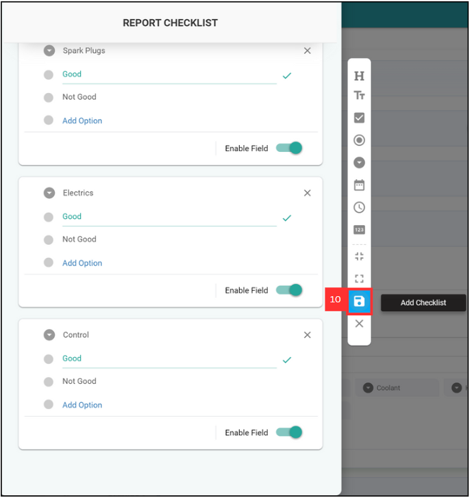
    

11. Click the "Cross" icon to close the checklist page. 

    

      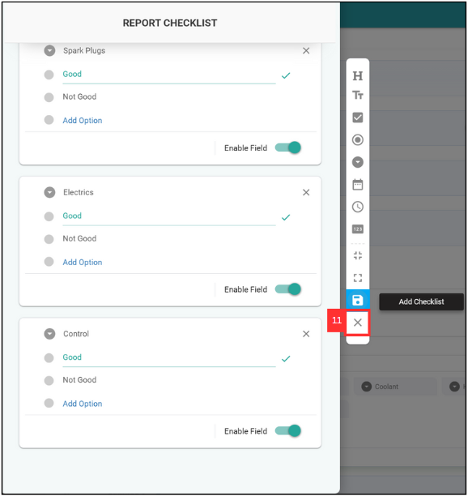
    

12. At this page, remember to click the blue “Save” icon beside once more, or else the previous changes you made will not be saved. Then click “OK”. 

    

      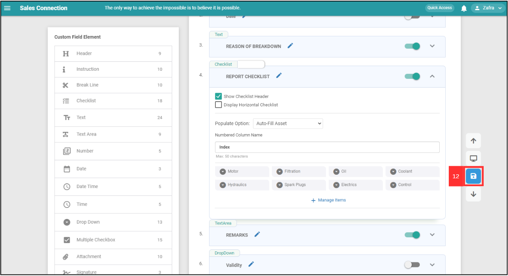
    

13. Your changes have been saved successfully.

    

      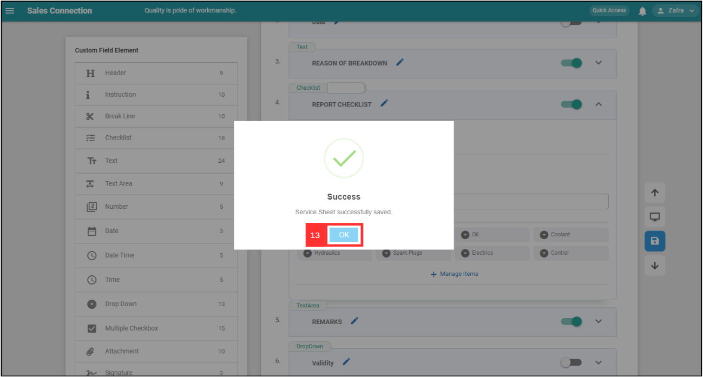
    

   

**Related Articles**
- [How to Add Dropdown Options in Digital Form?](Add_Dropdown_Options_in_Digital_Form.md)
- [How to Use Dropdown Field in Job/Project/Customer?](How_to_Use_Dropdown_Field_in_Job_Project_Customer.md)

<!-- [Link Text](https://salesconnection.github.io/Sales-Connection-Support/Edit_Checklist_Dropdown_Options.html) -->
