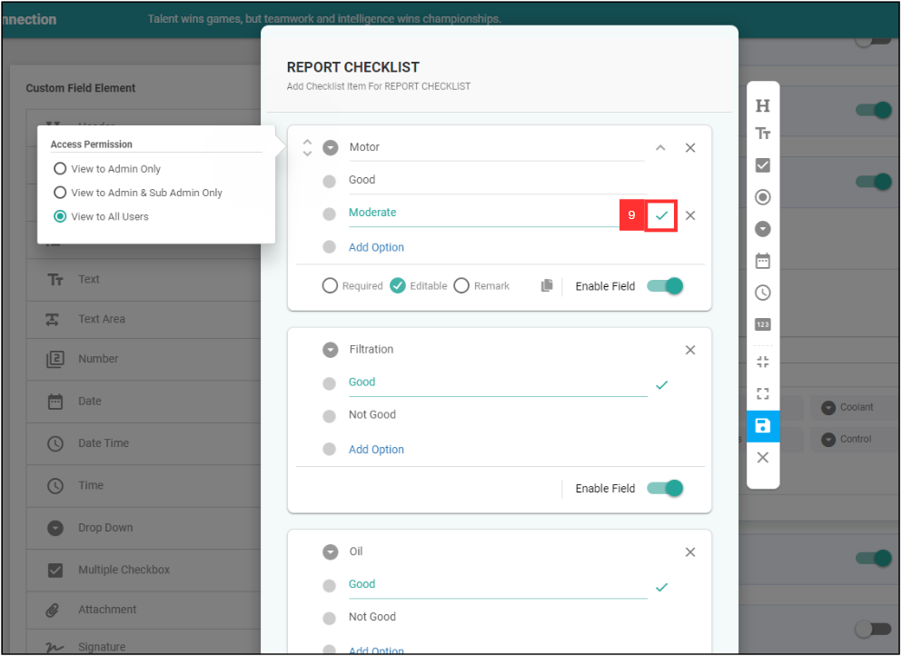

## ✍🏻 How to Edit Checklist Dropdown Options?

### If you want to edit the Checklist below

   

    
   

1. For example, if you want to edit checklist dropdown options for Service Sheet. 
    
   Go to desktop site navigation bar > "Template Settings" > "Digital Form Templates" > "Digital Form Template Settings". 
   **Open the page here**: [https://salesconnection.my/ServiceReport/TemplateSetting](https://salesconnection.my/ServiceReport/TemplateSetting) 

   

    
   

2. Select "Service Sheet".

   

    
   

   
3. Click "Yes" for the pop up message. 

   

    
   

4. Scroll down to "Custom Field View" and select the Checklist that you want to edit. 

   

    
   

5. Click the expand button. 

   

    
   

6. Click the "+ Manage Items". 

   

    
   

7. Edit the checklist dropdown option by clicking on which option you want to edit. 

   

    
   

8. For example, "Not Good" is edited to Moderate. 

   

    
   

9. Click the “Tick” icon if you wish to make the option become default, where in this case “Moderate” will be the preselected option every time. 

   If you don’t wish to have any preselected option, can just untick all options. 
   
   

    
   

10. After editing, click the blue Save icon and click “OK” on the pop up message to save your changes.    

    

      
    

11. Click the "Cross" icon to close the checklist page. 

    

      
    

12. At this page, remember to click the blue “Save” icon beside once more, or else the previous changes you made will not be saved. Then click “OK”. 

    

      
    

13. Your changes have been saved successfully.

    

      
    

    
      

**Related Articles** 
[How to Add Dropdown Options in Digital Form?](Add_Dropdown_Options.md)
