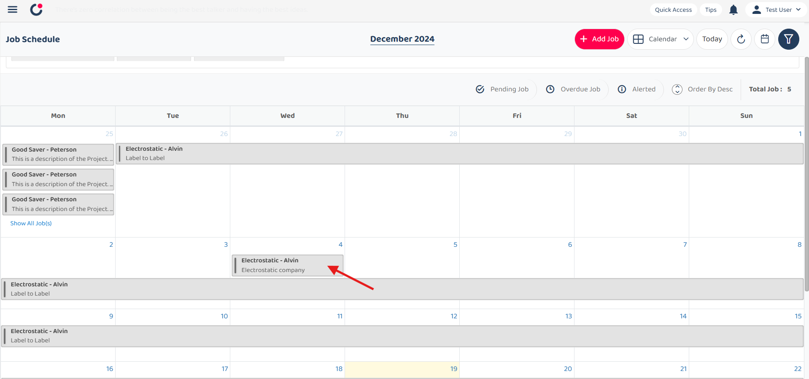
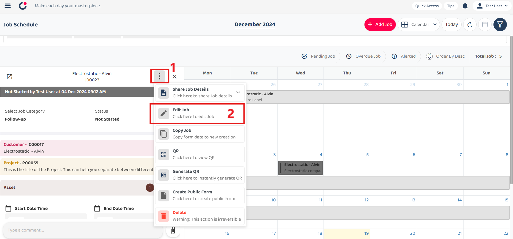
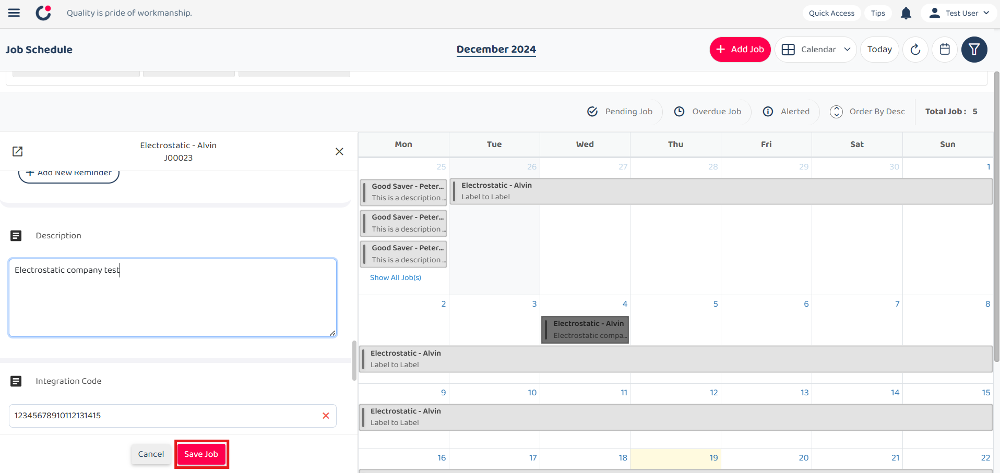
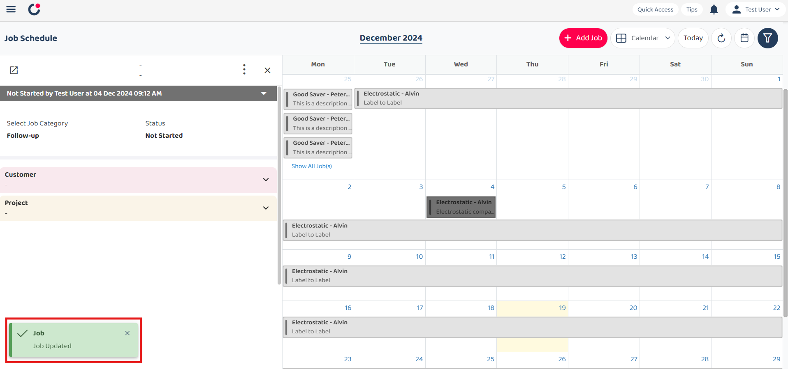
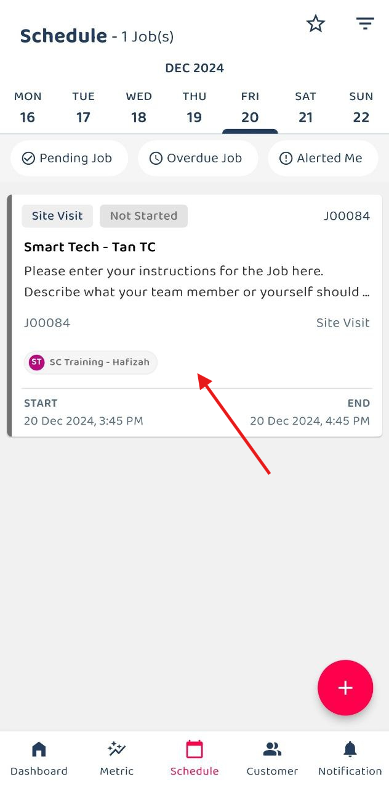
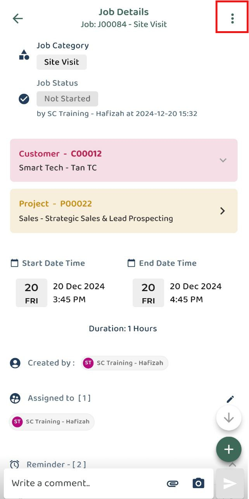
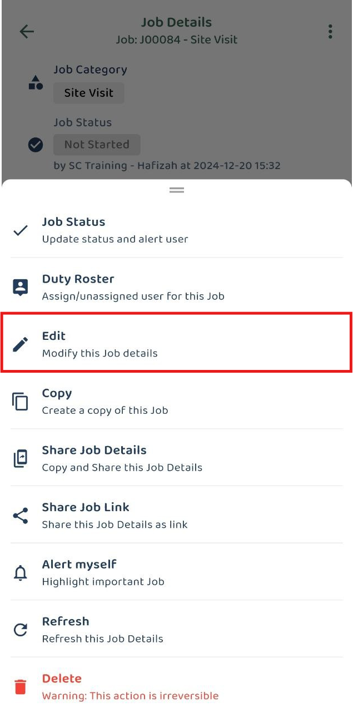
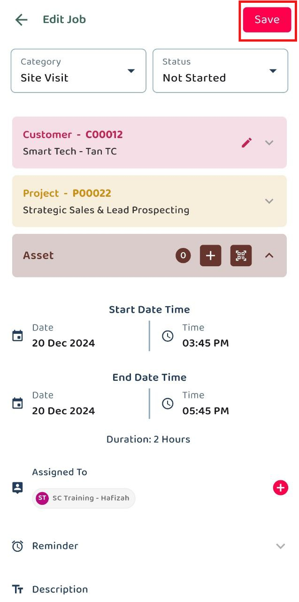
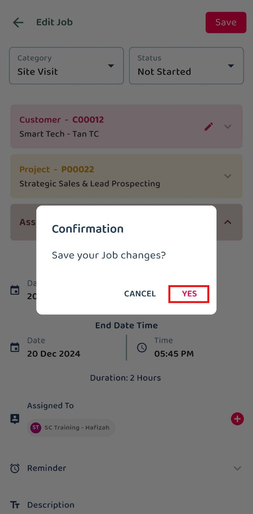
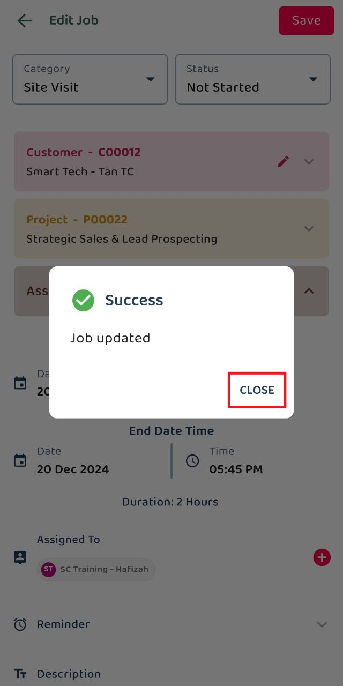

## How to edit details?
*Note : Edit job details are shown below.

#### Scenario 1 : (Web) Edit Job Details
1) Select an existing job that want to edit.  

         

 

2) Click the three dot icon and select 'Edit Job'. 

         

 

3) Edit the details and save it. 

         

 

4) The job details are updated. 

         

 

#### Scenario 2 : (App) Edit Job Details
1) Select an existing job that want to edit.  

         

 

2) Click the three dot icon and select 'Edit'. 

         
         

 

3) Edit the details and save it. 

         
         

 

4) The job details are updated. 

         

 

