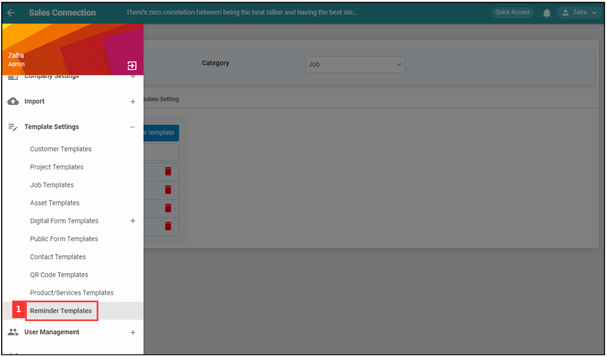
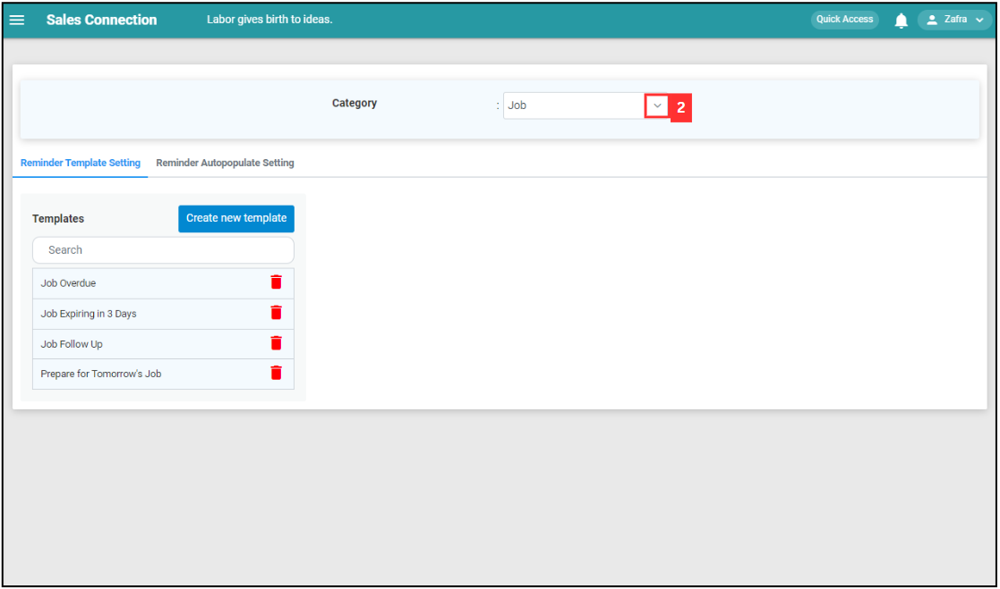
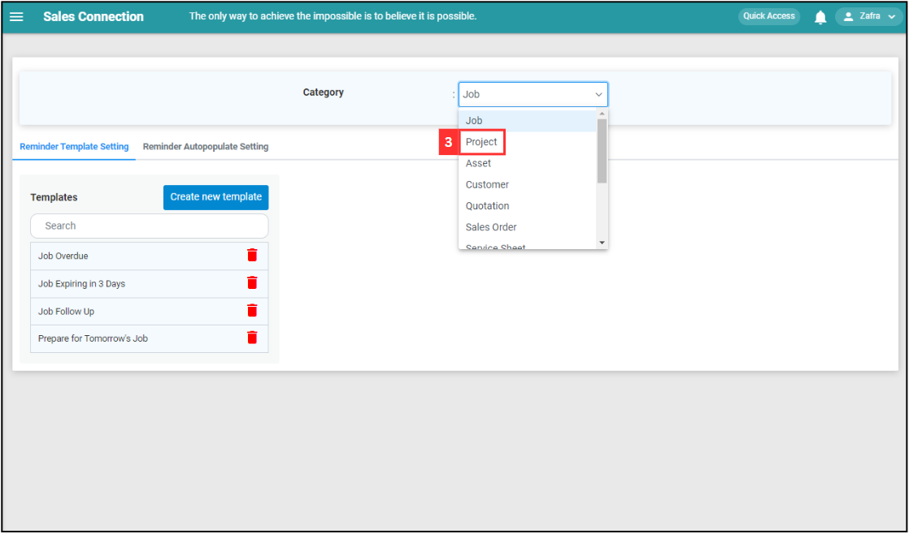
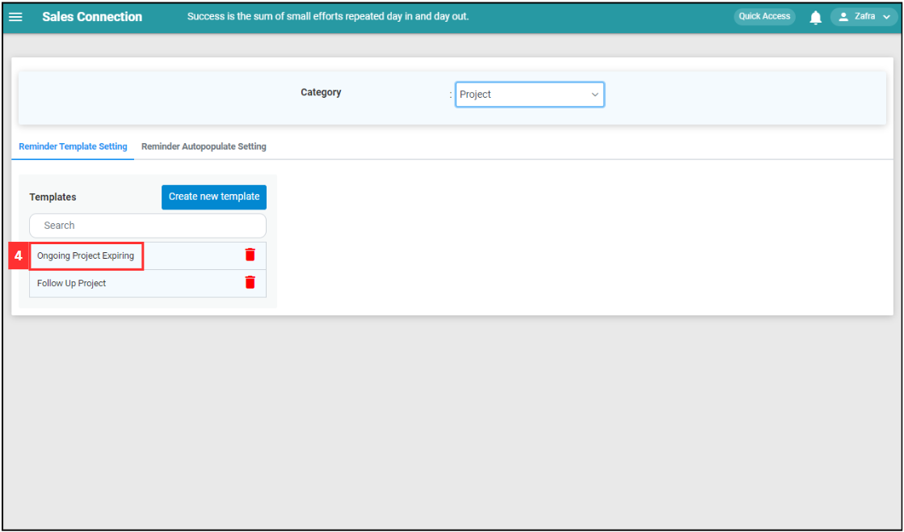
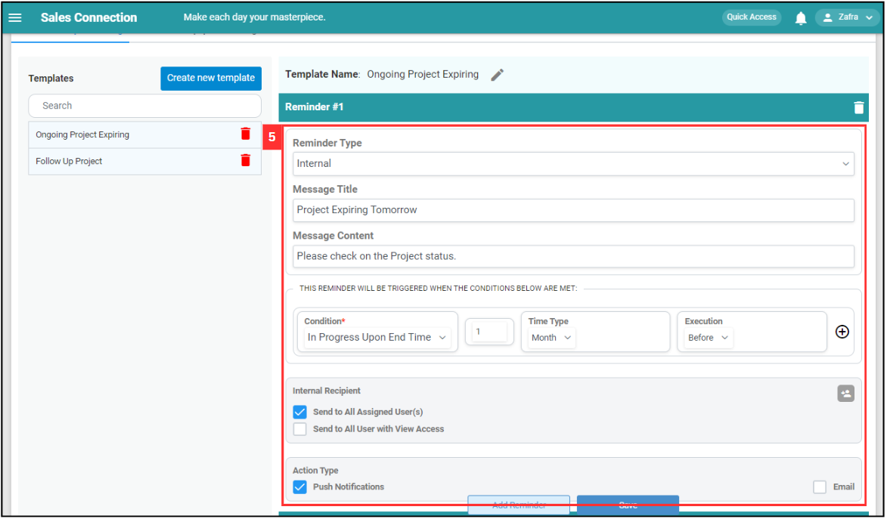
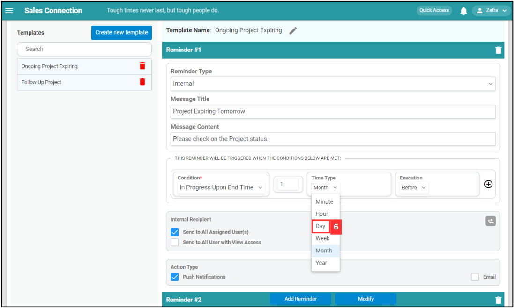
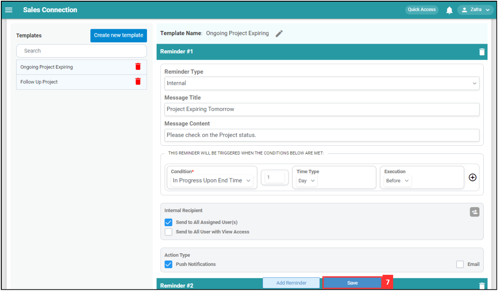
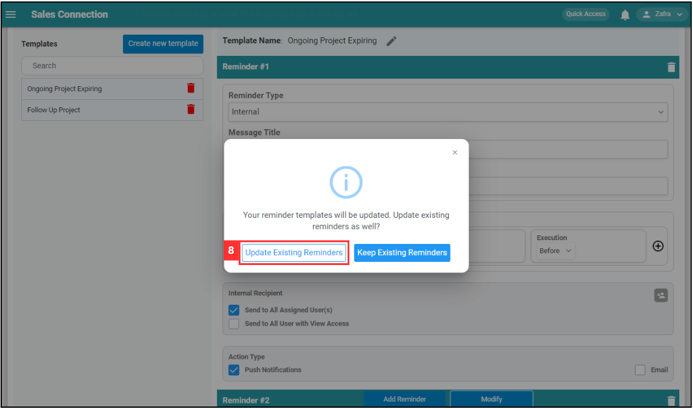

Version 1.0 
Created: 7 June 2024 
Updated: 7 June 2024 
## How to Edit Reminder Template?
    
  1. For example, if you wish to edit the reminder template for Project. At the desktop site's navigation bar, go to Template Settings > Reminder Templates. 
     **Edit Reminder Templates Here:** [https://salesconnection.my/reminder/templatev2](https://salesconnection.my/reminder/templatev2) 

     

       
     

  2. Click on the expand icon for the category. 

     

       
     

  3. Select one of the dropdown options based on Reminder level. 

     

       
     

  4. Click on the reminder that you wish to edit. 

     

       
     

  5. Enter the new details for the reminder. 

     

       
     

  6. For example, click on the expand button of "Time Type" and click "Day". 

     Difference between Message Title and Message Condition 
     
     | Message Title | Message Content |
     |---------------|-------------------|
     | Headline of Reminder in Notification/Email Subject. | Content of the Reminder. |

      
     
     | Terms | Meaning |
     |-------|---------|
     | Condition | Specifies the trigger for the reminder. |
     | Duration | Represents a numeric value associated with the time type. |
     | Time Type | Specifies the unit of time for the numeric value entered in the second column. |
     | Execution | Indicates whether the reminder is to be executed before or after the specified. |
    
     *Note: **Do not** change the Reminder Type unless instructed to. 
     
     

       
     

  6. Click on the "Save" button. 

     

       
     

  7. Choose which reminders you wish to change and click the "Save" button. In this example, "Future reminders" only is chosen. 

     

       
     

   

**Related Articles**
- [I Get Spammed By a Lot of Notifications. How Do I Disable It?](Disable_Notification.md)

<!-- [Link Text](https://salesconnection.github.io/Sales-Connection-Support/Edit_Reminder_Template.html) -->
