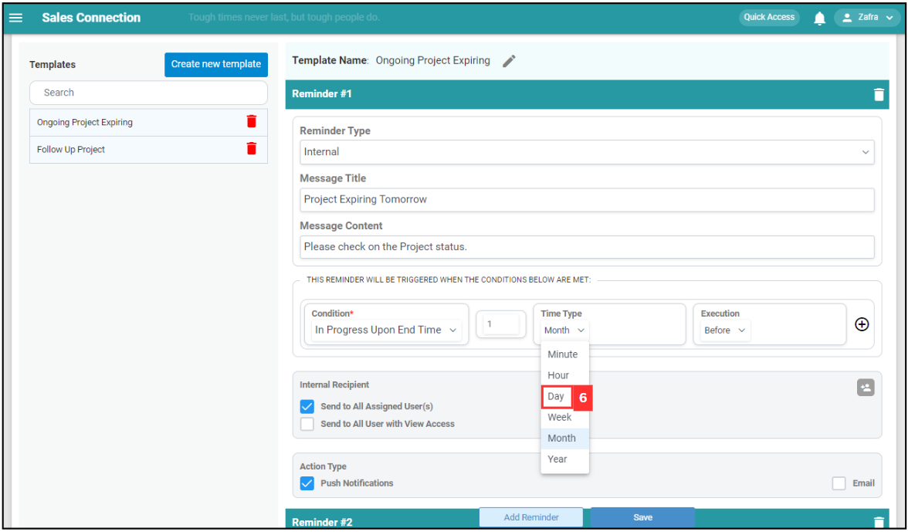
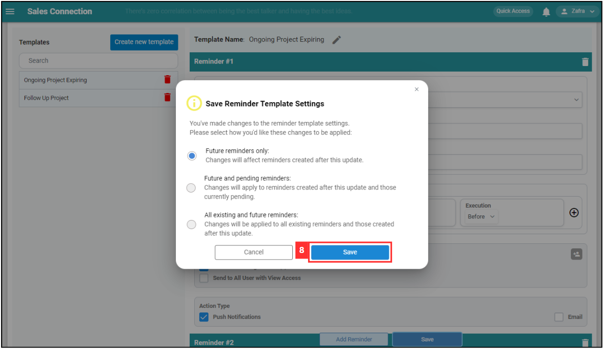

## How to Edit Reminder Template?
    
  1. For example, if you wish to edit the reminder template for Project. At the desktop site's navigation bar, go to Template Settings > Reminder Templates. 
     **Edit Reminder Templates Here:** [https://salesconnection.my/reminder/templatev2](https://salesconnection.my/reminder/templatev2) 

     

       
     

  2. Click on the expand icon for the category. 

     

       
     

  3. Click "Project". 

     

       
     

  4. Click on the reminder that you wish to edit. 

     

       
     

  5. Enter the new details for the reminder. 

     

       
     

  6. For example, click on the expand button of "Time Type" and click "Day". 

     

       
     

  7. Click on the "Save" button. 

     

       
     

  8. Choose which reminders you wish to change and click the "Save" button. In this example, Future reminders only is chosen. 

     

       
     

