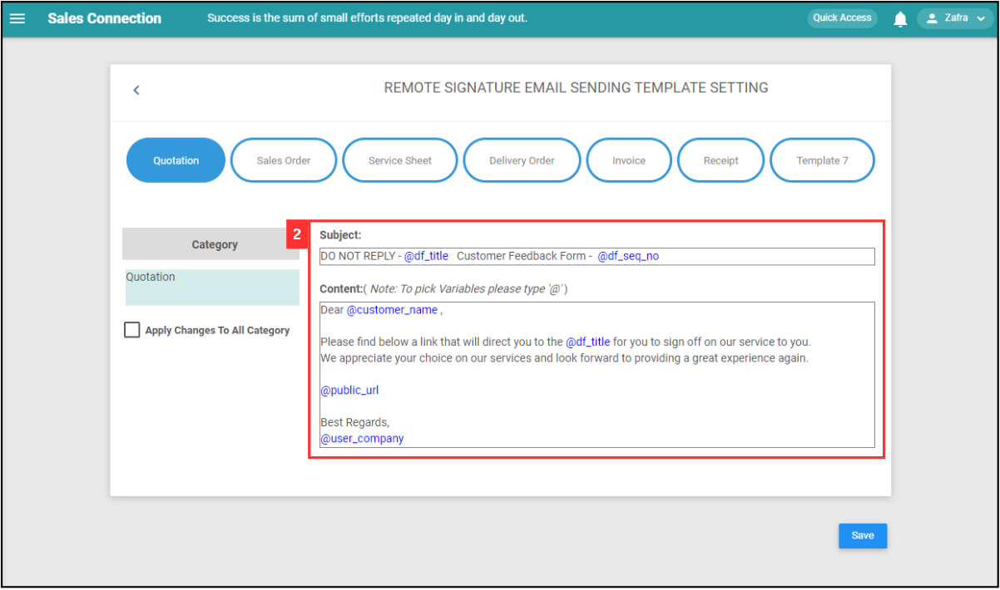
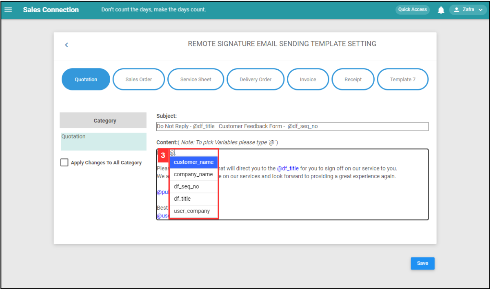
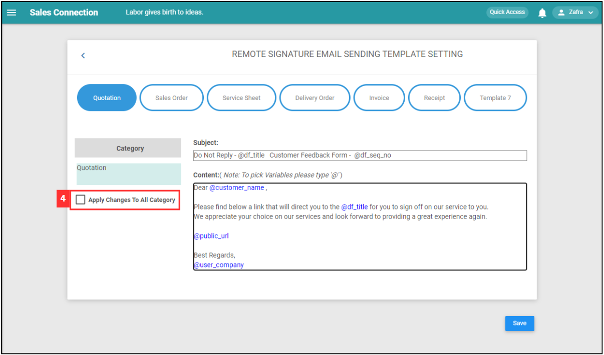
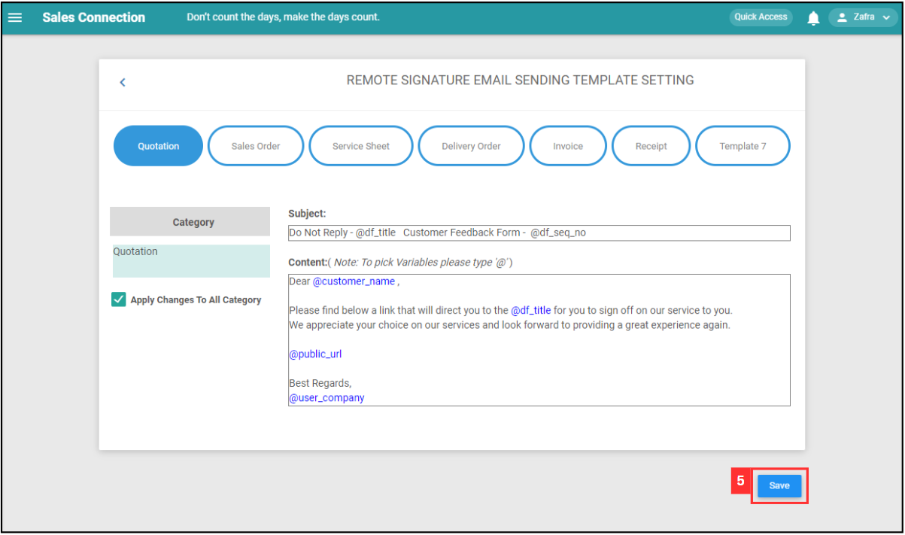
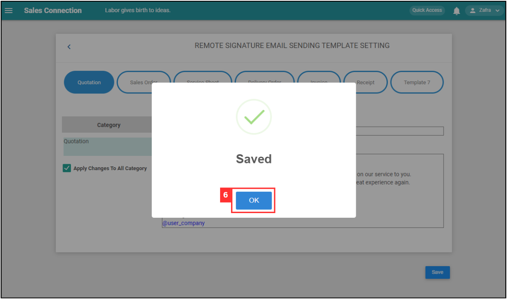

Version 1.0 
Created: 24 May 2024 
Updated: 24 May 2024 
## How to Edit Remote Signature Email Template?

1. To edit remote signature email template, go to the desktop site navigation bar > Company Settings > Digital Form Settings > Remote Signature Email Template Settings. 
   **Open Remote Signature Email Template Settings Page Here:** [https://salesconnection.my/ServiceReport/remoteSignEmailTemplate](https://salesconnection.my/ServiceReport/remoteSignEmailTemplate) 
   
   

      
   

3. Edit the subject and the content. 

   

      
   

4. Enter @ and you can have the customer name or company name appear on the email. 

   

      
   

5. Tick the box if you wish to use the same template for other digital forms. 

   

      
   

6. Click on the "Save" button. 

   

      
   

7. Click "OK" and the new remote signature email template has been saved successfully. 

   

      
   

      

**Related Article**
- [How to Request for Remote Signature From Customer?](How_to_Get_Remote_Signature_From_Customer.md)
- [How to Sign and Upload Company Stamp into Digital Form？](Request_Signature_Company_Stamp.md)

<!-- [Link Text](https://salesconnection.github.io/Sales-Connection-Support/Edit_Remote_Signature_Email_Template.html) -->
