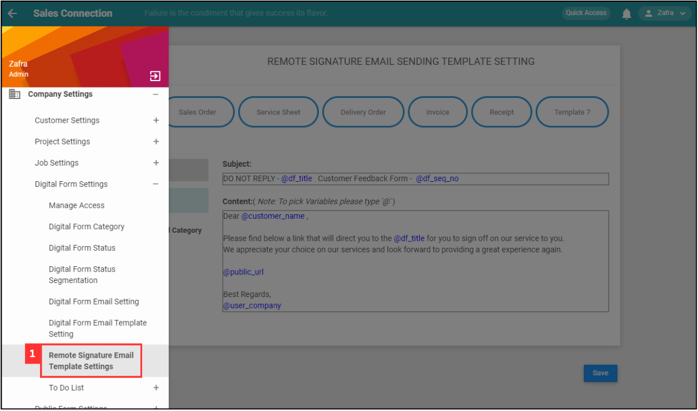
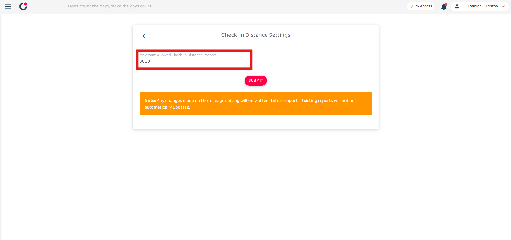
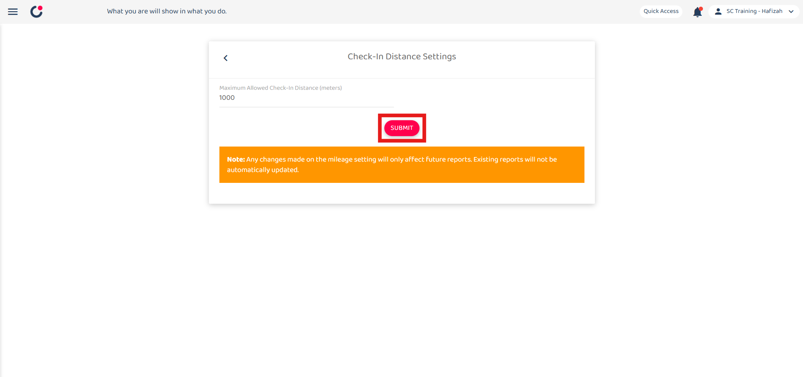
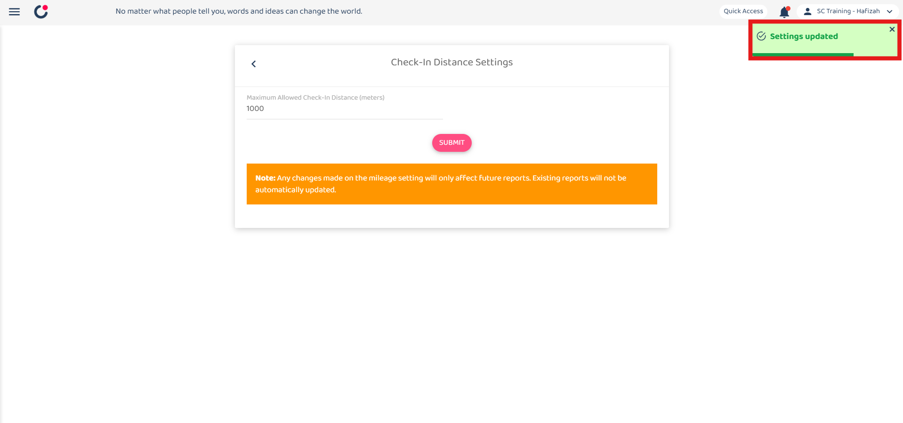

## How to Edit Remote Signature Email Template?

1. To edit remote signature email template, go to the desktop site navigation bar > Company Settings > Digital Form Settings > Remote Signature Email Template Settings. 

   

      
   

2. Enter the number of the maximum allowed check in distance. 
   *Note: The suggested check in distance is 1000 meters. 

   

      
   

3. Click on the "SUBMIT" button. 

   

      
   

4. Click "OK" and the new check in distance has been saved successfully. 

   

      
   

5. Click on the "SUBMIT" button. 

   

      
   

6. Click "OK" and the new check in distance has been saved successfully. 

   

      
   

