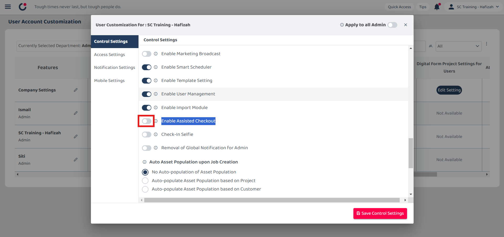

## ❓ How to Enable Assist Check Out?

*Note: Only certain admins can perform this action.  

  1. To enable assist check out, go to desktop site navigation bar > User Management > User Account Customisation (UAC). 
     **Open UAC Page Here:** [https://salesconnection.my/manageuac](https://salesconnection.my/manageuac) 

     

       
     

  
  2. Use Ctrl + f to search "Enable Assisted Checkout". 
  
     

       
     

     
  3. Click on the "Disabled" button on the user who needs this power (normally admin). 

     

       
     

  
     *Note: Whoever with "Enabled" for the Enable Assisted Checkout, they will have the power to perform the assist check out for every user. 

  4. Click the "Enable Assisted Checkout" to perform the action to other staff. 

     

       
     

  5. Click "Save Control Settings" to save the changes. 

     

        
     

    

  **Related Article** 
[Why My Staff Cannot Check In?](Assist_Check_Out.md)
