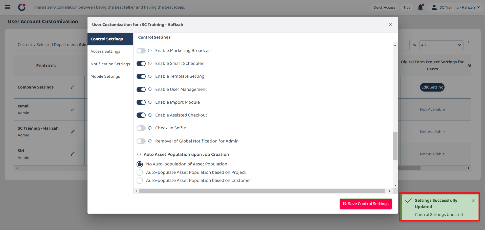
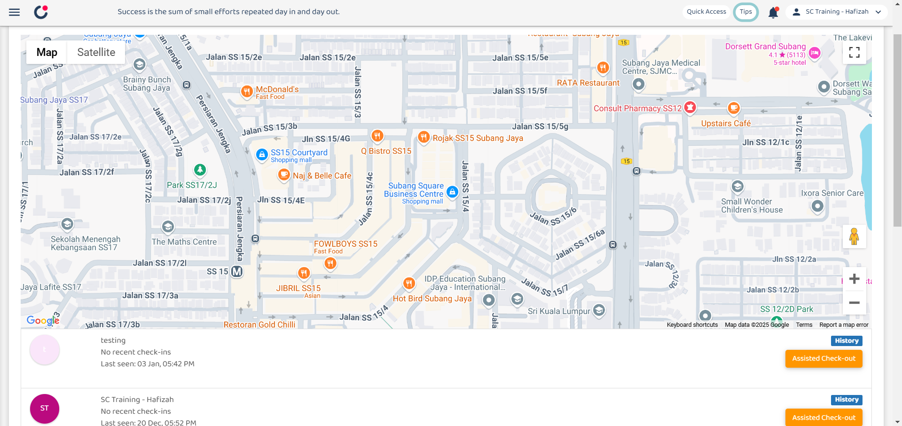

Version 1.0 
Created: 24 May 2024 
Updated: 24 May 2024 
## ❓ How to Enable Assist Check Out?

*Note: Only certain admins can perform this action.  

  1. To enable assist check out, go to desktop site navigation bar > User Management > User Account Customisation (UAC). 
     **Open UAC Page Here:** [https://salesconnection.my/uac](https://salesconnection.my/uac) 

     

       
     

  
  2. Click on the department name. 
  
     

       
     

     
  3. Enter the name of the user who needs this authority (normally admin). 

     

       
     

  
  4. Click on the "Select Department" button. 

     

       
     

  5. Click the "pencil" icon beside the user who needs this authority (normally admin). 

     

        
     

     
     *Note: Whoever with "Enabled" for the Enable Assisted Checkout, they will have the power to perform the assist check out for every user. 

  6. Press Ctrl + F on your keyboard and type “Enable Assisted Checkout” to search for the field. 

     

       
     

  
  7. Click "Enable Assisted Checkout" to allow this person to help others perform assisted checkouts. 

     

       
     

  8. Click "Save Control Settings" to save the changes. 

     

        
     

  9. The change is saved when the message prompts out. 

     

        
     

     
  10. Now, you can see the "Assisted Check-out" button here. 
      **Open Business Map Overview Page:** [https://salesconnection.my/BusinessMap](https://salesconnection.my/BusinessMap) 

      

         
      

    

**Related Articles** 
- [I Forgot to Check Out, How?](Assist_Check_Out.md)
- [I am at the location, but the system says I am too far from the location.](Check_In_Address.md)

<!-- [Link Text](https://salesconnection.github.io/Sales-Connection-Support/Enable_Assist_Check_Out.html) -->
