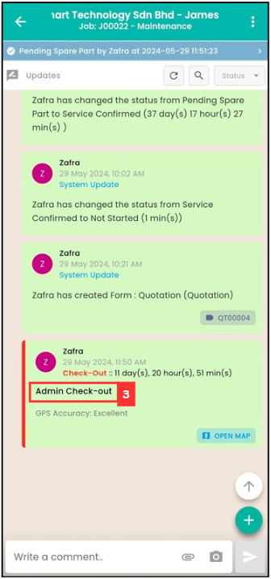

## How to Enable/Disable Version Access Permission?

**Version Access Permission** is 

1. Go to desktop site navigation bar > User Management > User List. 
   **Open User List Here:** [https://salesconnection.my/usermanage/userlist](https://salesconnection.my/usermanage/userlist) 

   

      
   

     
2. Click on the "pencil" icon beside the user that need desktop access. 

   

      
   

     
3. Once the action is done, ask the user to refresh the job detail page to confirm the "Assisted Check out" was successful.
  
   

      
   

     

**Related Articles**
- [How to Enable Assist Check Out?](Enable_Assist_Check_Out.md)
- [I am at the location, but the system says I am too far from the location.](Check_In_Address.md)
