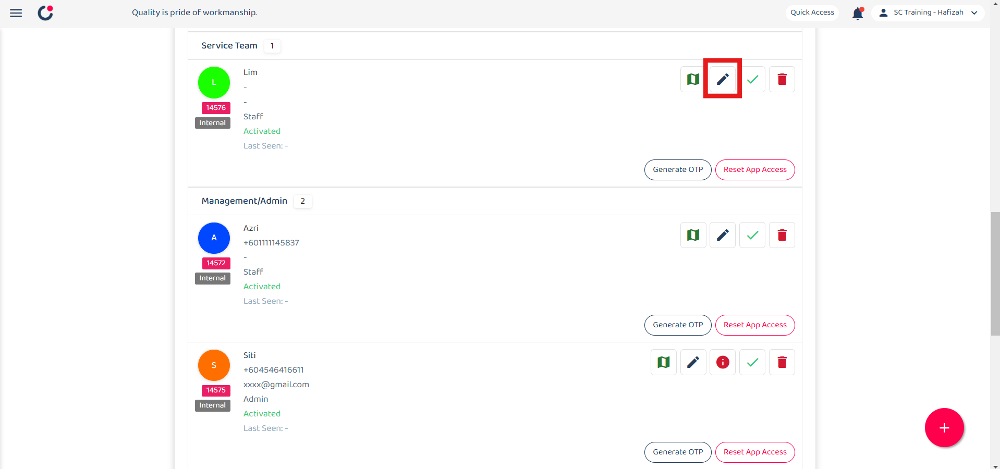
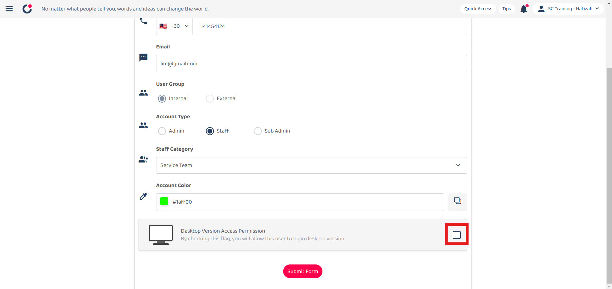
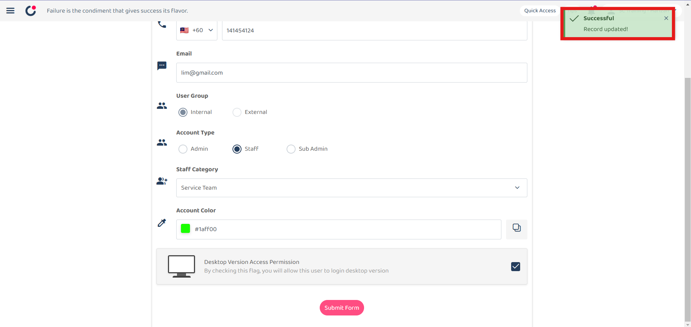

Version 1.0 
Created: 28 June 2024 
Updated: 28 June 2024 
## How to Enable/Disable Version Access Permission? (For Staff)

*Note: Sub-Admin and Admin users will automatically have access to Desktop Version.  

1. At the desktop site navigation bar, go to User Management > User List. 
   **Open User List Here:** [https://salesconnection.my/usermanage/userlist](https://salesconnection.my/usermanage/userlist) 

   

      
   

     
   *Note: You must have access to User Management menu to perform this action. Please request permission or help from your admin if you do not have access to the menu. 
   
2. Click on the "pencil" icon beside the user that needs desktop access. 

   

      
   

     
3. Ensure the email of the user is correct. 
  
   

      
   

4. Tick the box to give desktop access to the user. 

   

      
   

5. Click "Submit Form". 

   

      
   

6. The device access has been given to the user when "Record Updated” prompt appears. 

   

      
   

     

**Related Articles**
- [How to Login Into Sales Connection Using Mobile and Desktop?](Login.md)
- [How to Assist My New User to Login?](New_User_Login.md)

<!-- [Link Text](https://salesconnection.github.io/Sales-Connection-Support/Enable_Disable_Version_Access_Permission.html) -->
