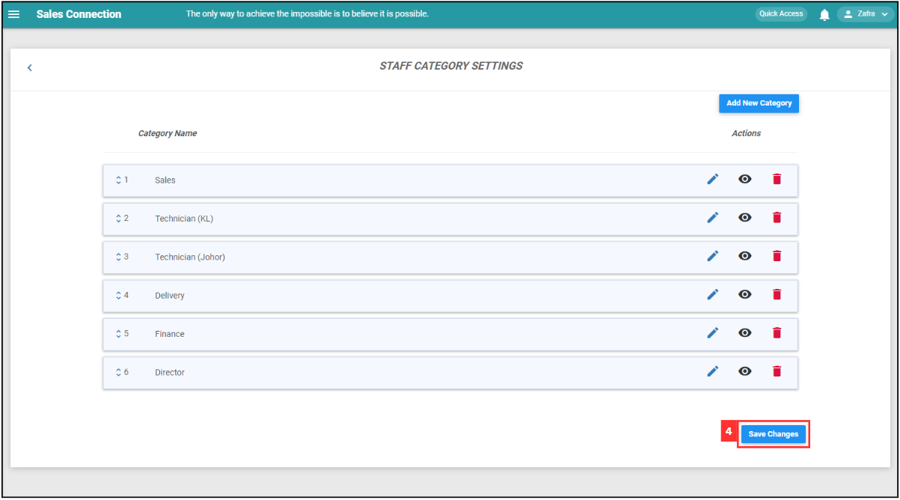

## How to pull out Job/Project/Form report?
**Navigate to the section by clicking it.** 

- [Export as CSV](#section1) 
- [Export as Excel](#section2) 
- [Export as PDF](#section3)
   

### Export as CSV
  1. At the desktop site's navigation bar, go to Business Reports > Job Report. 
     **Open Job Report Here:** [https://salesconnection.my/reports/activity](https://salesconnection.my/reports/activity) 

     

       
     

  2. Click "CSV" to export the report. 

     

       
     

  3. Wait for the system to export the file. 

     

       
     

  4. Click "Download" to download the file needed. 

     

       
     

  5. The file downloaded can be viewed in your desktop "File Explorer". 

     

       
     

      

### Export as Excel
  1. At the desktop site's navigation bar, go to Business Reports > Job Report. 
     **Open Job Report Here:** [https://salesconnection.my/reports/activity](https://salesconnection.my/reports/activity) 

     

       
     

  2. Click "Excel" to export the report. 

     

       
     

  3. Wait for the system to export the file. 

     

       
     

  4. Click "Download" to download the file needed. 

     

       
     

  5. The file downloaded can be viewed in your desktop "File Explorer". 

     

       
     

      
     

### Export as PDF
*Note: No PDF export option for Digital Form. 
  1. At the desktop site's navigation bar, go to Business Reports > Job Report. 
     **Open Job Report Here:** [https://salesconnection.my/reports/activity](https://salesconnection.my/reports/activity) 

     

       
     

  2. Click "PDF" to export the report. 

     

       
     

  3. Customize the PDF title and choose the header before clicking the "Generate PDF" button. 
  
     

       
     

  
  4. Wait for the system to export the file. 

     

       
     

  5. Click "Download" to download the file needed. 

     

       
     

  6. The file downloaded can be viewed in your desktop "File Explorer". 

     

       
     

        

**Related Article** 
[How to Add New User?](Add_New_User.md)
