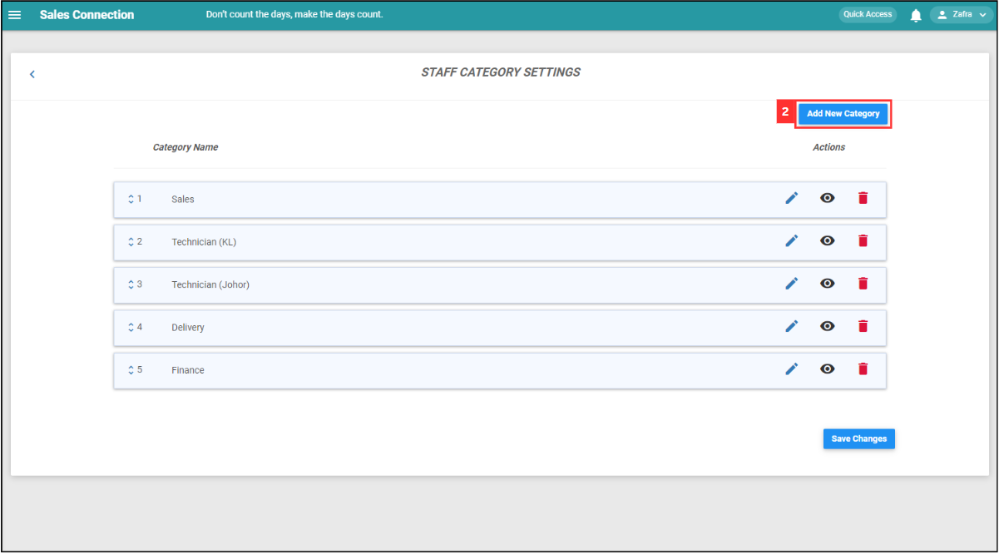
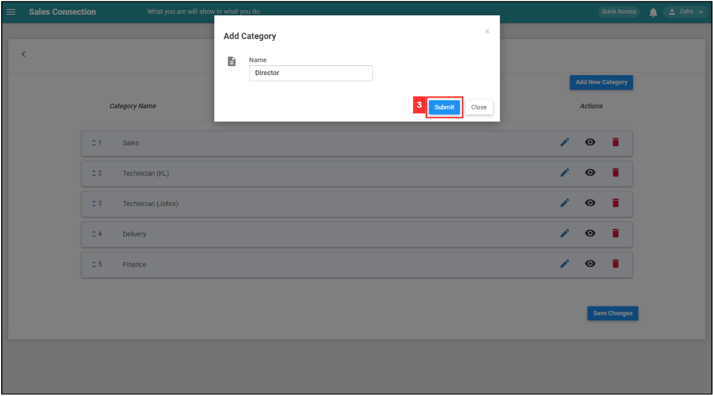

## How to pull out Job/Project/Form report?
    
  1. At the desktop site's navigation bar, go to Business Reports > Job Report. 
     **Open Job Report Here:** [https://salesconnection.my/reports/activity](https://salesconnection.my/reports/activity) 

     

       
     

  2. There is three different formats to export, which are **CSV**, **Excel**, and **PDF**. Choose the format you want and click on it. 
     **Add New User Category Here:** [https://salesconnection.my/settings/CategoryList?type=usother](https://salesconnection.my/settings/CategoryList?type=usother) 

     

       
     

  3. Wait for the system to download the file. 

     

       
     

  4. Click "Download" to download the file needed. 

     

       
     

  5. The file downloaded can be viewed in your desktop "File Explorer". 

     

       
     

        

**Related Article** 
[How to Add New User?](Add_New_User.md)
