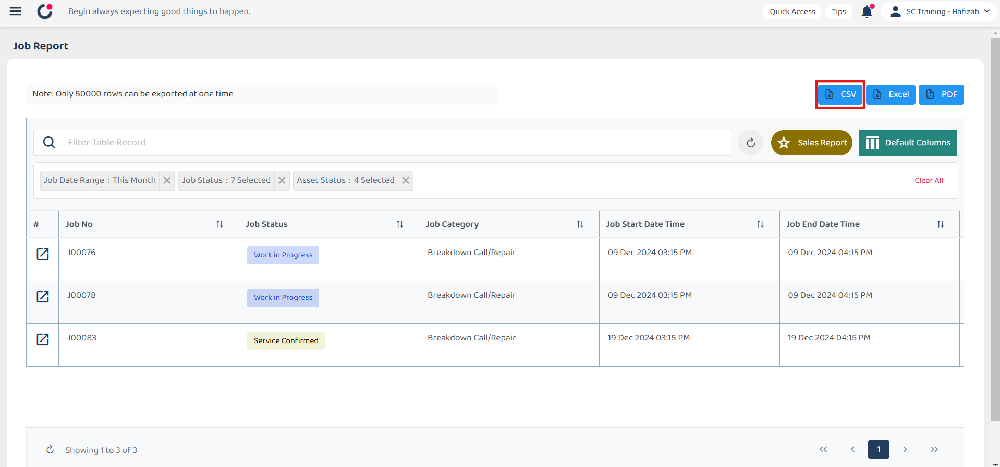
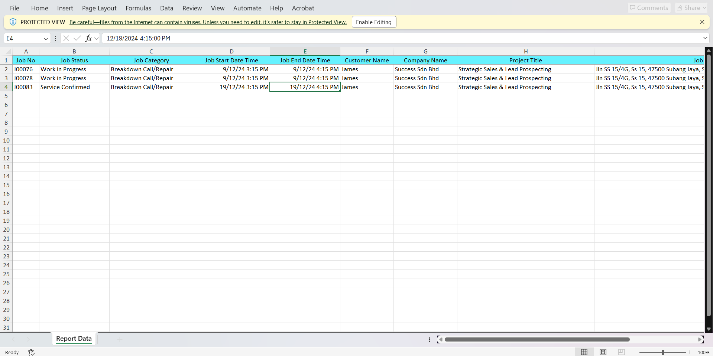
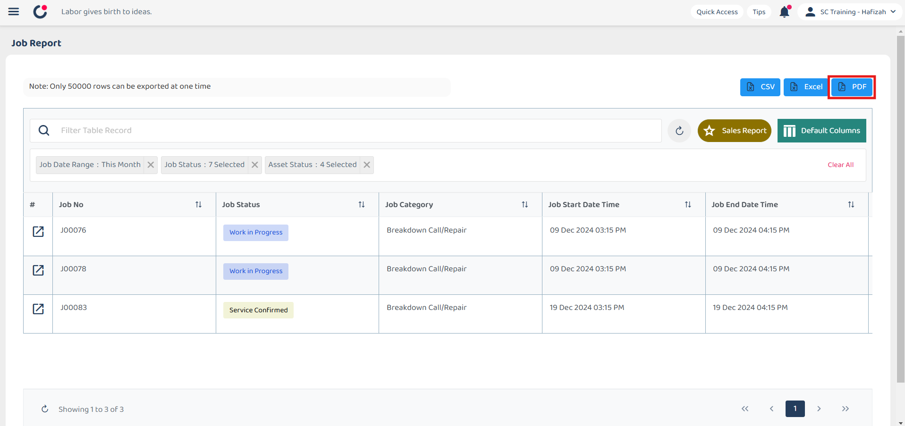
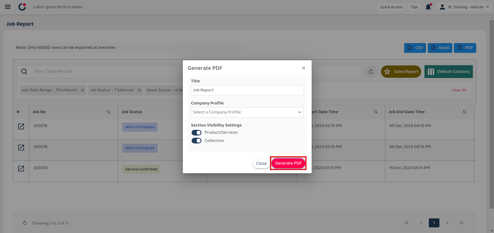
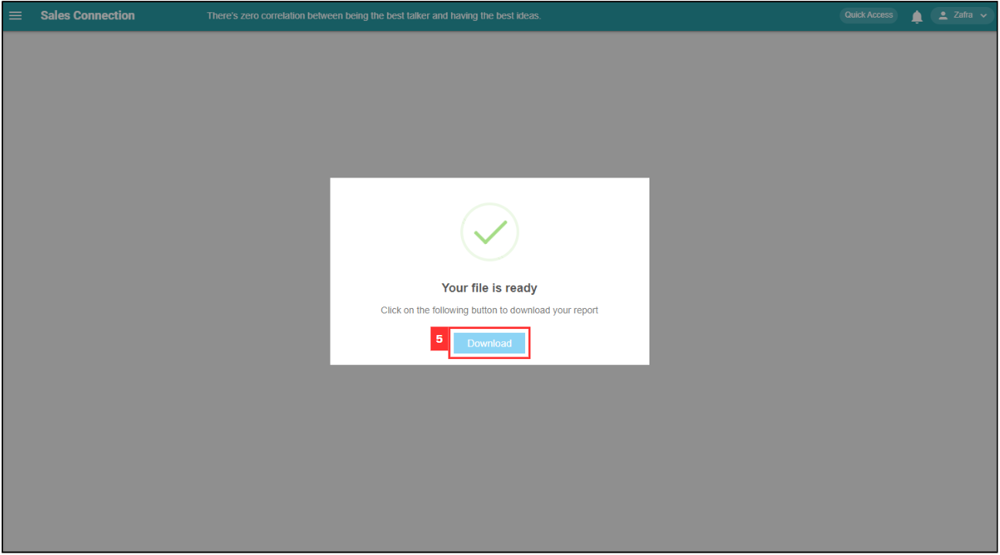
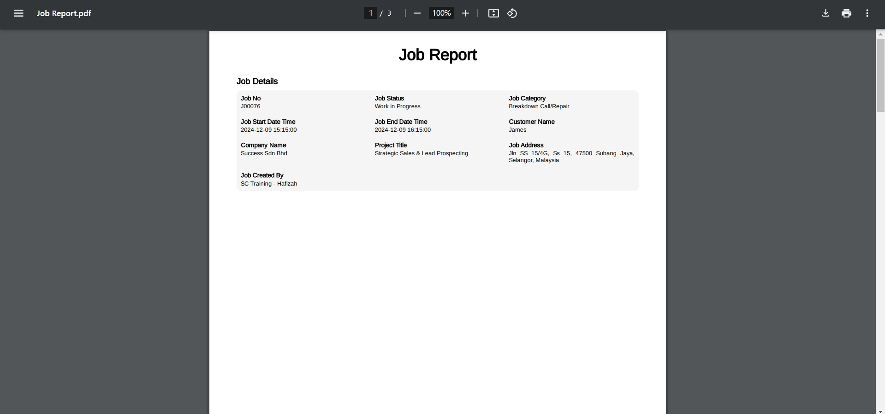

Version 1.0 
Created: 24 May 2024 
Updated: 24 May 2024 
## How to Pull Out Job/Project/Form Report?
**Difference Between CSV, Excel and PDF** 

| Feature | CSV | Excel | PDF |
|---------|-----|-------|-----|
| Type | Plain text file | Spreadsheet file | Fixed-format document |
| Use | Data backup | Data analysis and reporting | Final reports and sharing |
| Best For | - Simple data storage | - Complex analysis | - Formal presentations |
|  | - Data backup | - Detailed reports | - Sharing finalize report |

 

**Navigate to the section by clicking it.** 

- [Export as CSV](#section1) 
- [Export as Excel](#section2) 
- [Export as PDF](#section3)
   

### Export as CSV
  1. At the desktop site's navigation bar, go to Business Reports > Job Report. 
     **Open Job Report Here:** [https://salesconnection.my/reports/activity](https://salesconnection.my/reports/activity) 

     

       
     

  2. Click "CSV" to export the report. 

     

       
     

  3. Wait for the system to export the file. 

     

       
     

  4. Click "Download" to download the file needed. 

     

       
     

  5. The file downloaded can be viewed in your desktop "File Explorer". 

     

       
     

      

### Export as Excel
  1. At the desktop site's navigation bar, go to Business Reports > Job Report. 
     **Open Job Report Here:** [https://salesconnection.my/reports/activity](https://salesconnection.my/reports/activity) 

     

       
     

  2. Click "Excel" to export the report. 

     

       
     

  3. Wait for the system to export the file. 

     

       
     

  4. Click "Download" to download the file needed. 

     

       
     

  5. The file downloaded can be viewed in your desktop "File Explorer". 

     

       
     

      
     

### Export as PDF
*Note: No PDF export option for Digital Form. 
  1. At the desktop site's navigation bar, go to Business Reports > Job Report. 
     **Open Job Report Here:** [https://salesconnection.my/reports/activity](https://salesconnection.my/reports/activity) 

     

       
     

  2. Click "PDF" to export the report. 

     

       
     

  3. Customize the PDF title and choose the header before clicking the "Generate PDF" button. 
  
     

       
     

  
  4. Wait for the system to export the file. 

     

       
     

  5. Click "Download" to download the file needed. 

     

       
     

  6. The file downloaded can be viewed in your desktop "File Explorer". 

     

       
     

        

**Related Articles** 
- [How to Add Dropdown Options in Digital Form?](Add_Dropdown_Options_in_Digital_Form.md)
- [How to Edit Checklist Dropdown Options?](Edit_Checklist_Dropdown_Options.md)

<!-- [Link Text](https://salesconnection.github.io/Sales-Connection-Support/Export_Report.html) -->
