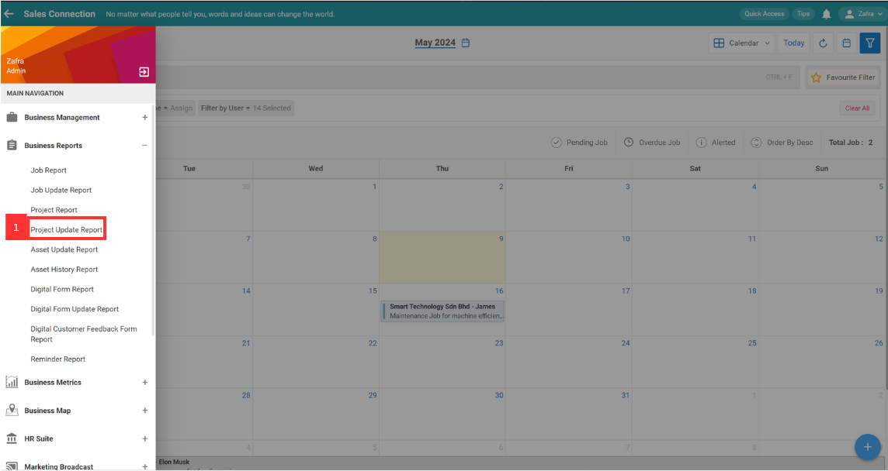
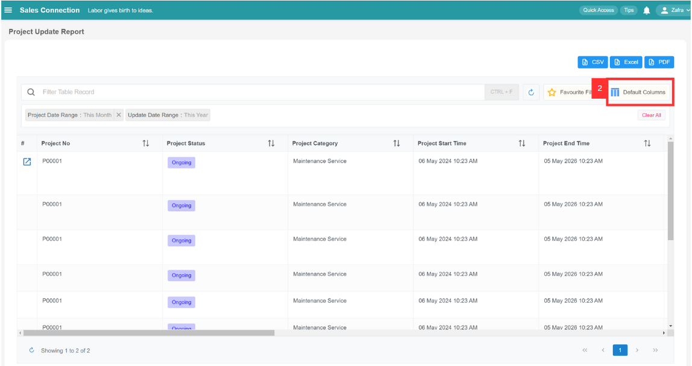
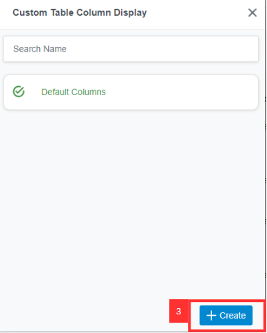
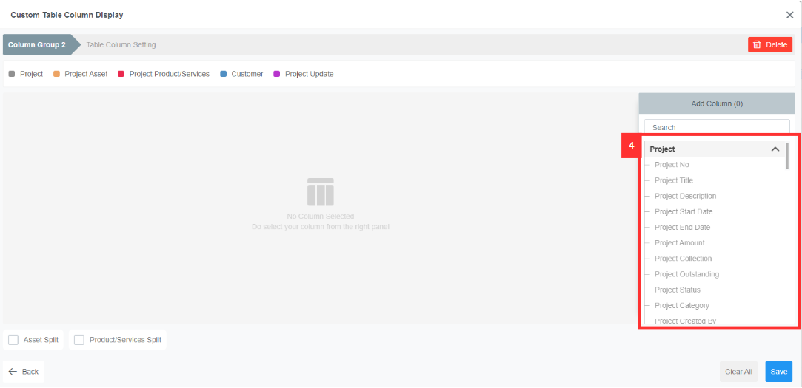
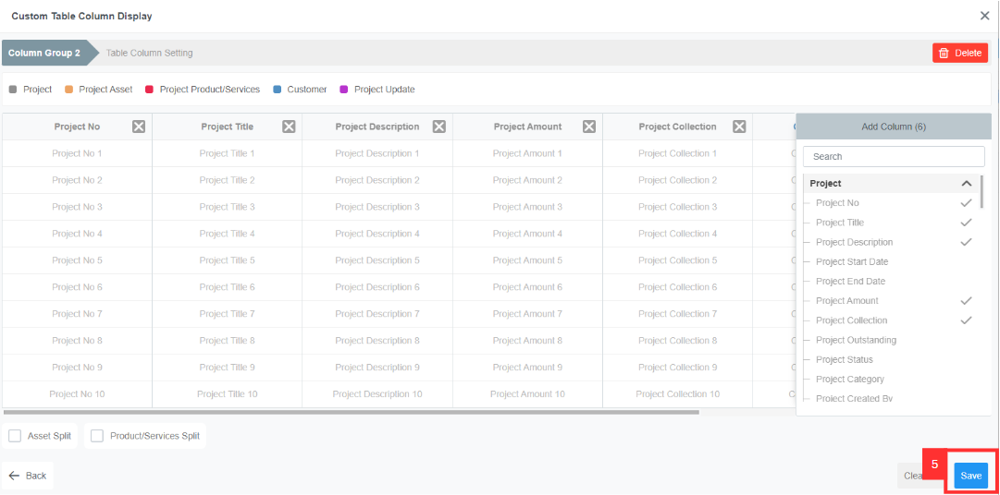
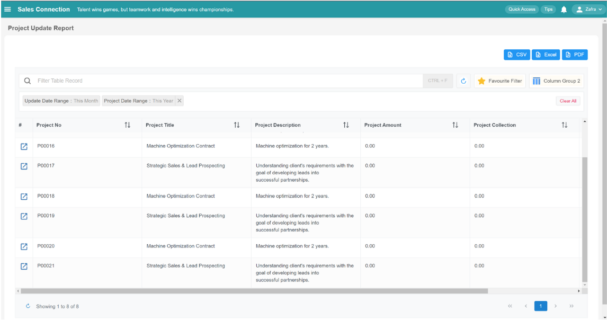
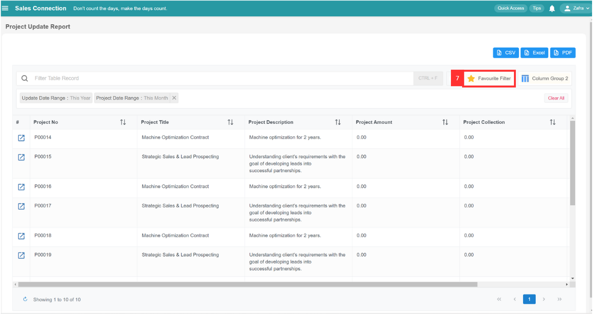
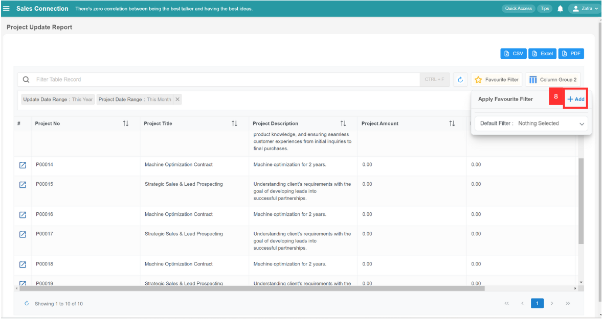
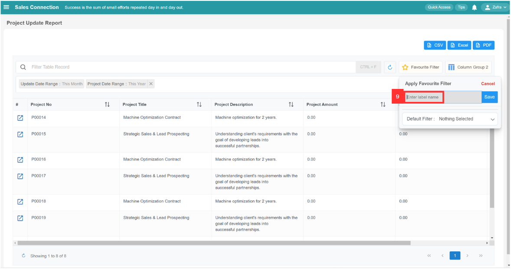
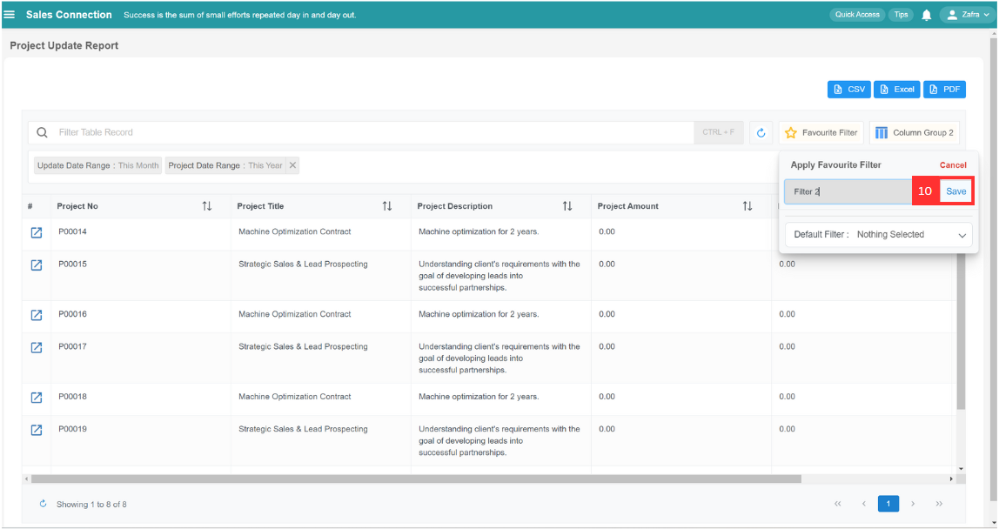

## ❤ How to set favourite filter in Project Update Report?

**Desktop site:** 

1. In the "Main Navigation", under the "Business Reports", select "Project Update Report".
   **Add Favourite Filters in Project Update Report here:** [https://salesconnection.my/reports/deal-update](https://salesconnection.my/reports/deal-update)

   

     
   
 

2. Click the "Default Columns".

   

     
   
 

3. Click the "Create" button to create a new custom table column display.

   

     
   
 

4. You can select the column based on your own preference.

   

    
   
 

5. Click "Save" to save the custom column display that you want.
   
   

     
   
 

6. This is the output.
   
   

     
   
 

7. To save this favourite Filter, click "Favourite Filter".

   

     
   
 

8. Click the "+Add" button.

   

     
   
 

9. Enter the name for this customized favourite filter.

   

     
   
 

10. Click "Save" to save this favourite filter.

    

      
    
 

## ❤ How to apply your favourite filter in Project Update Report? 

1. Default filter will show every time when you enter this page. If you want to apply your favourite filter, you will need to click the "Favourite Filter".

   

     
   
 

2. Select the favourite filter to apply.

   

     
   
 

3. Here is the output.

   

     
   
 
4. 
5. This is the output based on the filter you apply.

    
  
  

**Mobile App:** 

1. In the "Schedule" page of the Sales Connection Mobile App, click the star icon.

 

    
  
 

2. Click "Manage Filter".

 

    
  
 

3. Select the favourite filter based on your preference by clicking the 3 dots icon.

 

    
  
 

4. Click the "Set as default" to save your favourite filter.

 

    
  
 

5. Whenever you login to the mobile app, you will be able to see the favourite filter in the job schedule

 

    
  
 
