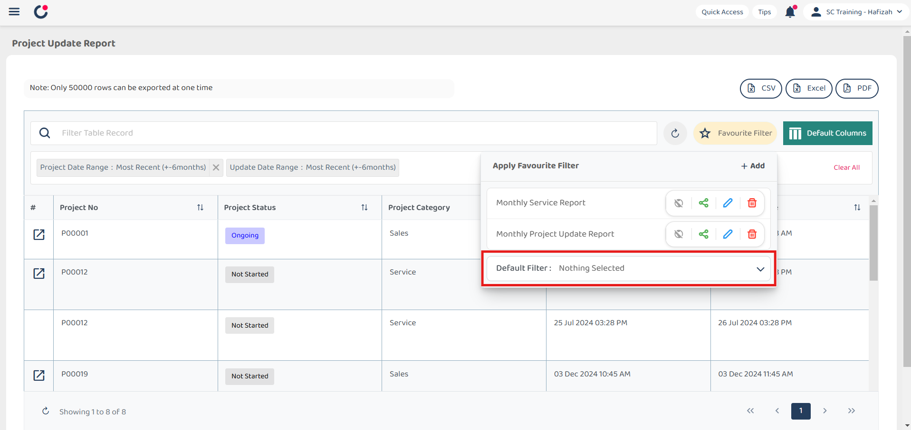

## ❤ How to set favourite filter in Project Update Report?

**Desktop site:** 

1. In the "Main Navigation", under the "Business Reports", select "Project Update Report". 
   **Add Favourite Filters in Project Update Report here:** [https://salesconnection.my/reports/deal-update](https://salesconnection.my/reports/deal-update)

   

     
   
 

2. Click the "Default Columns".

   

     
   
 

3. Click the "Create" button to create a new custom table column display.

   

     
   
 

4. You can select the column based on your own preference.

   

    
   
 

5. Click "Save" to save the custom column display that you want.
   
   

     
   
 

6. This is the output.
   
   

     
   
 

7. To save this favourite Filter, click "Favourite Filter".

   

     
   
 

8. Click the "+Add" button.

   

     
   
 

9. Enter the name for this customized favourite filter.

   

     
   
 

10. Click "Save" to save this favourite filter.

    

      
    
 

## ❤ How to set your customize favourite filter as default in Report page? 

**Desktop Version:** 

1. For example, if you want to set an favourite filter as default in "Project Update Report". First step, you need to click "Favourite Filter".

   

     
   
 

2. Click the expand button.

   

     
   
 

3. Select for which customized favourite filter you want to apply as default filter.

   

     
   
 

4. Your favourite filter as been successfully set as default when it show as the picture below.

   

     
   
 

5. This is the result when you log in to the same page next time.

   

     
   
  

   

**Related Article** 
[Filter For Job](Filter_For_Job.md)
